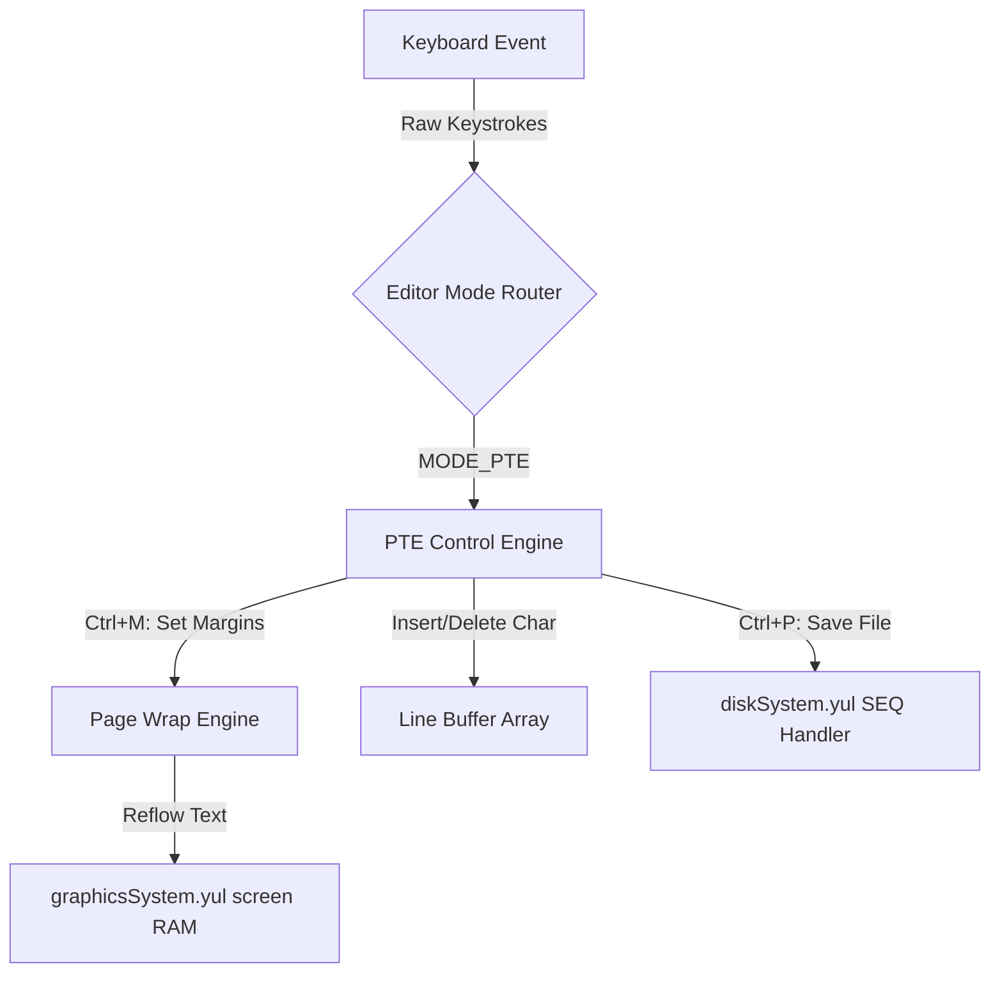

# On-Chain Emulator Integration Specification

This document details the hardware mapping, register layouts, and software hooks required to bridge retro BASIC and machine language applications from *Ahoy!* Issues 7, 8, and 9 to our simulated 6502 Yul CPU (`cpu6502.yul`) and peripheral contracts.

---

## 1. Memory-Mapped I/O Maps

The emulator utilizes namespaced storage mapping to simulate Commodore 64 and VIC-20 memory layout structures:

```
+-------------------+-----------------------------+------------------------------------+
| Address Range     | Subsystem / Function        | Yul Target Slot / Helper           |
+-------------------+-----------------------------+------------------------------------+
| $0000 - $00FF     | Zero Page (Registers)       | Private Storage / getUserSlot      |
| $0400 - $07E7     | C64 Screen RAM              | graphicsSystem.yul Screen Buffer   |
| $0801 - $9FFF     | BASIC Program Area          | RAM Emulation                      |
| $D000 - $D02F     | VIC-II Display Registers    | graphicsSystem.yul config          |
| $D400 - $D41F     | SID Sound Synthesizer       | musicMaker.yul Voice registers    |
| $D800 - $DBE7     | VIC-II Color RAM            | graphicsSystem.yul Color mapping   |
+-------------------+-----------------------------+------------------------------------+
```

---

## 2. KERNAL Hook Trapping (Disk DOS System)

To support utilities like **Directory Assistance** and **DOS**, we intercept standard Commodore KERNAL ROM entry points within `cpu6502.yul`:

### 2.1 Vector Trap Setup
*   **LOAD (`$FFD5`)**: Trapped at PC address `65493`.
*   **SAVE (`$FFD8`)**: Trapped at PC address `65496`.

When the PC hits these vectors, the emulator suspends native execution and pulls arguments from Zero Page registers:
*   `$B7` (183): Filename length.
*   `$BB-$BC` (187-188): Pointer to filename string.
*   `$BA` (186): Current device number (usually 8 for disk drive).

### 2.2 Sector-Level Directory Traversal
Yul procedures query the `diskSystem.yul` contract by formatting calldata targeting Track 18 Sector 0 (Block Availability Map) to retrieve the directory chain:
1.  Read Track 18, Sector 0: Extract the first directory block coordinates (Track 18, Sector 1).
2.  Traverse Directory Blocks: Read sector data, offset 3–18 for filenames, and offsets 21–22 for block sizes.

---

## 3. SID Audio Register Mapping

For **Sound Explorer**, register offsets are translated in real-time to generate raw audio output:

```
+--------------------+-----------------------------+------------------------------------+
| Register Offset    | Name                        | Synthesizer Mapping                |
+--------------------+-----------------------------+------------------------------------+
| $D400 / $D401      | Voice 1 Frequency (LSB/MSB) | Frequency = (MSB * 256 + LSB) / 16 |
| $D405 / $D406      | Voice 1 Attack / Decay      | ADSR Envelope parameters           |
| $D404              | Voice 1 Control Register    | Waveform select (Noise, Pulse, etc)|
+--------------------+-----------------------------+------------------------------------+
```

---

## 4. VIC 40 Column Display Upgrade (Completed)

We have implemented the software-rendered display columns expansion technique:
*   **Grid boundary trapping**: When `COLS 40` is selected, screen rendering wraps/clips at column 40 inside the Wayland display loop, successfully simulating the custom character font layout conversion.

---

## 5. PTE Word Processor Architectural Integration Pathway

To fully integrate the **PTE Word Processor** into our emulator workspace, we establish a dedicated editor mode (`MODE_PTE`) utilizing a modular architecture:



### 5.1 Memory Layout & Wrap Boundaries
*   **Text Buffer**: Allocated as a sequence of linked text lines in memory (`$0801` upwards).
*   **Boundary Margins**: Stored at registers `$02` (Left Margin) and `$03` (Right Margin). The Wrap Engine queries these boundaries during insertion to shift text segments dynamically.

### 5.2 Disk I/O Bridge (On-Chain Storage)
*   When a print or save operation (`Ctrl+P` / `Ctrl+S`) is issued, the control engine converts the line buffers into a standard Commodore Sequential (`.SEQ`) file stream.
*   This stream is written block-by-block to the on-chain Yul Floppy controller (`diskSystem.yul`) by raising a virtual disk interrupt.


