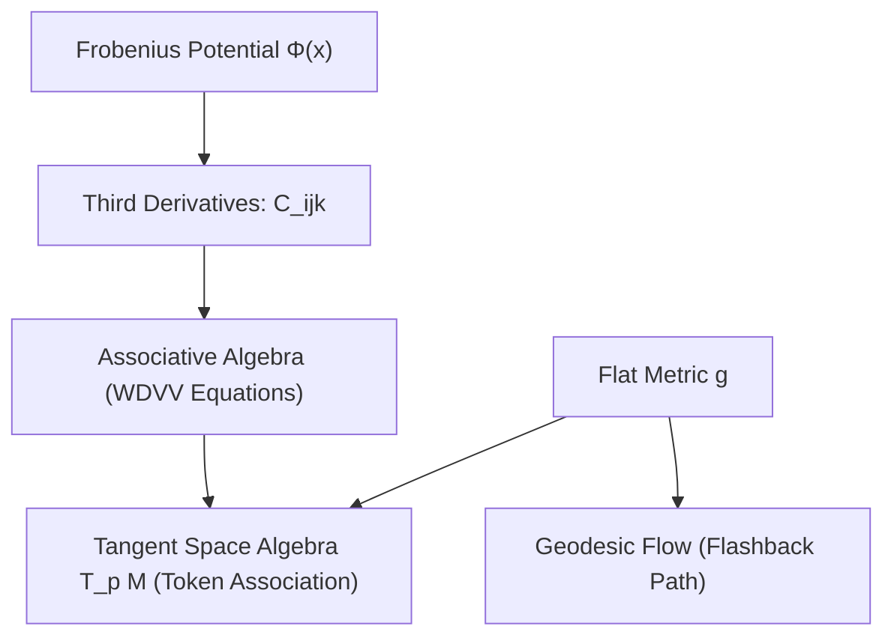

# The Frobenius Manifold Capacitor: Weighted Token Memories and Flashback Imagery

This document outlines the geometric and physical synthesis of a **Frobenius Manifold Capacitor**. It leverages the differential geometry of Frobenius manifolds (incorporating flat metrics and associative algebras compatible with the WDVV equations) as a storage medium for sparse, weighted token memories, using geodesic flow to trigger associative "flashback" imagery.

---

## 1. Mathematical Foundation: The Frobenius Manifold

A **Frobenius manifold** $M$ is a differentiable manifold equipped with:
1. A flat Riemannian/pseudo-Riemannian metric $g$.
2. A commutative, associative algebra structure $\circ$ on the tangent spaces $T_p M$, smoothly varying with $p \in M$.
3. A unity vector field $e$ that is flat: $\nabla e = 0$.
4. A compatibility condition between $g$ and $\circ$:
   $$g(u \circ v, w) = g(u, v \circ w)$$
5. A Frobenius potential $\Phi$ (in flat coordinates $x^1, \dots, x^n$ where $e = \frac{\partial}{\partial x^1}$), such that the structure constants $C_{ijk}$ of the algebra are third derivatives:
   $$C_{ijk}(x) = \frac{\partial^3 \Phi}{\partial x^i \partial x^j \partial x^k}$$
   The associativity of $\circ$ translates into the **Witten-Dijkgraaf-Verlinde-Verlinde (WDVV) equations**:
   $$\sum_{s,t} \frac{\partial^3 \Phi}{\partial x^i \partial x^j \partial x^s} g^{st} \frac{\partial^3 \Phi}{\partial x^t \partial x^k \partial x^l} = \sum_{s,t} \frac{\partial^3 \Phi}{\partial x^i \partial x^k \partial x^s} g^{st} \frac{\partial^3 \Phi}{\partial x^t \partial x^j \partial x^l}$$



---

## 2. The Capacitor Model: Physical Substrate

In a physical capacitor, energy is stored in an electric field between conductors. In a **Frobenius Manifold Capacitor**:
* **Dielectric Medium**: The manifold $M$ itself acts as the dielectric substrate, where polarization corresponds to coordinates $x^i$.
* **Charge Vector**: Represented by a vector field $Q \in T_p M$ representing the density of "token memory" states.
* **Potential Energy**: Stored in the Frobenius potential $\Phi(x)$. The capacity of the manifold to store energy is governed by the Hessian of the potential:
   $$E_{\text{stored}} = \frac{1}{2} \sum_{i,j} g_{ij} Q^i Q^j$$
* **Electrostatic Potential**: Voltage is represented by the gradient of the potential, $\nabla \Phi$. Associations arise when a charge density $Q$ deforms the flat metric, shifting the manifold's curvature.

---

## 3. Weighted Token Memories

Tokens (words, concepts, or neurological states) are mapped to coordinates on $M$. 

### Weighting and Association
* **Token Coordinate**: A token $\tau_i$ corresponds to the coordinate vector field $X_i = \frac{\partial}{\partial x^i}$.
* **Token Weight**: The weight $w_i$ of a token is represented by its projection onto the metric:
  $$w_i = g(Q, X_i)$$
* **Memory Product**: The associative algebra product $X_i \circ X_j$ determines how tokens combine. If two tokens $\tau_i$ and $\tau_j$ are highly associated, their product generates a strong vector component in a third direction $\tau_k$, governed by:
  $$X_i \circ X_j = \sum_{k} C_{ij}^k(x) X_k$$

Because the structure constants $C_{ij}^k(x)$ depend on the position $x$ on the manifold, **memory context is dynamic**. Shifting the state $x$ (the current thought vector) changes how concepts associate with one another.

---

## 4. Flashback Imagery

A "flashback" is modeled as a sudden, highly coherent recall of past token states triggered by a geometric instability (e.g., a limit cycle or geodesic attractor).

```
State x(t) ---> (Curvature Singularity / WDVV Node) ---> Rapid Geodesic Collapse ---> Flashback (Coherent Recall)
```

1. **Geodesic Trajectory**: In the absence of external input, the mental state evolves along a geodesic line on the manifold:
   $$\frac{d^2 x^k}{d t^2} + \sum_{i,j} \Gamma_{ij}^k \frac{dx^i}{dt} \frac{dx^j}{dt} = 0$$
   where $\Gamma_{ij}^k$ are the Christoffel symbols derived from the flat metric $g$.
2. **Curvature Trigger**: Near singular points of the Frobenius potential $\Phi$ (where the algebra $\circ$ degenerates or changes signature), the Christoffel symbols grow rapidly, causing the trajectory to accelerate toward a specific region of the manifold.
3. **Flashback Image Reconstruction**: This rapid acceleration focuses the vector state into a narrow subspace dominated by a highly weighted eigenvector of the structure tensor $C_{ij}^k$. This focus acts as a "flashback," rendering a vivid, isolated, and highly correlated set of token memories (an image or sequence) out of the sparse manifold substrate.
