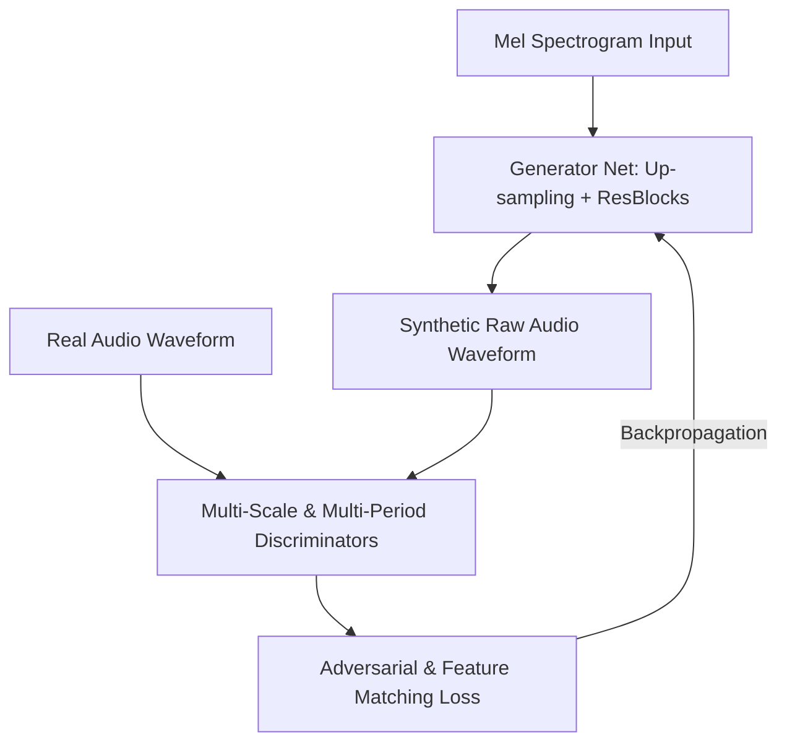

# GAN Techniques in Speech Synthesis: LPC vs. HiFi-GAN

This report analyzes the application of Generative Adversarial Networks (GANs) to text-to-speech (TTS) systems, drawing direct comparisons between the legacy parametric methods and the neural vocoders integrated into the [tts_dashboard.html](file:///home/mariarahel/src/tsfi2/atropa_pulsechain/frontend/tts_dashboard.html).

---

## 1. Overview of Vocoder Architectures in the Dashboard

Our dashboard exposes two primary vocoding paradigms:

1. **LPC Lattice Filter (LPC)**:
   - **Methodology**: Parametric synthesis using linear predictive coding. It models speech as a source-filter system where the excitation (voiced glottal pulses or unvoiced noise) passes through an all-pole filter representation of the vocal tract.
   - **Acoustic Profile**: Fast, deterministic, and highly stable, but prone to a metallic, robotic, or "buzzy" machine-like quality due to simplified excitation models.

2. **Multi-Period Neural (HiFi-GAN)**:
   - **Methodology**: A deep generative adversarial model that synthesizes high-fidelity raw audio waveforms directly from input features (like Mel spectrograms).
   - **Acoustic Profile**: Rich, organic, and realistic. It captures fine-grained temporal structures, phases, and micro-texture details that hand-crafted parametric models miss.

---

## 2. Why Traditional Vocoders Buzz: The Excitation Gap

Parametric models like LPC or the historic TMS5220 emulate the human vocal tract using simplified waveforms:
- **Voiced Excitation**: Typically a Rosenberg glottal pulse (or a simple sawtooth) repeated at the fundamental frequency ($F_0$).
- **Unvoiced Excitation**: White noise.

This creates a sharp binary distinction: a frame is either completely voiced or completely unvoiced. In reality, human speech contains **mixed excitation** (e.g., breathy vowels, voiced fricatives like `/z/`) and complex phase alignments. When a simplified source excitation is passed through the LPC lattice filter, the phase mismatches and lack of high-frequency sub-band noise result in the characteristic "robotic buzz."

---

## 3. How GANs Solve the Phase Reconstruction Problem

In neural speech synthesis, acoustic models (like Tacotron 2 or FastSpeech) first map text/phonemes to a **Mel spectrogram** (a low-dimensional, compressed representation of audio energy over time). The role of the vocoder is to map this spectrogram back into raw 1D audio samples ($x_t$).

The fundamental challenge is **phase retrieval**. A spectrogram discards phase information, keeping only magnitude. 
- Traditional algorithms (like Griffin-Lim) reconstruct phase iteratively but introduce smearing.
- **GANs** solve this by learning the mapping implicitly through a competitive minimax game.

### The Generator
In architectures like **HiFi-GAN**, the generator is a fully convolutional neural network. It takes the Mel spectrogram and up-samples it using transposed convolutions until the temporal resolution matches the raw audio sample rate (e.g., upsampling by $256$ to go from $80$ Hz frame rate to $20,480$ Hz audio). **Multi-Receptive Field Fusion (MRFF)** modules run in parallel to observe different patterns at varying periodicities, blending them together to reconstruct clean wave shapes.

### The Discriminators (The Secret to Quality)
A single discriminator checking raw audio struggles because audio is highly periodic (waveforms repeat) and spans vast temporal contexts. To solve this, HiFi-GAN utilizes two types of discriminators:
1. **Multi-Period Discriminator (MPD)**: Splits the 1D audio signal into 2D matrices of different prime periods (e.g., $2, 3, 5, 7, 11$). This forces the network to look at periodic structures (like pitch cycles) separately, ensuring harmonic accuracy and removing pitch-based buzzing.
2. **Multi-Scale Discriminator (MSD)**: Evaluates the raw audio at different down-sampled scales (e.g., $1\times, 2\times, 4\times$) to guide both high-frequency details and overall sequence consistency.

---

## 4. Adversarial Loss vs. Feature Matching Loss

To achieve human-like fidelity, GAN vocoders don't just rely on standard GAN binary cross-entropy loss. They incorporate **Generator Feature Matching Loss**:

$$\mathcal{L}_{FM}(G; D) = \mathbb{E} \left[ \sum_{i=1}^{T} \frac{1}{N_i} \| D^{(i)}(x) - D^{(i)}(G(s)) \|_{1} \right]$$

This loss measures the difference in the intermediate feature maps of the discriminators when processing real audio ($x$) versus generated audio ($G(s)$). By forcing the generator to match these hidden features, the network learns the underlying natural acoustic properties of the recording environment, breath patterns, and vocal tract dynamics.

---

## 5. Integration into the Dashboard Pipeline

In the dashboard context:
- **Local Play (LPC / HiFi-GAN)**: 
  - Selecting `lpc` uses our local Javascript emulator `synthesizeLatticeSamples` which runs a 10-stage lattice filter.
  - Selecting `hifigan` routes the phoneme projection to `synthesizeNeuralSamples`.
- **C Offline Play**: The compiled `test_speech_c_controller` maps phonetic sequences, queries the `predictMelQuantized` contract for latent Mel frames, and runs the fast Yul-based vocoder (`synthesizeNeuralWav`) using the selected upsampling factors.
