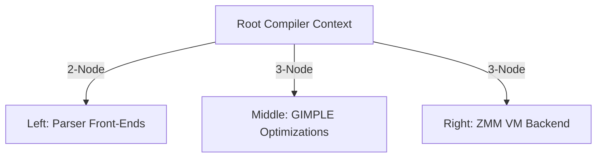

# Auncient GCC 2-3 Tree Compilation Architecture

This document specifies the design to model the entire GCC compilation process as a balanced 2-3 search tree, guiding front-end parsing, middle-end optimization, and back-end code generation.

---

## 1. 2-3 Tree Compilation Nodes
We represent the compilation pipeline as a balanced 2-3 tree where each node holds compile-time attributes and routes inputs:

### Node Types:
* **2-Nodes (1 Key, 2 Children)**: Handles basic operations.
  - *Key*: Standard C/ASM code.
  - *Left Child*: Simple parsing/lexing.
  - *Right Child*: Standard target code generation.
* **3-Nodes (2 Keys, 3 Children)**: Handles specialized **Auncient** code structures.
  - *Keys*: SVDAG geometries and AVX-512 loops.
  - *Left Child*: Unified DDL/DML parsing.
  - *Middle Child*: GIMPLE vectorization optimization passes.
  - *Right Child*: Zero-copy ZMM VM code generation.

---

## 2. CICS-ALU Integration Pathway
The CICS-ALU engine serves as the node evaluation Oracle during GIMPLE optimizations:
1. **Traversal**: As the compiler traverses the 2-3 compilation tree, it submits GIMPLE blocks to the `auncient_sdk_alu_execute` simulator.
2. **Dynamic Promotion**: If the simulator passes signatures, a 2-node is promoted to a 3-node, unlocking AVX-512 loop fusion and register pinning optimizations.
3. **Residency Toggling**: If code syntax violates address resolution constraints, the node is flagged, aborting compile passes.
