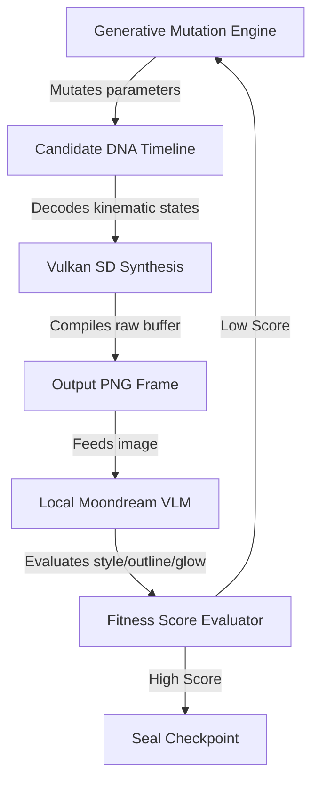

# General 2D Character Synthesizer Architecture
*Evolving Infinite 2D Cel-Animations from a Unified DNA Standard*

The procedural DNA structures established in the **Dragon's Lair** pipeline provide the foundations for a **General 2D Character Synthesizer System**. By standardizing a 31-byte kinematic and material description record, we can generate, interpolate, and evolve animations for any 2D character profile (dragons, knights, beasts, and custom creations) using direct Vulkan Stable Diffusion synthesis.

---

## 1. Unified DNA Parameter Translation

To support a wide range of character archetypes, the 31-byte DNA record is interpreted polymorphically depending on the active **Character Profile**:

| Offset | Standard DNA Field | Red Dragon Profile | Teddy Knight Profile | Cave Beast Profile |
| :--- | :--- | :--- | :--- | :--- |
| **0** | `g_x` (float) | Horizontal displacement | Running/crouching offset | Charging velocity |
| **4** | `g_y` (float) | Vertical breath bobbing | Jump height/leap altitude | Heavy stomp vibration |
| **8** | `stretch` (float) | Wing stretch / squash | Armor weight flex | Muscle deformation / load |
| **12** | `pulse` (float) | Tail wave / breathing | Cape wave frequency | Horn outline pulse |
| **16** | `energy` (float) | Fire breath volume | Shield glow intensity | Eye-laser energy scale |
| **20** | `light` (float) | Fire illumination contrast | Iron highlight reflex | Deep cave backlighting |
| **24** | `color[3]` (u8) | Scale tint (Crimson) | Fur color (Brown) | Hide tint (Blue/Indigo) |
| **27** | `eye[3]` (u8) | Glowing yellow iris | Helmet slit glow (Amber) | Glowing red iris |
| **30** | `eye_count` (u8)| Visible eyes (default 2) | Slit status (0=shut, 1=open) | Active eye count (1 to 4) |

---

## 2. The Evolutionary Synthesis Pipeline

We can automate character evolution by defining a **closed-loop feedback system** that scores the aesthetic compliance of generated frames against our desired 1980s cel-animation standard:



### The Selection Parameters (Moondream VLM Prompts):
- **Contrast Check**: *"Verify if the shadows are dramatic and dark fantasy styled."*
- **Outline Integrity**: *"Confirm if the character has bold, hand-drawn black ink contours and is free from modern CGI shading artifacts."*
- **Color Adherence**: *"Assess if the character color matches RGB specification and exhibits gouache texture."*

---

## 3. General Implementation Blueprint

To deploy this generalized synthesizer, the code utilizes a parser pattern:

```cpp
// Pseudocode for the unified generator loop
void synthesize_unified_scene(const char* profile_name, int frame_idx) {
    // 1. Fetch DNA frame data (31-byte record)
    TsfiDnaRecord frame = parse_dna_frame("assets/dragon.dna", frame_idx);

    // 2. Build profile-specific prompt based on DNA mappings
    char prompt[512];
    if (strcmp(profile_name, "knight") == 0) {
        snprintf(prompt, sizeof(prompt), 
            "A brave cartoon knight, silver armor RGB(%d,%d,%d), helmet glow RGB(%d,%d,%d), "
            "1980s cel animation style, classic Don Bluth style, bold outlines, "
            "contrast %.2f, holding a glowing shield with energy %.2f", 
            frame.r, frame.g, frame.b, frame.er, frame.eg, frame.eb, frame.light, frame.energy);
    } else if (strcmp(profile_name, "dragon") == 0) {
        // Red Dragon formatting...
    }

    // 3. Trigger Stable Diffusion Worker
    invoke_vulkan_worker(prompt, frame.g_x, frame.g_y, frame.stretch);
}
```

---

## 4. Next Steps for Expansion
1. **Extend Preset Library**: Integrate new character models (e.g., Sorcerer, Shadow Beast).
2. **Build Interpolator API**: Expose a REST path `/api/synthesize-transition` allowing seamless morphing between any two character DNA files.
3. **VLM Self-Correcting Engine**: Write a daemon script that uses Moondream responses to adjust prompt weights dynamically on the fly to maximize hand-drawn cel authenticity.
