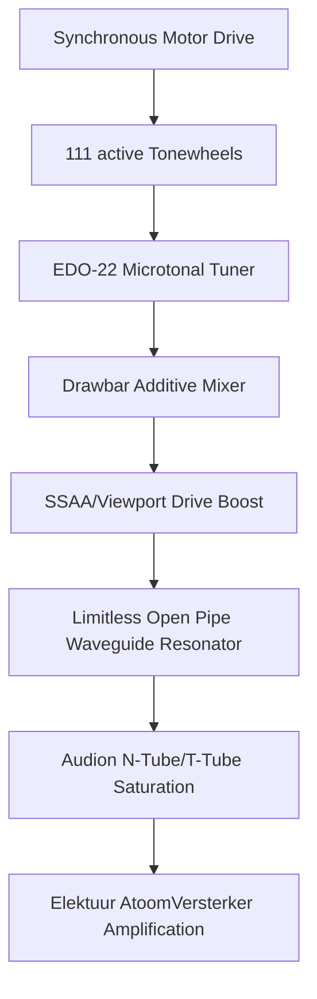

# Hammond H111 Hypervisor Open Hardware Layout

The Hammond H111 Organ synthesis engine integrates microtonal additive synthesis with physical waveguide acoustics. The visual layout and synthesis engine model the mechanical and acoustic bounds of large steel tonewheel assemblies and open brass resonator tubes without software limitations.

## 1. System Architecture

## 2. Component Design

### 111-Frequency EDO-22 Tonewheels
* **Configuration**: 111 rotating steel tonewheel gears inside open-frame cages.
* **Geared Ratios**: Tuned dynamically to EDO-22 microtonal scale divisions:
  $$f_n = 32.7032 \times 2^{\frac{n}{22}}$$
* **Signal Generation**: Modulates electromagnetic induction pickups to feed drawbar harmonics.

### Limitless Open-Tube Resonant Pipes
* **Open Waveguide**: Models dual-path forward and backward pressure waves with end correction parameters.
* **Resonant Frequency Bounds**: Simulates low-frequency acoustic coupling ($\lambda/4$) matching pedal notes down to Low C ($33.3\text{ Hz}$).

---

## 3. Visual Dashboard Preview

Here is the visual mockup of the Hammond H111 Hypervisor dashboard displaying the active 111 tonewheel gears, brass pipes emitting acoustic waveforms, and EDO-22 microtonal graphs:

