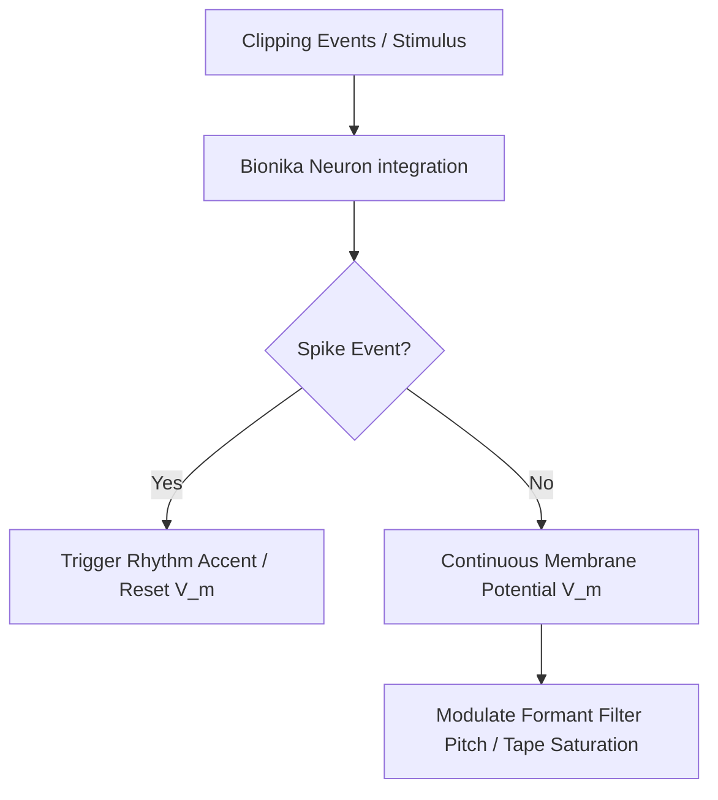

# Improvise Bionika: Generative Neural Sound Control

This document details how to configure the **Bionika Threshold Spiking Neuron** as a generative Control Voltage (CV) source to create improvisational, self-modulating rhythms and tones in the **TSFi2 Synthesis Studio**.

---

## 1. The Neural Improvisation Architecture

Rather than generating simple linear patterns, Bionika simulates cell membrane potential ($V_m$) with leaky integration and spike discharge. We route these dynamic neural states to live audio processes:

---

## 2. Parameter Control Modulations

In `frontend/studio.html`, you can route the Bionika membrane potential `bionikaVm` using the `bionika.route` parameter:

| Route Selector | Target Parameter | Modulation Mechanism |
| :--- | :--- | :--- |
| `route = 1` | **Formant Pitch** | Adds up to $+0.15 \times \text{pitch}$ modulation based on $V_m$ level, shifting vowel tones dynamically. |
| `route = 2` | **Sequencer Tempo** | Adds up to $+60 \text{ BPM}$ to the rhythm sequencer, accelerating tempo during high neural activity. |
| `route = 3` | **Tunnel Diode Bias** | Adds up to $+0.4\text{V}$ bias offset, changing the waveshaping characteristics of the clipper. |

### Neural-Driven Tape Saturation

Additionally, $V_m$ modulates the soft-saturation threshold of the **Telcan Tape Simulator**:

$$\text{Saturation Threshold} = 1.0 - (V_m \times 0.4)$$

As the neuron approaches threshold firing, the tape saturation threshold drops from $1.0$ down to $0.6$, introducing rich harmonic distortions during neural stress.

---

## 3. How to Activate Neural Improvisation

1. Open the [studio.html](file:///home/mariarahel/src/tsfi2/atropa_pulsechain/frontend/studio.html) dashboard.
2. Select the **Bionika Neuron** card to view the neural parameter panels.
3. Set the **CV Modulation Route** slider to one of the targets:
   - `1`: Modulate Formant Vowels
   - `2`: Modulate Rhythm Tempo
   - `3`: Modulate Clipper Bias
4. Adjust the **Stimulus** slider to inject current, causing the neuron to spike periodically and drive the synthesis engine.

---

## 4. Conclusion

By using biological neuron models to drive standard synthesis parameters, the studio moves away from fixed clocks to organic, signal-driven improvisation. The resulting audio-visual output reflects the underlying physics of neural membrane integration.
