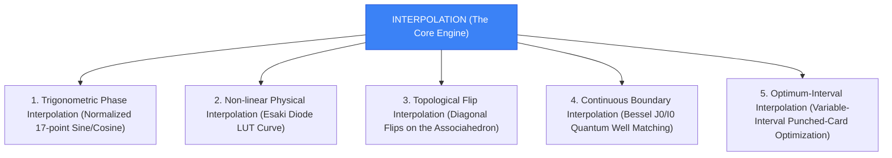

# Interpolation: The Unified Theory of the Synthesis and Control Framework

This document presents the grand unified theory of **Interpolation** as the core mathematical and physical framework of our synthesizer. It explains how interpolation acts as the bridge connecting early numerical computation (MTAC), quantum boundary matching, discrete polytopes, and real-time DSP.

---

## 1. The Core Philosophy of Interpolation

In mathematics, **Interpolation** is the method of constructing new data points within the range of a discrete set of known data points. In our synthesizer, interpolation is not merely an optimization technique; it is the fundamental mechanism that allows discrete algebraic structures to manifest as continuous, organic audio waves.

---

## 2. The Five Pillars of Interpolation in the Studio

### 1. Trigonometric Phase Interpolation
* **Mechanism**: Maps discrete quarter-sine lookup values (17 points) to a continuous $[0, 1.0]$ phase cycle.
* **Role**: Generates the primary carrier waves without the computational overhead of infinite Taylor series.

### 2. Non-linear Physical Interpolation
* **Mechanism**: Linearly interpolates the Esaki tunnel diode current-voltage characteristics.
* **Role**: Models analog physical drift (including temperature parameters) inside the LC tank oscillator.

### 3. Topological Flip Interpolation
* **Mechanism**: Traverses the edges of the Stasheff polytope.
* **Role**: Interpolates between discrete disc triangulations to generate smooth voice-leading chord progressions and polyrhythmic tempos.

### 4. Continuous Boundary Interpolation
* **Mechanism**: Solves the Schrödinger equation at the barrier boundary $r = R$.
* **Role**: Matches standard oscillating Bessel solutions ($J_n$) to modified decaying solutions ($I_n/K_n$), interpolating the wave function smoothly to simulate quantum tunneling saturation.

### 5. Optimum-Interval Interpolation
* **Mechanism**: Employs variable-interval grids based on function curvature (Herget & Clemence).
* **Role**: Places more sample points where functions transition sharply, compressing storage sizes while maintaining maximum interpolation accuracy.
