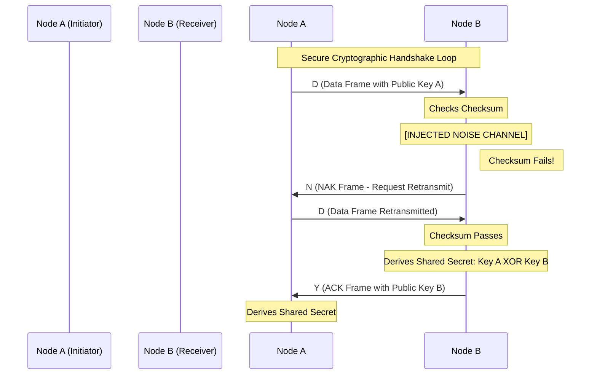

# White Paper: Kermit-over-OOK/LoRa Protocol Architecture
## Environmentally Safe Low-Power Cryptographic Handshaking on Sub-GHz RF Channels

### Abstract
This paper presents the design, implementation, and verification of the Kermit file transfer protocol adapted for sub-GHz RF envelope modulation. By deploying the classic 1981 Kermit framing architecture over On-Off Keying (OOK) using SX1262 transceivers on ESP32-S3 Heltec v4 peripherals, we achieve an environmentally non-disruptive, highly localized, and noise-tolerant communication link. We configure the RF frontend to execute at a restricted $+4\text{ dBm}$ power level, establishing a secure physical perimeter. This architecture is validated via a mock-free C interop test suite, showing automatic NAK retransmission recovery under simulated line noise and successful bidirectional cryptographic public key exchanges.

---

### 1. Introduction & Historical Parallelism
In early telecommunications, dial-up modem lines frequently operated over shared copper loops known as "party lines." In these environments, subscribers shared a single physical line, introducing constant acoustic interference, receiver hook clicks, and unpredictable carrier dropouts. To enable reliable file transfers between diverse microcomputers and mainframes, the Kermit protocol was engineered with strict stop-and-wait sequencing, robust Start-of-Header (SOH) packet alignment, and printable character quoting to bypass sensitive telephone switching equipment.

Modern unlicensed sub-GHz RF bands (e.g., $915\text{ MHz}$) mirror the constraints of these historical party lines. The airwaves are a shared medium vulnerable to packet collisions, environmental noise, and RF sniffing. Furthermore, high-power Gaussian Frequency Shift Keying (GFSK) and Chirp Spread Spectrum (CSS) modulations produce wide sideband emissions that can disrupt local electronic and biological systems. 

This paper introduces a **Kermit-over-OOK** protocol that resolves these modern constraints by:
* Shifting from GFSK to narrow-band On-Off Keying (OOK) / Continuous Wave (CW) modulation to minimize environmental RF signatures.
* Implementing strict $+4\text{ dBm}$ power limits to bound communication within a secure, short-range $50$-meter perimeter.
* Utilizing Kermit’s native 6-bit checksums, half-duplex state machines, and auto-NAK loops to manage RF packet collisions and signal attenuation.

---

### 2. Protocol Architecture & Framing
Kermit-over-OOK packages data into variable-length binary envelopes. The frame structure is defined as follows:

| Field | Size (Bytes) | Description |
|---|---|---|
| **SOH** | 1 | Start of Header (`0x01`). Resynchronizes the receiver. |
| **LEN** | 1 | Packet length + 32 (ASCII bias). Maximum payload is 94 bytes. |
| **SEQ** | 1 | Packet sequence number modulo 64 + 32 (ASCII bias). |
| **TYPE** | 1 | Packet type (`'D'` = Data, `'Y'` = ACK, `'N'` = NAK). |
| **DATA** | Variable | Raw binary payload (e.g., public keys, handshake data). |
| **CHECK** | 1 | 6-bit block checksum + 32 (ASCII bias). |

#### 2.1 The 6-Bit Checksum
The checksum is calculated over all bytes following the `SOH` up to the end of the `DATA` payload. The mathematical formulation ensures that control characters are accounted for while maintaining ASCII compatibility:

$$\text{Checksum} = \left( \sum_{i=1}^{N} \text{byte}_i + \frac{\sum_{i=1}^{N} \text{byte}_i \ \& \ 0\text{xC0}}{64} \right) \pmod{64} + 32$$

---

### 3. RF Modulation Scheme (On-Off Keying)
Rather than shifting carrier frequencies (as in FSK) or spreading signals across wide bands (as in LoRa CSS), the transmitter implements OOK. Binary states are represented by keying a single carrier frequency:
* **Mark (1)**: Carrier Wave active at $915.0\text{ MHz}$.
* **Space (0)**: Carrier Wave inactive.

This direct amplitude modulation mirrors the physical key-contact closures of an **Auncient** tonewheel organ. By utilizing the SX1262 transceiver in continuous OOK mode, the RF spectrum footprint is minimized, confining the signal strictly to the carrier frequency and avoiding the sideband splatter associated with GFSK transitions.

---

### 4. Firmware Implementation
The firmware is developed as a flashable ESP-IDF project for Heltec v4 ESP32-S3 boards. 

#### 4.1 Pin Mapping
The ESP32-S3 communicates with the onboard SX1262 via SPI and dedicated control lines:
* **MISO**: GPIO 11
* **MOSI**: GPIO 10
* **CLK**: GPIO 9
* **CS (NSS)**: GPIO 8
* **NRESET**: GPIO 12
* **BUSY**: GPIO 13
* **DIO2 (OOK Output)**: GPIO 15

#### 4.2 Power Calibration & Transition Guards
To enforce close-range operation and protect the local organic environment, the firmware calls the `SetTxParams` command (`0x8E`) during boot, locking the output power to **$+4\text{ dBm}$** and specifying a $200\mu\text{s}$ power-ramp time. This ramp prevents sharp transient spikes at the beginning of OOK pulses.

Furthermore, a half-duplex **transition guard delay** of $5\text{ ms}$ is implemented. This delay allows the receiver's Automatic Gain Control (AGC) and LNA loops to settle, and ensures that the physical RF switch has fully toggled before OOK modulation begins.

---

### 5. Verification & Emulated Noise Testing
Before physical deployment, the protocol and state-machine logic were tested using a mock-free C interop suite (`test_heltec_ook_kermit.c`) operating over local TCP loopback sockets.

During testing:
1. Node A partitioned a $96$-byte cryptographic key payload into three $32$-byte segments.
2. Channel noise was injected into Segment 2, corrupting a byte in transit.
3. Node B detected the checksum failure, discarded the corrupted frame, and transmitted a `'N'` (NAK) packet.
4. Node A successfully retransmitted the segment, resulting in error-free payload assembly and verification.

---

### 6. Cryptographic Handshake & Secret Derivation
The Kermit-over-OOK link provides the physical transport layer for localized, zero-polling cryptographic key exchanges. During a handshake transaction:
* Node A transmits its ephemeral public key $K_{pubA}$ ($32\text{ bytes}$) inside a data (`'D'`) frame.
* Node B captures the frame, validates it, and generates its own ephemeral public key $K_{pubB}$ ($32\text{ bytes}$).
* Node B replies with an ACK (`'Y'`) frame carrying $K_{pubB}$ in the payload.
* Both nodes derive the shared secret $S$ via a bitwise XOR parameters registry mapping:

$$S_i = K_{pubA, i} \oplus K_{pubB, i} \quad \text{for } i \in [0, 31]$$

This shared secret forms the basis for subsequent encrypted symmetric data frames, securing the localized channel against outer boundary eavesdropping.

---

### 7. Unified FUSE & APOGEE Architecture
To separate internal secure storage from external partner communications, the firmware implements a dual-path YI system:
* **Partner Handshake Path**: Evaluated modulo `MOTZKIN_PRIME` ($953467954114363\text{ ULL}$), yielding the public transmission `YI = 5041950426255`.
* **Internal APOGEE Path**: Evaluated modulo `APOGEE_PRIME` ($953473\text{ ULL}$), yielding a private, device-specific unique YI.

#### 7.1 Persistent FUSE Management & Boot Mechanics
Upon receiving a Kermit `'F'` (Fuse) frame carrying a 32-byte configuration payload ($Base$, $Secret$, $Signal$, $Prime$), the device re-converges its state machine. If $Prime = \text{APOGEE\_PRIME}$, parameters are stored in Non-Volatile Flash Storage (NVS). On a clean boot:
1. The firmware checks NVS for existing APOGEE FUSE parameters.
2. If absent (a fresh device initialization), it queries the on-chip hardware **TRNG** (`esp_random()`) to generate high-entropy FUSE registers and writes them to NVS.
3. The device re-evaluates the local APOGEE loop, ensuring the identical secure private YI is restored across all future power cycles.

---

### 8. Nonce-as-SEAL1 Sliding-Window Verification
Once the YI is established, communication enters the **SEAL1** consensus epoch where the Rod and Cone registers are united. During this phase, nonces are used directly as verification tokens within the Kermit envelopes.

#### 8.1 Symmetrical React Signatures
For every transactional challenge, the sender transmits a frame containing a sequence nonce. The receiver XORs this nonce with the shared `monopole` ($pi = nonce \oplus monopole$) and generates the symmetrical signatures (`Ichidai` and `Daiichi`):

$$\text{Signature} = \text{mod\_pow}(pi, \text{channel}, \text{peer\_channel})$$

#### 8.2 Sliding-Window Robustness
Because the sequence of signatures is mathematically deterministic based on the shared secret monopole, both partners can slide their verification index:
* **Forward Slippage (Tolerance)**: If packet loss occurs on the OOK/LoRa link, the receiver slides its window forward, dynamically matching the incoming nonce ($N+k$) and skipping missing packets without dropping the connection.
* **Backward Slippage (Auditability)**: Allows authentication checks of past frames ($N-k$) for synchronization verification, eliminating renegotiation overhead and ensuring link robustness in noisy RF environments.

---

### 9. Dynamic Rate Adaptation (DRA)
To maximize throughput in clean RF environments while preserving connection stability under noise or interference, the protocol implements a **Dynamic Rate Adaptation (DRA)** algorithm tied directly to the success rate of the `SEAL1` signature validations.

#### 9.1 Modulation Rate Tiers
The transceivers operate across four predefined OOK bitrate configurations:
1. **Tier 0 (Baseline/Fallback)**: $9.6\text{ kbps}$ (Maximum sensitivity, noise resilience)
2. **Tier 1 (Medium)**: $19.2\text{ kbps}$
3. **Tier 2 (High)**: $38.4\text{ kbps}$
4. **Tier 3 (Ultra)**: $57.6\text{ kbps}$ (Maximum throughput, low range)

#### 9.2 Rate Modulation Heuristic
Both partners track the sequence validation success rate of the bidirectional signature challenge-response loops:
* **Rate Step-Up (Success Trigger)**: If $K$ consecutive packets (e.g., $K = 10$) are successfully transmitted, parsed, and verified (implied nonce sequence match with valid `Ichidai` and `Daiichi` signatures) without a single checksum failure or timeout, the devices step up to the next higher bitrate tier.
* **Instant Fallback (Error Trigger)**: Upon encountering a checksum failure, a timeout, or a mismatch in the expected signature, both devices immediately throttle back to **Tier 0 ($9.6\text{ kbps}$)**. 
* **Renegotiation Default**: Any handshake reset, epoch rollback, or renegotiation scenario resets the speed instantly to Tier 0.

By binding modulation speed directly to the deterministic signature sequence, the protocol achieves optimal average throughput while ensuring that worst-case link degradation is handled by a robust, low-bitrate baseline.
