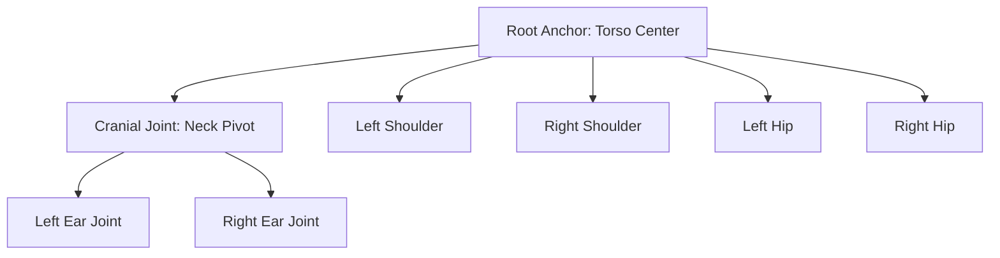

# Phase 2.5: Kinematic Rigging & Hull Generation

This document details the architectural specification for **Phase 2.5**, an intermediate compilation stage that translates static Vision-Language Model (VLM) bounding boxes into a functional kinematic skeleton and physical collision hulls before code generation.

---

## 1. Pipeline Position

```
[ Phase 2: VLM Discovery ]
          | (Static Bounding Boxes)
          v
[ Phase 2.5: Kinematic Rigging & Hull Generation ]  <-- (Current Phase)
          | (Rigged Joints, Rotation Limits, Collision Hulls)
          v
[ Phase 3: DeepSeek-Coder ]
```

---

## 2. Structural Rigging: Joint Hierarchies & Constraints

Static bounding boxes (e.g., `Fur/Body Bounds`, `Eye Bounds`) are mapped to a joint hierarchy. Each joint is assigned relative anchor points and rotational constraints to guarantee anatomical coherence during animation.



### Rotation Limit Parameters
To prevent clipping and unnatural limb twisting, we establish maximum rotational boundaries (Euler Angles) for each joint:

| Joint Name | Parent | Relative Pivot (X, Y, Z) | Min Angle | Max Angle |
| :--- | :--- | :--- | :--- | :--- |
| **Cranial Joint** | Torso | `(0, 0, 140)` | $-30^\circ$ | $+30^\circ$ |
| **Shoulder Joint** | Torso | `(±40, -20, 110)` | $-90^\circ$ | $+180^\circ$ |
| **Hip Joint** | Torso | `(±30, -30, 20)` | $-45^\circ$ | $+45^\circ$ |

---

## 3. Physical Hull Construction (Collision Primitives)

To calculate environmental and entity collisions (such as the Teddy Bear hitting obstacles or spikes in the game loop) without checking every vertex, Phase 2.5 wraps the wireframe in low-resolution collision primitives:

1. **Torso Hull (Cylinder)**:
   * Mapped directly from the VLM's `Fur/Body Bounds`.
   * **Dimensions**: Height = 140 units, Radius = 60 units.
2. **Head Hull (Sphere)**:
   * Centered on the Cranial Joint.
   * **Dimensions**: Radius = 70 units.
3. **Limb Hulls (Capped Capsules)**:
   * Stretched from shoulders/hips to the limb end vertices.

```
       (Sphere Hull)
         /-------\
        |  Head   |
         \-------/
             |
       ==============
      |   Cylinder   |
      |   Torso      | (Torso Hull)
      |   Hull       |
       ==============
        /          \
    (Capsule)    (Capsule) (Limb Hulls)
```

---

## 4. Compilation Output to Phase 3

The output of Phase 2.5 is a standardized JSON definition passed directly to **DeepSeek-Coder (Phase 3)**:

```json
{
  "joints": {
    "root": { "pos": [0, 0, 70] },
    "head": { "parent": "root", "offset": [0, 0, 70], "limits": [-30, 30] },
    "left_shoulder": { "parent": "root", "offset": [-40, -20, 40], "limits": [-90, 180] }
  },
  "hulls": [
    { "type": "sphere", "joint": "head", "radius": 70 },
    { "type": "cylinder", "joint": "root", "radius": 60, "height": 140 }
  ]
}
```
This guarantees that the generated Yul physics code (`processPhysics`) and shader functions obey structural skeletal boundaries.
