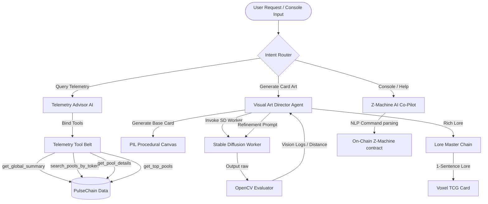

# LangChain Agent Fabric Blueprint

The NoNukes ecosystem features a multi-agent AI system orchestrated via LangChain. This architecture bridges off-chain LLM cognitive capabilities (Gemini / OpenAI) with on-chain PulseChain telemetry, procedural image generators, and interactive Yul virtual machines.

Below is the blueprint of all LangChain agents, chains, and tools deployed in this project.



---

## 1. Visual Art Director Agent (`scripts/langchain_art_director.py`)
This agent runs an **Active Vision Feedback loop** to align text-to-image prompts with exact biometric goals (glowing eyes, color hex codes, sickness modifiers) for voxel rendering.

### Core Mechanics
*   **Prompt template**: Uses weighted tags to reinforce colors.
*   **Vision Feedback Integration**: Directly parses numerical output from the OpenCV validator (`validate_bear_image`).
*   **Chain Definition**:
    ```python
    system_instruction = (
        "You are the LangChain Visual Director. Your job is to modify Stable Diffusion prompts "
        "to correct fur color and eye representation issues based on OpenCV vision feedback logs. "
        "Make sure to emphasize colors, adjust lighting contrast, or modify weights (e.g. (golden fur:1.4)) "
        "to improve target matching. Output ONLY the new revised prompt string."
    )
    prompt_chat = ChatPromptTemplate.from_messages([
        ("system", system_instruction),
        ("user", "Original Prompt: {prompt}\n\nVision Feedback Logs:\n{logs}\n\nPlease output a revised prompt.")
    ])
    chain = prompt_chat | llm | StrOutputParser()
    ```

---

## 2. The Lore Master (`scripts/batch_generate_art.py`)
Fuses metadata attributes with futuristic science fiction descriptions to compile Trading Card Game (TCG) descriptions.

### Core Mechanics
*   **Prompt template**: Generates single-sentence sci-fi descriptions.
*   **Chain Definition**:
    ```python
    prompt = ChatPromptTemplate.from_messages([
        ("system", "You are the Lore Master of Dysnomia. Write a single-sentence sci-fi trading card description for a digital asset. Be extremely creative, futuristic, and dramatic. Do not use markdown, quotes, or exceed 150 characters."),
        ("user", "Token Name: {name}\nSymbol: {symbol}\nOriginal Type: {type}\nAttributes: {desc}\nColor: {color}\n\nWrite a 1-sentence sci-fi card lore description:")
    ])
    chain = prompt | llm | StrOutputParser()
    ```

---

## 3. Telemetry Advisor AI (`scripts/telemetry_advisor.py`)
Operates as a **function-calling agent** returning live, real-time PulseChain pool analytics (swaps, liquidity, reserves, and token prices).

### LangChain Tools Exposed
*   `get_global_summary()`: Aggregates total pools, volume, and groups.
*   `search_pools_by_token(query)`: Maps user requests to specific minters.
*   `get_pool_details(pool_address)`: Exposes exact reserve ratios and prices.
*   `get_top_pools(metric, limit)`: Ranks pools dynamically.

---

## 4. Z-Machine AI Co-Pilot & Lore Guide (`scripts/dashboard_server.py`)
Two new LangChain chains attached directly to the Z-Machine Console interface to interpret player inputs and provide lore hints.

### A. AI Co-Pilot (Command translation)
Translates freeform natural language player input into the bytecode verbs expected by the Yul virtual machine:
```python
system_prompt = (
    "You are the Z-Machine AI Game Co-Pilot. Translate their natural language intent "
    "into standard game action verbs if possible (look, take [item], Reaction [address]). "
    "Start by showing the translated command: '>> TRANSLATED: look'..."
)
```

### B. AI Lore Guide (Contextual Hints)
Reads the current console history logs and uses LangChain to suggest secrets or hints to guide the player:
```python
system_prompt = (
    "You are the Z-Machine Lore Master and Guide. Look at the terminal logs of their game session. "
    "Provide a helpful hint, a secret, or guide them on what action verbs to try next."
)
```
