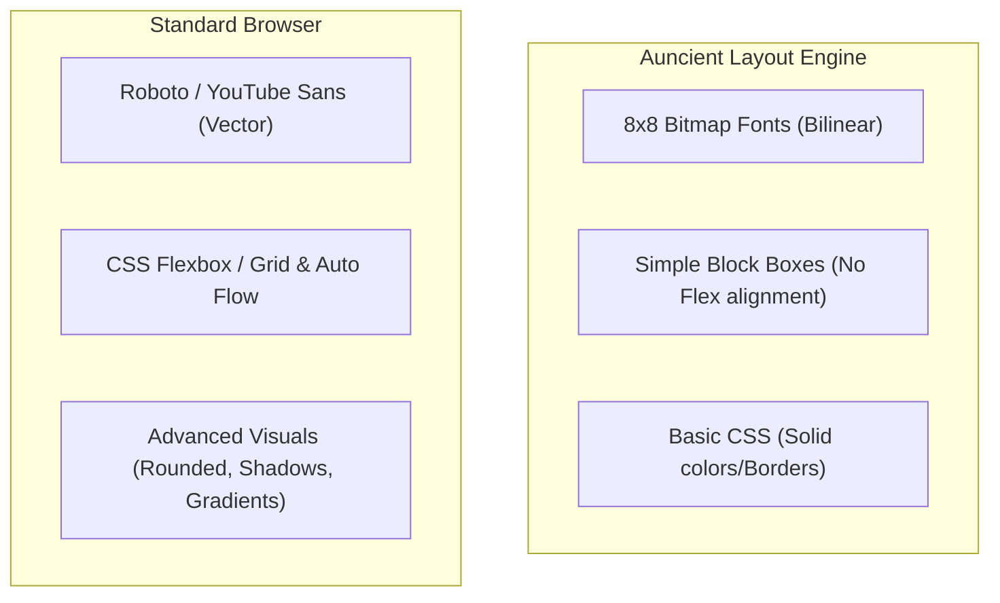

# Layout Comparison & Parity Report

This report evaluates the visual differences between our **Auncient** layout engine's rendering outputs and standard browser renderings of the YouTube interface.

---

## 1. Side-by-Side Comparison

---

## 2. Key Differences Identified

### 1. Typography & Font Shaping
* **Layout Engine:** Characters are rendered from a static monochrome [font_8x8](file:///home/mariarahel/src/tsfi2/atropa_pulsechain/tsfi2-deepseek/src/tsfi_paint.c#L9) bitmap definition. Even with bilinear smoothing, text lacks kerning and scale adjustments.
* **Standard Browser:** Employs vector-based Truetype/OpenType font engines with subpixel anti-aliasing and kerning calculations.

### 2. Flexbox and Grid Positioning
* **Layout Engine:** Inline and block boxes flow sequentially. The layout solver ([tsfi_layout.c](file:///home/mariarahel/src/tsfi2/atropa_pulsechain/tsfi2-deepseek/src/tsfi_layout.c)) lacks standard margin auto-centering (`margin: 0 auto`) and flex layouts (`justify-content`, `align-items`).
* **Standard Browser:** Renders nested grids, float wrappers, and aligns containers contextually.

### 3. Visual Effects & Assets
* **Layout Engine:** Only rasterizes rectangles with solid colors. It does not parse or draw borders with round corners (`border-radius`), gradients, SVG vectors, or image textures.
* **Standard Browser:** Paints complex shadow overlays, icons, dynamic thumbnails, and media stream textures.
