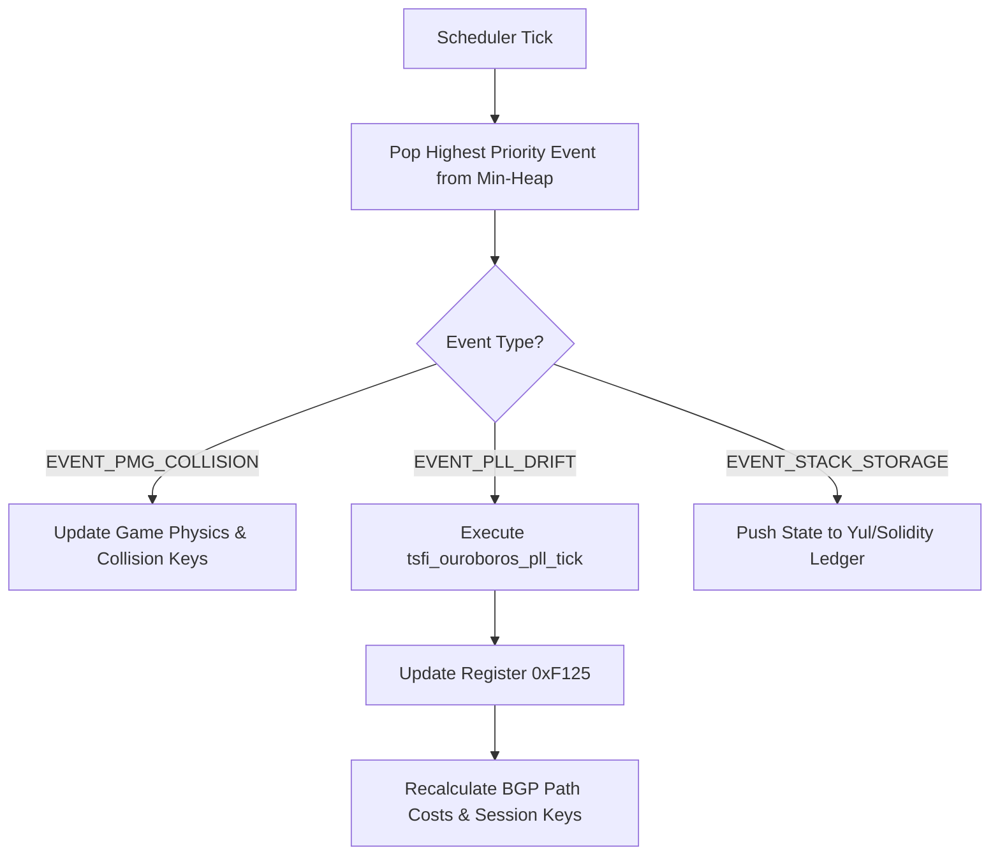
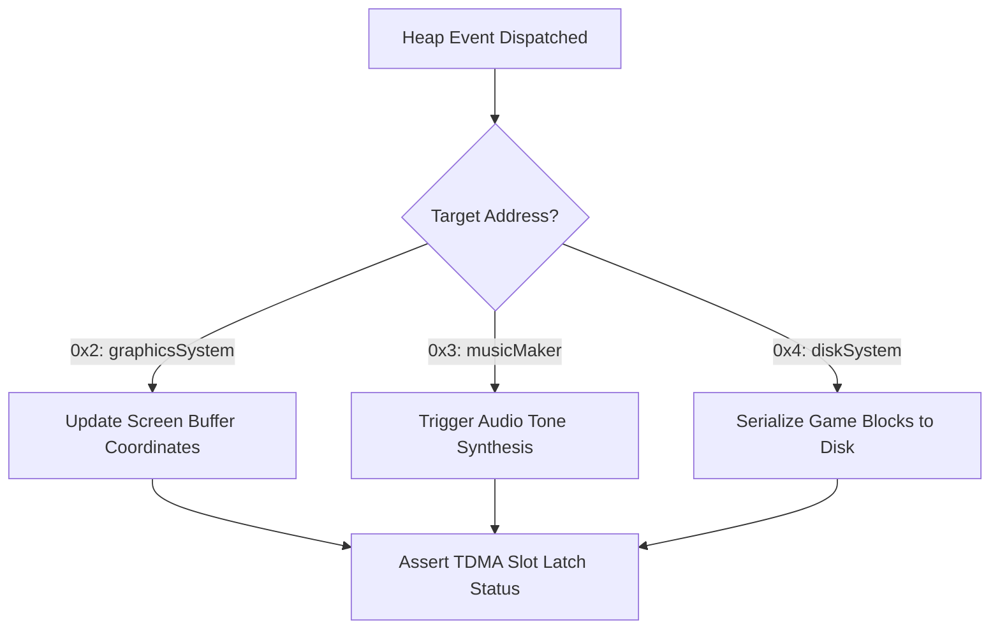

# Auncient Level Up Coordinated Scheduler Specification

The Level Up Coordinated Scheduler manages and schedules tasks across the **Auncient** ZMM VM guest environment. It enforces phase-coherent execution bounds by coordinating the **Ouroboros PLL** (Phase-Locked Loop) clock filter, the **Atari GTIA PMG** (Player-Missile Graphics) collision subcomponents, and Yul-based stack storage contracts.

---

## 1. Subsystem Telemetry Mapping

### Ouroboros PLL Clock Subsystem
* **Telemetry Register**: `0xF125` stores the active phase deviation metrics calculated by the second-order Proportional-Integral (PI) loop filter.
* **Math Model**:
  * Phase error: $e_k = \text{ref\_phase} - \text{vco\_phase}$
  * PI Adjustment: $u_k = K_p e_k + K_i \sum e_k$
* **VM Usage**: Governs BGP routing cost multipliers, B-side dual-stack transaction validation, and secure conference key rotations.

### GTIA PMG Graphics Subsystem
* **Registers**: Address space offsets mapping player positions (`hpos`), sizing, and colors.
* **Collision Mask**: GTIA overlap register fields trigger game loop state transitions.
* **Acoustic TDMA proofs**: PMG coordinate distances are proven cryptographically via:
  $$\text{proof} = \text{base}^{\text{distance}} \pmod{\text{MotzkinPrime}}$$
  which regulates slot authorization windows.

---

## 2. Min-Heap Priority Queue Architecture

To prevent clock drift from stalling high-urgency game physics (collision checks), the scheduler implements a strict Min-Heap priority queue layout:

| Event Type | Priority (Precedence) | Payload Detail | Execution Trigger |
| :--- | :--- | :--- | :--- |
| `EVENT_PMG_COLLISION` | **1** (Highest) | Sprite overlap bitmasks | Reduces health / triggers UI updates |
| `EVENT_PLL_DRIFT` | **5** (Medium) | Dynamic frequency error | Triggers PI loop filter ticks |
| `EVENT_STACK_STORAGE` | **10** (Lowest) | Yul stack push/pop data | Commits game states to ledger |

---

## 3. Ouroboros Scheduling Flow

---

## 4. Conflict & Synchronization Analysis

### A. Jitter vs. Collision Jitter
* **Conflict**: High PLL phase drift values (above threshold) trigger firewall safety checks and secure teleconference lockouts. If game loops continue running under lockouts, PMG coordinates drift, failing TDMA acoustic proofs.
* **Mitigation**: The scheduler pauses lower-priority game physics updates until the PI loop filter stabilizes clock drift below the threshold limit.

### B. EVM Dispatch Mutex Reentrancy
* **Conflict**: Both `tsfi_ouroboros_pll_tick` and standard Yul stack storage pushes call `lau_yul_thunk_execute`. If scheduler events interrupt each other within the same execution path, thread lockups on `g_thunk_execute_mutex` occur.
* **Mitigation**: The heap execution cycle runs sequentially under a single dispatcher loop, guaranteeing that no two VM thunks are invoked concurrently on the same context.

### C. Storage Alignments
* **Conflict**: Out-of-order execution in the heap could commit stack sync events before the clock updates, introducing invalid timestamps inside the ledger history.
* **Mitigation**: Stack storage transactions read their timestamps directly from the PLL-calibrated register (`0xF180`), locking the sequence order.

---

## 5. Unified Multi-Contract Guest Routing (UMCGR)

The Unified Multi-Contract Guest Routing (UMCGR) architecture enables the scheduler to dispatch enqueued heap events directly to active guest EVM contracts.

### Routing and Execution Spec
* **Payload Packaging**: Events enqueued via `pushEvent` encode the target contract destination address in the event header data.
* **Execution Boundary**: The host scheduler invokes guest contract functions dynamically via `lau_yul_thunk_execute()`, keeping all subsystems coordinated synchronously.
