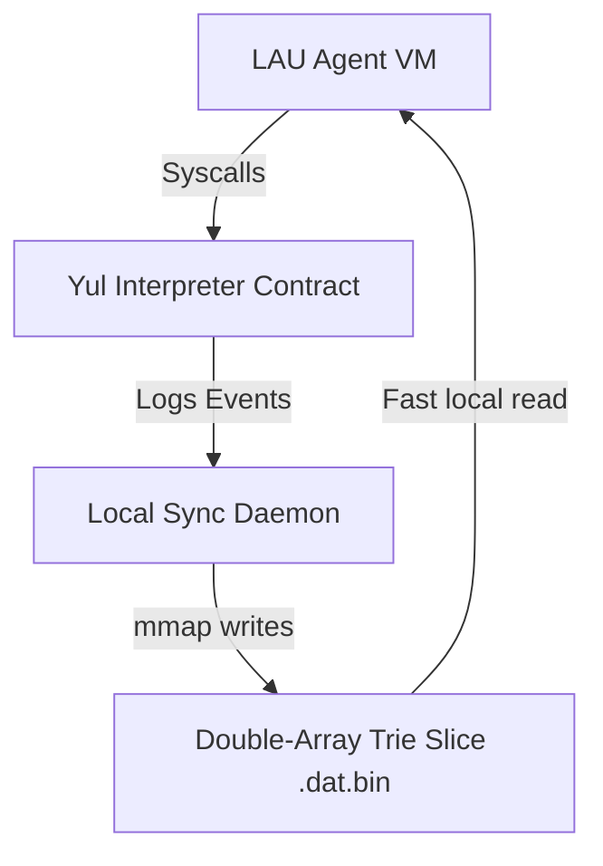

# LogOS Kernel Architecture & Backtracking VM Specifications

This document defines the architectural layout of the **Logical Operating System (LogOS)** designed to establish cryptographically sovereign agency for LAU agents on BTC Rails.

---

## 1. System Overview

LogOS provides a hybrid operating system environment combining:
*   **On-Chain Kernel Execution**: A Yul-based Rails VM processor implementing state machine rules and syscall execution.
*   **Local High-Performance Storage**: Memory-mapped (`mmap`) Double-Array Trie (DAT) database slices mapping the file system structure and logic tables.
*   **Non-Deterministic Execution**: Stack VM backtracking engines supporting choice points (`OP_TRY_ME_ELSE` / `OP_FAIL`).

---

## 2. The Syscall Table (OS Register Mappings)

The Yul interpreter loop registers standard OS functions via distinct instruction hex codes:

| Hex Opcode | Name | Description | Stack Input | Stack Output |
| :--- | :--- | :--- | :--- | :--- |
| `0x11` | `sys_open` | Resolves path/variable registry keys from the DAT slice | `[path_hash]` | `[concrete_addr]` |
| `0x12` | `sys_write` | Emits a `SysWrite` log event to trigger DAT file updates | `[key, val]` | `[success_code]` |
| `0x13` | `sys_fork` | Registers a child VM context link on-chain | `[child_id]` | `[success_code]` |
| `0xac` | `OP_CHECKSIG` | Verifies ECDSA signature using the `ecrecover` precompile | `[hash, s, r, v]` | `[signer_addr]` |

---

## 3. Backtracking VM Specification

To resolve non-deterministic search rules, the interpreter implements choice-point restoration states.

### `OP_TRY_ME_ELSE` (`0x21`)
Saves a snapshot of the current VM registers to a local choice-point frame stack:
1. Pushes current PC (target jump index) to choice point cache.
2. Clones the current `stack` and `altstack` structures.
3. Advances execution along the primary execution branch.

### `OP_FAIL` (`0x22`)
Signals constraint failure and triggers backtracking:
*   **If Choice Points Exist**: Pops the last Choice Point frame, restores registers (PC, stack, and altstack), and branches to the alternative target.
*   **If Empty**: Signals complete execution halt.

---

## 4. Memory-Mapped Persistence Model

To minimize write amplification and achieve sub-microsecond lookup latency, the local sync worker maps `.dat.bin` snapshots into virtual memory:
*   **Zero-Copy Lookups**: Searches navigate state transitions directly inside the active memory page offsets without deserialization overhead.
*   **Sliding Window Backups**: Maintains a 10-slot sliding window of versioned backups (`.dat.bin.backup_[0-9]`) to roll back local DAT states in case of chain reorganization.
