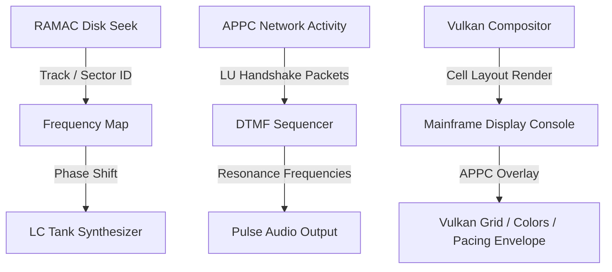

# Mainframe & RAMAC Synthesizer Demo Architecture (Vulkan UX Enhanced)

This blueprint outlines the visual, sonic, and structural timeline for demonstrating the real-time interaction of the IBM Mainframe emulation layers, RAMAC cylinder geometries, and the unified audio synthesizer pipeline, mapped directly to Vulkan rendering swapchains.

---

## 1. Structural Timeline & Audio-Visual Sync (90 Seconds)

| Time Interval | Scene | Visual Channel (Vulkan Compositor Overlays) | Audio Channel (Synthesizer Engines) |
| :--- | :--- | :--- | :--- |
| **00:00 - 00:15** (15s) | **I. System Boot & Winchester Handshake** | SNA [LU-LU session establishment](file:///home/mariarahel/src/tsfi2/atropa_pulsechain/tsfi2-deepseek/src/tsfi_mainframe_sna.c#L323) logs and WinchesterMQ SCSI loop registers scrolling on the IBM 3270 visual map. | High-frequency carrier waves generated via [tsfi_resonance](file:///home/mariarahel/src/tsfi2/atropa_pulsechain/tsfi2-deepseek/src/tsfi_resonance.c) showing channel synchronization. |
| **00:15 - 00:35** (20s) | **II. RAMAC Disk Geometry Sweep** | Real-time wireframe projection of RAMAC magnetic track cylinders, sectors, and seeking read/write access arms. | Frequency slides and sweeps mapped to track distances via the [LC Tank synthesizer](file:///home/mariarahel/src/tsfi2/atropa_pulsechain/tsfi2-deepseek/src/tsfi_lc_tank.c). |
| **00:35 - 00:55** (20s) | **III. APPC LU6.2 Session Authorization** | Live rendering of [FMH-5 headers](file:///home/mariarahel/src/tsfi2/atropa_pulsechain/tsfi2-deepseek/src/tsfi_mainframe_sna.c#L874). The Vulkan viewport displays a red security alert corner flash which turns green upon valid `APPC_SEC_PROGRAM` verification. | Low-frequency sub-bass pulses synchronized with security validation sequences. |
| **00:55 - 01:15** (20s) | **IV. DECnet-over-SNA Packet Chaining** | Vulkan renders the **APPC Grid Console** dynamically showing Basic vs. Mapped state lines. Basic mode color pipelines render in Blue while Mapped modes render in Green, with dynamic pacing bracket bars `[ ][ ][ ]` scaling with window size. | Standard DTMF sequences triggered per segment transmission via the [DTMF Sequencer](file:///home/mariarahel/src/tsfi2/atropa_pulsechain/tsfi2-deepseek/src/tsfi_computel_dtmf_sequencer.c). |
| **01:15 - 01:30** (15s) | **V. Critical Load Failure & DACTLU Teardown** | Visual distortion matrix mapping soft-body physics models during high-load FET discharge cycles, followed by graceful LU session termination (DACTLU). | Low-frequency sub-bass sweeps and white noise burst alerts indicating session teardown. |

---

## 2. Core Synthesizer Mapping Formulas

* **Cylinder Seek Sweeps**:
  $$\text{Frequency } (f_c) = f_{\text{base}} + \left(\frac{\text{Cylinder ID}}{\text{Max Cylinders}}\right) \times \Delta f_{\text{seek}}$$
* **Sector Access Modulation**:
  $$\text{Phase } (\phi) = \sin(2\pi \cdot f_1 \cdot t) + \cos(2\pi \cdot f_2 \cdot t)$$
  *Where $f_1, f_2$ are DTMF frequencies representing active SNA Logical Units.*
