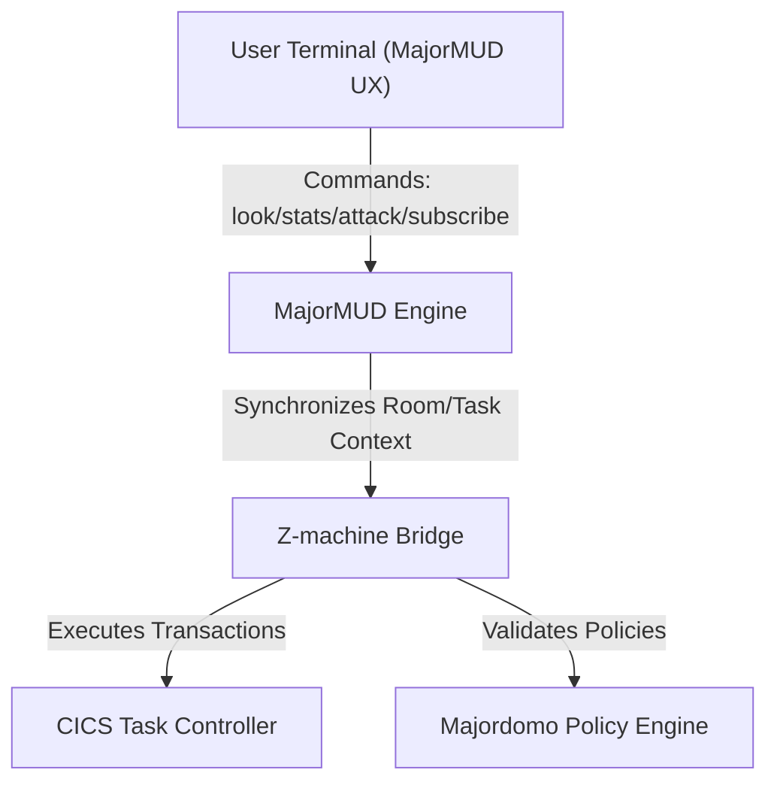

# MajorMUD Z-machine Integration Plan

This plan details the design and deployment strategy for exposing Majordomo mailing list features and CICS task execution controls within the Z-machine terminal space using the MajorMUD text-based interface.

## 1. Architectural Layout

## 2. Interface Bridging Strategy

* **Combat & Hit Physics**: Standard MajorMUD attack inputs translate directly to CICS PMG Abend handlers. Any damage calculations or player respawns trigger corresponding system priority adjustments and suspension resets.
* **Mailing List Entity Interactions**: Subscribing, moderation forwarding, and policy checks are represented as in-game room transitions. Interacting with list objects queries the Majordomo configuration parser.
* **Low-level SCSI/ZMM Mapping**: Movement across coordinate spaces updates low-level Yul virtual registers, translating mathematical transformations into dynamic viewport updates.
