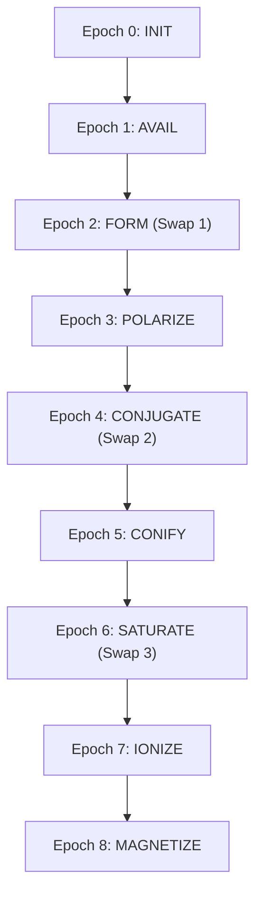

# Storyboard: 9-Epoch Manifold Animation Schema

### Primary Hyper-Photorealistic Keyframe (Epoch 8: MAGNETIZE)

### AI Diffusion Video-to-Video Refined Keyframe POC (Epoch 6)

### AI Diffusion Video-to-Video Refined Keyframe POC (Epoch 5: CONIFY)

### AI Diffusion Video-to-Video Refined Keyframe POC (Epoch 2: FORM Swap)

To accurately capture the transition from random noise to a rigid, magnetized manifold, the animation is modeled as a trilateral wavefield simulation across a 3D grid. This schema outlines the visual, physical, and mathematical states of each of the 9 Helmholtz epochs.

---

## 🎨 Visual System & Aesthetic Tokens

| Token | Role | Color Hex | Visual Metaphor |
| :--- | :--- | :--- | :--- |
| **Rod Field** | Primary Actor | `#39FF14` (Neon Green) | Concentric wave bands, oscillating vertically |
| **Cone Field** | Resonator | `#00F0FF` (Electric Cyan) | Radiating ripple grids, oscillating horizontally |
| **Critical Swap** | Transition Indicator | `#FF3131` (Neon Red) | Intense particle collision/discharge sparks |
| **Magnetized Lock** | Ultimate Rigidity | `#FFD700` (Blinding Gold) | High-contrast, stable, glowing solid state |
| **Substrate Grid** | Manifold Topography | `#121214` to `#24242A` | 11-level Banach-Hilbert grid mesh (512 KiB) |

---

## 🌀 Particle Physics (Verlet Integration)
All transient effects (sparks, dust, and energy flow) are calculated using **Verlet integration** to maintain consistency with the C engine:
$$x_{n+1} = 2x_n - x_{n-1} + a \cdot \Delta t^2$$
*   **Forces ($a$)**: Modulated by the proximity to the Rod/Cone dynamos and the local field amplitude.
*   **Damping**: Low friction during swaps to simulate vacuum entropy; high damping during the Epoch 8 lock.

---

## 🎞️ The 9-Epoch Animation Timeline

### 🎬 Epoch-by-Epoch Visual Script

#### **Epoch 0: INIT (Substrate Initialization)**
*   **Formula**: `Base, Secret, Signal = RANDOM_bn()`
*   **Visual State**: A dark, cold 3D grid representing the 512 KiB memory space. Faint, unorganized noise ripples across the 11 levels.
*   **Animation Details**: Two glowing nodes (Rod and Cone) fade in at opposite corners. They pulse erratically with zero coordination, displaying fluctuating raw hexadecimal strings in the background.

#### **Epoch 1: AVAIL (Wavefield Availability Check)**
*   **Formula**: `Contour = Xi^Secret mod Prime`
*   **Visual State**: A strictly unidirectional, one-way transmission of the external seed `Xi` firing outward towards the nodes.
*   **Animation Details**: Bright directional energy wavefronts shoot from the central `Xi` coordinate directly into Node A and Node B, establishing their initial `Contour` wavefields. There is zero feedback or return channel in this step.

#### **Epoch 2: FORM (First Critical Swap — Contour Exchange)**
*   **Formula**: `Base = Cone->Contour^Secret mod Prime`
*   **Visual State**: The concentric `Contour` rings expand until they collide in the center of the grid.
*   **Animation Details**: At the collision front, particles flash `#FF3131` (Neon Red). The waveforms of the Rod and Cone bend, shifting their base frequencies as they absorb each other's contours.

#### **Epoch 3: POLARIZE (Alignment of Trilateral Poles)**
*   **Formula**: `Pole = Base^Secret mod Prime`
*   **Visual State**: The field transitions from circular waves to linear waveforms.
*   **Animation Details**: The Rod aligns strictly along the Y-axis (glowing green stripes) while the Cone aligns along the X-axis (cyan stripes), creating a vibrant grid intersection pattern.

#### **Epoch 4: CONJUGATE (Second Critical Swap — Pole Exchange)**
*   **Formula**: `Coordinate = Cone->Pole^Secret mod Prime`
*   **Visual State**: A rapid exchange of polarized energy packets along the grid lines.
*   **Animation Details**: Neon sparks zip back and forth between the Rod and Cone poles. When the packets arrive, the respective poles glow with a composite cyan-green aura, representing the calculation of the cross-interference `Coordinate`.

#### **Epoch 5: CONIFY (Fresnel Focal Compression)**
*   **Formula**: `Foundation = Base^Identity mod Prime`
*   **Visual State**: The 11-level grid begins to warp inward, forming a funnel.
*   **Animation Details**: A sweeping camera movement displays the 2048 leaves of the grid compressing toward the center. The background coordinates accelerate downward, concentrating the light into a single point source.

#### **Epoch 6: SATURATE (Third Critical Swap — Foundation Exchange)**
*   **Formula**: `Element = Beta + Limit + Charge`
*   **Visual State**: The point source swells into a dense, high-energy sphere.
*   **Animation Details**: Rod and Cone foundations interlock. Verlet particles are violently ejected outwards in a radial burst as the modular base transitions to the custom base `Element` for both nodes.

#### **Epoch 7: IONIZE (Dielectric Charge Stabilization)**
*   **Formula**: `Dynamo = Base^Signal mod Element`
*   **Visual State**: The sphere stabilizes, and a high-impedance barrier forms between the halves.
*   **Animation Details**: Blue and green arcs of electricity (dielectric stabilization) trace along the boundaries of the grid. The nodes settle into deep, steady vibrations, representing the completed `Dynamo` values.

#### **Epoch 8: MAGNETIZE (Final Trilateral Lock)**
*   **Formula**: `Adduct(Rod, Cone->Dynamo) == Adduct(Cone, Rod->Dynamo)`
*   **Visual State**: Instability collapses; the system becomes static and perfectly rigid.
*   **Animation Details**: The electricity arcs freeze into a golden lattice structure. The entire 512 KiB grid flashes `#FFD700` (Gold) as the homomorphic mirror condition is met. The background hex strings halt, and the manifold glows with absolute, flat illumination.

---

## 🔗 Explicit `Fa` Data Member Routing Matrix

The individual mathematical variables stored inside the `Fa` struct map directly to active visual links, lines, and shapes rendered inside the canvas during execution:

| `Fa` Member | Mathematical Role | Visual Component / Connector | Shape Transition Behavior |
| :--- | :--- | :--- | :--- |
| **`Base`** | Starting coordinate scale | Primary Node centers (Node A/B) | Forms the gravitational anchor pulling particles in. |
| **`Secret`** | Modulo exponent key | Internal node oscillation rate | Modulates the fast noise fluctuations of node halos. |
| **`Signal`** | Exponent for Dynamo seal | High-frequency plasma paths | Sets the thickness/flicker frequency of connecting arcs. |
| **`Contour`** | Result of salt mapping | Expanding concentric wave rings | Expands radially outward until it crosses paths with the mirror node. |
| **`Pole`** | Mutated directional vector | Grid alignment lines (X and Y bands) | Warps the background grid mesh into parallel spatial bands. |
| **`Coordinate`** | Conjoined cross-pole state | Branching fractal lightning paths | Forms the zigzag connections between nodes (Epoch 4). |
| **`Foundation`** | Identity boundary limit | Convergence vortex vectors | Determines the rotation speed of the centripetal funnel (Epoch 5). |
| **`Element`** | Target modular basis prime | Encircling boundary rings | Expands into a protective outer ring surrounding the nodes. |
| **`Dynamo`** | Locked node charge | Neon plasma bridge intensity | Stabilizes the high-frequency plasma bridge between nodes (Epoch 7). |
| **`Monopole`** | System total mass | Gold Associahedron mandala | Unifies all components into a locked golden geometric mandala lattice. |
| **`Barn`** | Magnetization product | Volumetric thermal glow/heat trails | Holds the visual "heat" and thermodynamic glow during structural locking (Epoch 8). |

### 📈 Structural Connectivity Progression

1. **Disconnected Noise (Epoch 0 - 1)**: Independent `Base` and `Secret` fields exist as separate, floating point-charge nodes.
2. **First Interaction Seam (Epoch 2)**: The cross-exchange of `Contour` forms a flat vertical dividing wall in the center of the grid, sorting particles to either side.
3. **Orthogonal Grid Alignment (Epoch 3 - 4)**: The alignment of `Pole` forms a grid lattice of overlapping parallel lines. The computation of `Coordinate` causes fractal arcs to snap between the grids, bridging the spatial gap.
4. **Vortex Convergence (Epoch 5)**: `Foundation` warps 2D parallel coordinate lines into a 3D spiral funnel, drawing all particles into a singular central point.
5. **Polygonal Lock (Epoch 6 - 8)**: The customized `Element` bases build outer structural bounding loops, which finally crystallize under the `Monopole` verification into nested golden concentric hexagons, locking the Verlet particles onto fixed orbits.

---
> [!NOTE]
> When rendering this sequence, the animation duration of the "Critical Swap" frames (Epochs 2, 4, and 6) should be compressed to create a rhythmic, mechanical tempo that matches the 170 BPM system pulse.

