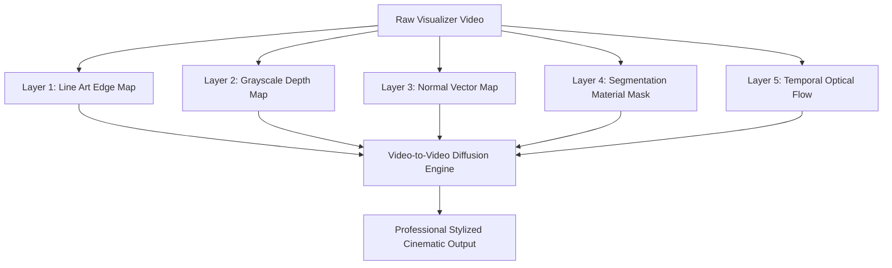

# AI Diffusion Guidance Layers Spec

To achieve maximum temporal stability and high-fidelity rendering during Video-to-Video AI Diffusion, you must generate and supply separate **ControlNet Guidance Layers** (Render Channels). These act as explicit structures that direct the AI where to place details, materials, and lighting.

---

## 🎨 The 5 Core Guidance Layers

### 1. Line Art / Outline Layer (`ControlNet LineArt`)
*   **Visual Form**: High-contrast, single-pixel black lines on a white background (or inverted).
*   **Purpose**: Locks the shapes of the `Fa` components (Triangle cores, Diamond channels, Hexagonal cages) in place. Prevents the geometric shapes from melting, warping, or drifting between frames during GFX1201 wavefront execution.
*   **Implementation**: Extracted using a Sobel filter on the canvas drawing paths mapped directly from the WinchesterMQ register states.

### 2. Depth Map / Z-Buffer Layer (`ControlNet Depth`)
*   **Visual Form**: Grayscale map where white represents proximity (nearest) and black represents empty space (farthest).
*   **Purpose**: Tells the AI the 3D depth placement of elements. Allows the diffusion model to compute:
    *   **Volumetric Fog & Bloom**: Glowing particles dispersing behind or in front of the nodes during a stochastic avalanche.
    *   **Ambient Occlusion**: Realistic shadows where overlapping elements converge (e.g. where the lightning arcs connect to the node).
*   **Implementation**: Rod and Cone centers are set to near-white (`#FFFFFF`), grid lines representing the Motzkin Prime field grid set to a dark gray (`#222222`), and background particles scale dynamically based on their size.

### 3. Normal Map Layer (`ControlNet Normal`)
*   **Visual Form**: RGB vector map indicating surface direction facing (Red = X-axis, Green = Y-axis, Blue = Z-axis facing).
*   **Purpose**: Enables the AI to render realistic metallic surfaces and dynamic reflections. When lighting shifts (e.g., during the Epoch 4 dielectric resolution swap), the AI uses the normal map to reflect the red flash off the sides of the green and cyan nodes.
*   **Implementation**: Derived mathematically by treating the opaque foundation circles as spheres/capsules running on the helmholtz list scheduler.

### 4. Segmentation Mask / Color ID Layer (`ControlNet Seg`)
*   **Visual Form**: Flat, solid color blocks (e.g., Node A = Solid Blue, Node B = Solid Yellow, Grid = Solid Green).
*   **Purpose**: Explicitly maps materials. The AI parses the color codes to apply specific textures matching our hardware layout:
    *   *Blue Mask* $\rightarrow$ "corroded copper wiring routed via LauWireLog ring buffers"
    *   *Yellow Mask* $\rightarrow$ "brushed carbon fiber casing with Biotika Alpha drawbar textures"
    *   *Green Mask* $\rightarrow$ "polished slate dashboard calibrated for Fomalhaut flare star tracking"
*   **Implementation**: Rendered by assigning unique solid color layers to each structural component type during drawing.

### 5. Temporal Optical Flow Map
*   **Visual Form**: Vector field indicating pixel movement direction and velocity between frame $t$ and frame $t+1$.
*   **Purpose**: Suppresses the high-frequency temporal flicker (boiling effect) common in AI video generation, ensuring smooth drift velocity.
*   **Implementation**: Generated using Farneback optical flow estimation on the compiled frame sequence.

## 💎 The Law of Cryptographic Mass vs. Topological Connectivity

All rendering layers adhere to a strict structural law:
*   **Cryptographic Mass (SHA-backed nodes)**: Wherever a component possesses one or more SHA hashes (such as the Rod, Cone, and Fomalhaute addresses), it represents physical **mass and matter**. The AI interprets these as solid, high-detail mechanical casing materials (brushed steel, copper coils).
*   **Topological Connectivity (The Grid & Arcs)**: The remaining grid coordinates and transfer lines possess no hashes and represent pure **connections and functioning order**. The AI renders these as transient energy fields, vector guidelines, and glowing plasma arcs.

## ⛓️ Mappings for Core Auncient Manifold Parameters

To ensure the AI Video-to-Video diffusion engine interprets the photorealistic layers with absolute precision, the core Auncient parameters map directly to specific rendering features and channels:

*   **`Base`**: Extracted in the **Depth Map** as the foundational 3D coordinate gravitational anchor of each node, establishing the central luminance point.
*   **`Signal`**: Renders as high-frequency flickering vector sparks inside the **LineArt** and **Temporal Optical Flow** layers, defining electrical arc velocity and thickness.
*   **`Foundation`**: Forms the centrifugal convergence warp vectors in the **Depth Map**, guiding the centripetal funnel vortex layout.
*   **`Manifold`**: Dictates the global lighting intensity and 3D structural perspective scale of the substrate grid across all five guidance layers.
*   **`Ring`**: Governs the concentric gold mandala lattice boundaries rendered in the **Segmentation Mask** and **LineArt** layers.
*   **`Barn`**: The thermodynamic anchor where the "heat" is held when the system undergoes magnetization. Renders as an intense thermal glow / volumetric heat distortion (the sensory "heat" of the trilateral lock) in the **Normal Map** and LFO displacement maps.
*   **`Channel`**: Outlined in **LineArt** as the outer diamond corridors that route energy between node nodes.
*   **`Identity`**: The mathematical threshold that defines the boundary layers in the **Segmentation Mask**, determining where node casing transitions to empty space.

---

> [!TIP]
> When compiling these layers using FFmpeg, ensure they are rendered into the same container with identical frame counts and zero variable frame rate settings. Any minor frame offset between layers will cause the ControlNet projection to misalign and produce heavy visual artifacting.
