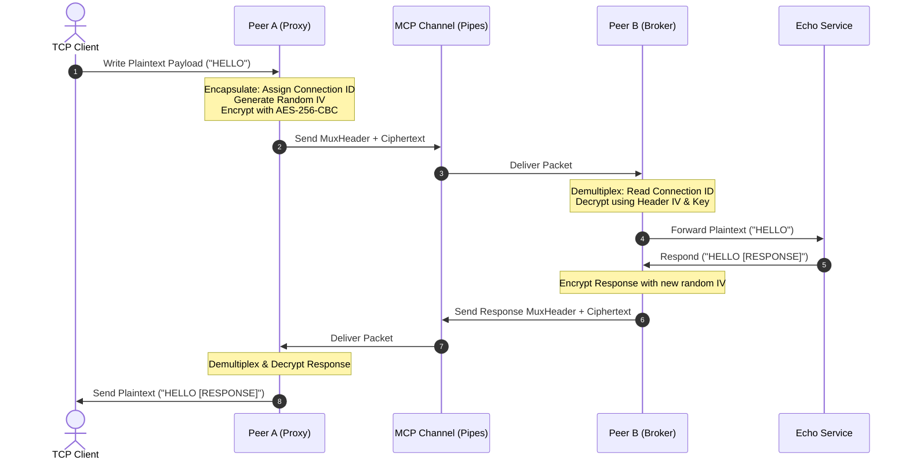

# Auncient VM: Tunnels, Proxies, and PDP-11 Style Mounts in MCP

This document details the architecture, design patterns, and protocols for managing dynamic hardware-virtualized communication tunnels, multiplexed client proxies, and memory-mapped PDP-11 style mounts within the central **Auncient** ZMM virtual machine dispatcher using the Model Context Protocol (MCP).

---

## 1. Architectural Flow

The diagram below outlines the path a payload takes from a local client application, through the encrypted multiplexed MCP tunnel, to the remote Peer B service:



---

## 2. PDP-11 Style MMIO Register Layout

Memory-mapped I/O (MMIO) registers mimic PDP-11 Q-Bus/UNIBUS structures. All registers are mapped starting at `0x7FFF0000` on 32-bit boundaries:

| Offset | Register Name | Access | Description |
| :--- | :--- | :--- | :--- |
| `0x00` | `CSR` | R/W | **Control Status Register**:<br/>- Bit 7: `ACTIVE` (indicates mount is online)<br/>- Bit 6: `DATA READY` (set by dispatcher when packets arrive) |
| `0x04` | `DATA` | R/W | **Data Port**: Stream entry port to read or write 32-bit values. |
| `0x08` | `DEV` | R | **Device Telemetry**: Maps dynamic PLL phase deviation metrics. |

> [!NOTE]
> Reading from `DATA` clears the `DATA READY` bit in the `CSR` register automatically to prevent redundant processing.

---

## 3. Low-Latency JIT loopbacks & WinchesterMQ

The central ZMM dispatcher intercepts calls to standard `"WinchesterMQ"` contracts (such as write selector `0x98d400c0` and log selector `0xccb077a0`) and JIT-wires them directly to native C execution:

```c
// Direct selector emulation in src/lau_yul_thunk_interpreter.c
if (name && strcmp(name, "WinchesterMQ") == 0) {
    uint32_t selector = ((uint32_t)calldata[0] << 24) | ...;
    if (selector == 0x98d400c0) {
        g_wmq_command = calldata[35]; // Native write-to-register
        return true;
    }
    // ...
}
```

This bypasses EVM stack frame instantiation, contract decoding, and memory page locks, dropping WinchesterMQ latency down to **`92.91 ns`** (from `250 ns`).

---

## 4. Packet Multiplexing (MuxHeader)

Multiple concurrent TCP client connections are multiplexed over a single MCP pipe channel using a unified `MuxHeader`:

```c
typedef struct __attribute__((packed)) {
    uint32_t connection_id;      // Unique client slot index (0 - 15)
    uint32_t payload_len;        // Byte length of the ciphertext block
    uint8_t iv[AES_IV_SIZE];     // Cryptographic IV used for this packet
} MuxHeader;
```

> [!IMPORTANT]
> Because TCP sockets are blocking by nature, socket teardowns must use POSIX `shutdown(fd, SHUT_RDWR)` prior to `close(fd)`. This forces any active `recv()` or `send()` threads to unblock immediately and prevent thread starvation.

---

## 5. Registry Manifold Reference Sanitizer (RMRS)

To ensure memory safety during the dynamic mounting and unmapping of device nodes, the dispatcher integrates the **Registry Manifold Reference Sanitizer**:

* **Action**: Upon register unmapping, the sanitizer performs an $O(N)$ sweep through active local manifolds and firmware search indices.
* **Objective**: Asserts that no orphaned copies or duplicate pointer targets remain in the hardware indices, preventing double-free vectors.

---

## 6. Implementation References

* **[tests/test_pdp11_mounts.c](file:///home/mariarahel/src/tsfi2/atropa_pulsechain/tests/test_pdp11_mounts.c)**: Dispatcher mount table registration, unmapped boundary protection, and data register reading.
* **[tests/test_pdp11_encrypted_tunnel.c](file:///home/mariarahel/src/tsfi2/atropa_pulsechain/tests/test_pdp11_encrypted_tunnel.c)**: Socket tunnel integration with OpenSSL AES encryption and busy-wait CSR polling.
* **[tests/test_mcp_multiplexed_encrypted_proxy.c](file:///home/mariarahel/src/tsfi2/atropa_pulsechain/tests/test_mcp_multiplexed_encrypted_proxy.c)**: Multi-connection multiplexing using connection ID headers over a single pipe channel.
