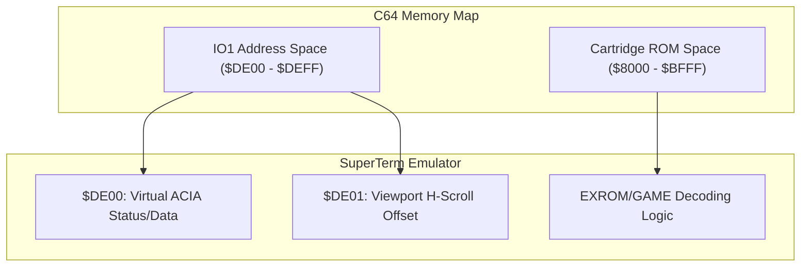

# Midwest Micro Associates: SuperTerm Cartridge Emulation Design Blueprint

This document specifies the integration architecture to emulate the **SuperTerm** cartridge hardware, 80/132-column side-scrolling screen memory, offline text editing buffer, and parallel print interface ("Sprinter") from **Midwest Micro, Inc.** on our virtual Yul EVM platform.

---

## 1. Cartridge Port Hardware Interface Emulation

The original SuperTerm was distributed with a dedicated physical cartridge. The cartridge mapped custom control ROM banks and hardware expansions to C64 memory spaces:

- **EPROM Address Mapping**: Maps a 16KB system control ROM to standard cartridge locations `$8000`–`$BFFF` (8K/16K ROM Mode) configured by setting control lines `EXROM=0` and `GAME=1` inside the EVM's memory map control registers.
- **Hardware Register Mapping**:
  - The cartridge incorporates custom memory-mapped IO registers at `$DE00`–`$DEFF` (C64 IO Address Space 1) to regulate hardware configurations:
    - `$DE00`: Handshake register interfacing with the virtual terminal serial line (ACIA status emulation).
    - `$DE01`: Side-scrolling offset register (controls window offsets for 80/132-column emulation).



---

## 2. 80-Column and 132-Column Side-Scrolling Framebuffer

SuperTerm supported displaying virtual 80-column and 132-column text widths on standard C64 40-column screens using interactive horizontal scrolling:

- **Virtual Grid Layout**:
  - Virtual text grids are sized to $80 \times 25$ or $132 \times 25$ characters in high-resolution memory.
- **Side-Scrolling Renderer**:
  - The viewport position shifts left or right based on the cursor position or user command inputs.
  - The software renderer reads the offset register `$DE01` to project a subset window onto the physical $40 \times 25$ character grid (or our native 1280x720 Wayland screen space).
  - Intercepting the scrolling offset allows our Wayland client to automatically render the active portion of the wide text grid.

---

## 3. Offline Buffer Text Editor Integration

SuperTerm featured an offline text buffer editor storing up to 18.4KB of offline communications:

- **Buffer Mapping**: Mapped to RAM address space `$1000`–`$5800` in the EVM environment.
- **Command Capture**:
  - Our Wayland terminal parser translates keystrokes to offline character buffers when the system enters offline mode (e.g. typing offline text edits).
  - Buffered content can be piped to the transmission channel using standard transfer protocol simulators (CBM, Xon-Xoff).

---

## 4. Midwest Micro "Sprinter" Printer Interface

The cartridge interface allowed connection to the "Sprinter" accessory to enable simultaneous logging to a parallel printer:

- **Printer Address Hook**: Emulates a parallel Centronics-compatible port interface mapped to user port registers (`$DD01`).
- **Printer Logging**:
  - Characters written to `$DD01` are captured by our console logger and written directly to a local text file `artifacts/sprinter_output.log`, simulating continuous print log output.

---

## 5. Deployment and Verification Command

To test the virtual Midwest Micro SuperTerm ROM boot sequence inside our terminal emulator, run:

```bash
./bin/test_wayland_terminal_shell --load-rom plugins/superterm_c64.bin
```
