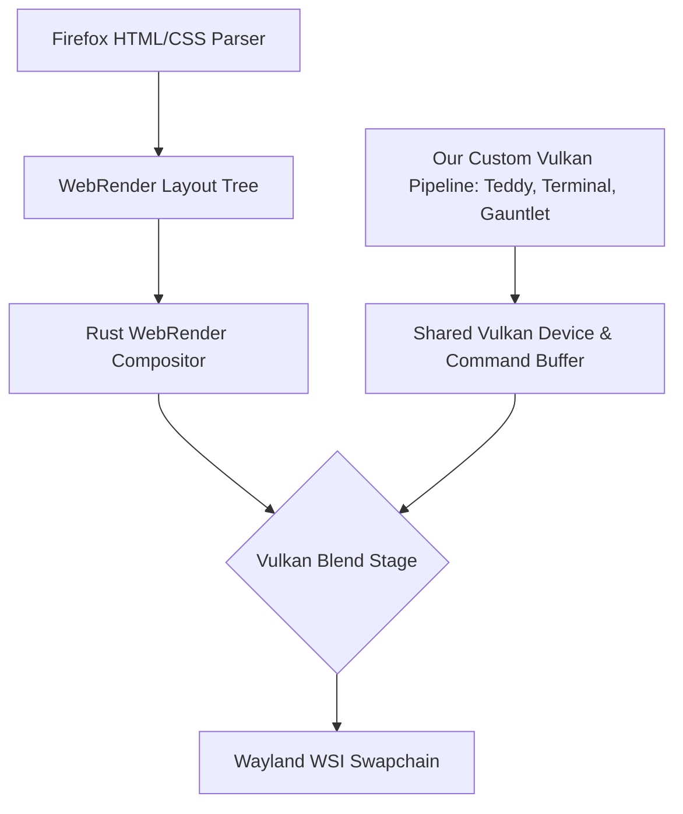

# Mozilla Vulkan/Wayland Integration Plan

This document outlines the architecture for integrating our native **Auncient** Wayland Vulkan technologies directly inside the Mozilla Firefox rendering pipeline.

## 1. Current Technologies to Port
Our existing native rendering demos located in `tsfi2-deepseek` include:
*   **Wayland Terminal Shell (`test_wayland_terminal_shell.c`):** Renders an interactive shell interface directly using raw pixel buffers.
*   **Vulkan Teddy Bear Generator (`test_vulkan_teddy.c`):** Headless and windowed 3D mesh rendering using Vulkan pipelines.
*   **Gauntlet / Lunar Lander / Space War:** Standard 2D vector game loops.

## 2. Mozilla Integration Architecture

Since the Firefox compositor (**WebRender**) is written in Rust and manages the GPU swapchain natively, we can integrate our custom Vulkan pipeline at two distinct levels:

### Level 1: WebRender Custom Render Tasks (Texture Injection)
We can inject our Vulkan drawing passes directly into WebRender's pipeline as external textures:
1. **Shared Vulkan Context:** Initialize our Vulkan resources (Teddy pipeline, Terminal buffers) using the same Vulkan Logical Device (`VkDevice`) as WebRender.
2. **External Image Rendering:** Render the 3D teddy bear or terminal grid to a Vulkan offscreen texture.
3. **Texture Mapping:** Pass the texture handle (`VkImage`) to WebRender via its External Image API (`wr_notifier` and `ExternalImageHandler` in Rust/C++ glue). The browser then renders our content inside a standard HTML element container.

### Level 2: Compositor Blending (Direct Window Overlay)
If we want our terminal or gauntlet to overlay the entire browser window:
1. **Intercept Present Pass:** Hook into Firefox's Wayland Windowing System Integration (`nsWindowWayland.cpp`).
2. **Command Buffer Recording:** Record our Vulkan draw commands (drawing the terminal border or gauntlet UI) directly into the main render command buffer before presenting to the Wayland surface.

## 3. Implementation Steps
1. **Await Clone Completion:** Wait for the shallow clone of `gecko-dev` to finish.
2. **Locate GFX Integration Points:** Map out the exact C++/Rust files in Firefox handling Vulkan instance creation (`gfx/thebes/`, `gfx/webrender/`).
3. **Write Vulkan Compositor Hook:** Implement the Vulkan texture sharing and drawing calls within the layout loops.
