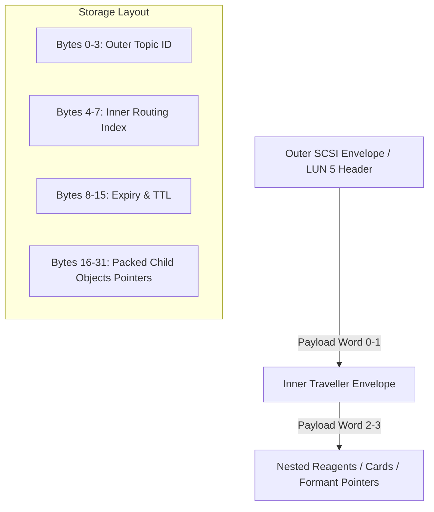

# Architectural Specification: Nested Envelopes in WinchesterMQ

To support complex routing slips and dynamic container hierarchy inside the **Auncient** `WinchesterMQ` messaging broker, we implement **Nested Envelopes**. This allows a message packet to serve as both a traveller (in transit) and a nested container (carrying interior sub-messages or reagents).

---

## 1. Structural Layout of Nested Envelopes

A nested message block is formatted as a 512-bit dual-word structure within the ZMM VM cache:

### Word 0: Outer Envelope (Routing Header)
*   **Bytes 0-3 (`Outer Topic ID`)**: The outer layer parsed by `performTopicFanOut` for LUN-level distribution.
*   **Bytes 4-5 (`Outer Priority & Flags`)**: TTL limits and priority tags for the transport layer.
*   **Bytes 6-7 (`Hop Counter`)**: Track current LUN index in routing slippage.

### Word 1: Inner Envelope (The Container Carrier)
*   **Bytes 8-11 (`Inner Topic ID`)**: Evaluated once the outer envelope is stripped/consumed at the destination LUN.
*   **Bytes 12-15 (`Parent Object ID`)**: Points to the primary container card.
*   **Bytes 16-31 (`Correlation & Child Keys`)**: Dynamic pointers mapping to nested child elements (e.g. alchemical reagents or secondary message payloads).

---

## 2. Low-Level Yul Execution Path (`WinchesterMQ.yul`)

When processing a nested message transfer:

1.  **Outer Resolution**:
    *   The SCSI engine retrieves `word0` and routes it to `destLun` based on the outer subscriber mapping.
2.  **Inner Extraction (Unwrapping)**:
    *   The recipient processes the message, extracts `word1`, and executes `moveObject(innerEnvelope, destCard)` to nest the child payload in the local room database.
3.  **Visual/Audio Feedback**:
    *   Formant filters shift dynamically based on the nesting depth (e.g., secondary formant filters pan relative to the inner coordinate offset).

---

> [!NOTE]
> By nesting envelopes, the SCSI messaging system can pass entire folders of state data as single transaction frames, preserving the strict structural integrity required by the ZMM VM.

