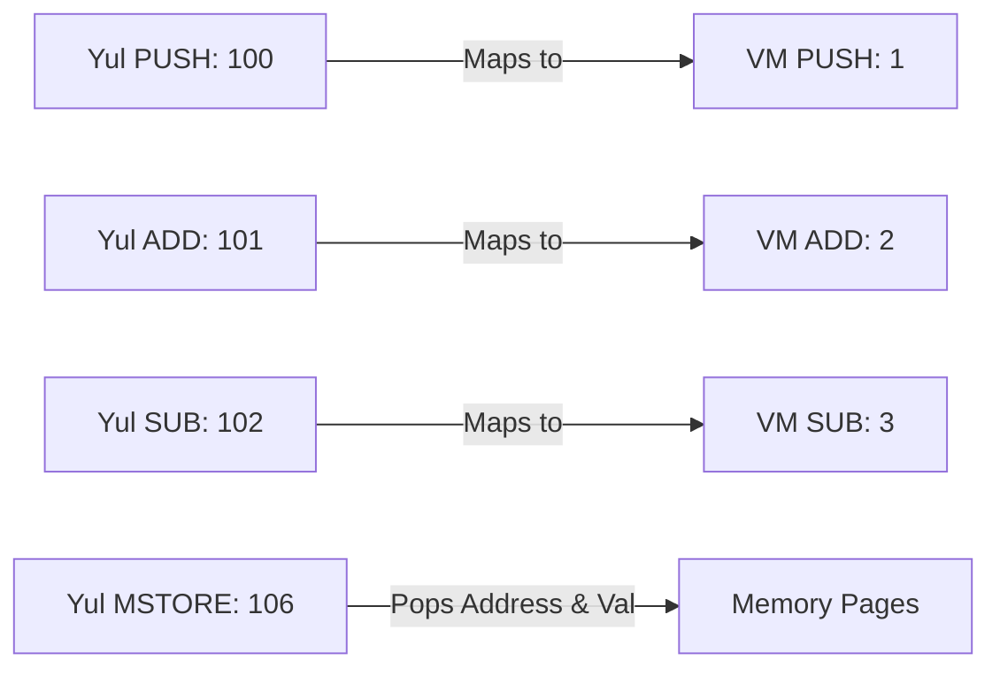
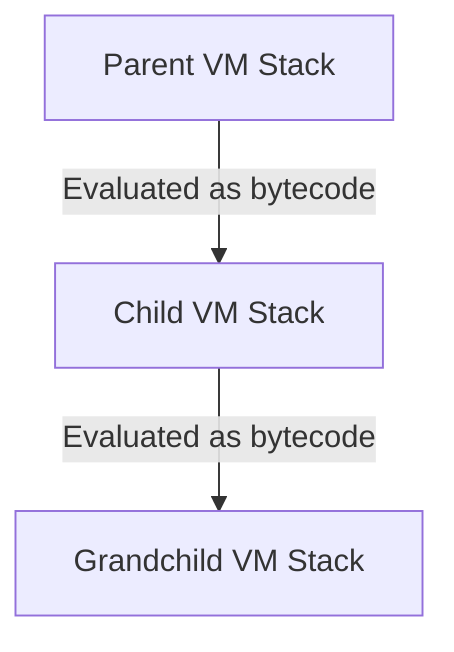

# EVM-on-BTC Nested Stack Machine Emulation

This document details the architecture, translation rules, and verification mechanics of the EVM-compatible dual-stack BTC Script VM system running within the Auncient VM layout.

---

## 1. Virtual Machine Registers & Tripartite Context

*   **VM Register Context**: The 2-stack execution structure manages two state arrays (`stack` and `altstack`) coupled with a program counter (`pc`) and halt state register (`halted`).
*   **Mathematical Function**: The system maps tape shifts mathematically as topological movements across Cartesian coordinates.
*   **Visual / Geometric Manifestation**: States map to projected orbital lines, modulating rendering opacity and coordinate twists.

---

## 2. 2-Stack Virtual Machine Execution Model

The VM implements a dual-stack configuration where `stack` serves as the primary evaluation stack and `altstack` acts as the alternate buffer, mirroring the Bitcoin Script architecture:

| Opcode | Mnemonic | Description |
|---|---|---|
| `1` | `PUSH` | Pushes the immediate 32-bit integer operand onto `stack`. |
| `2` | `ADD` | Pops two items, pushes their sum to `stack`. |
| `3` | `SUB` | Pops two items, pushes their difference to `stack`. |
| `4` | `TOALTSTACK` | Pops from `stack`, pushes to `altstack` (`OP_TOALTSTACK`). |
| `5` | `FROMALTSTACK`| Pops from `altstack`, pushes to `stack` (`OP_FROMALTSTACK`). |
| `6` | `HALT` | Stops execution cycle. |

---

## 3. Yul Intermediate Representation Translation

EVM-compatible Yul objects are translated directly to BTC stack actions using opcode mappings:



### Yul Memory Page Resolution
Memory operations (`MSTORE`) write key-value pairs directly to simulated memory page mappings. Memory state correctness is formally verified using:
$$\mathbf{VerifyMemory}(\text{Pages}, \text{Addr}, \text{ExpectedVal}) \iff \text{Pages}[\text{Addr}] == \text{ExpectedVal}$$

---

## 4. Recursive Virtualization (Arbitrary Depth Emulation)

Stack virtualization enables embedding stack machines at arbitrary depth. The parent VM stack elements are evaluated recursively as bytecode instructions by the child VM:



*   **Nested Structure (`InteropNestedVM`)**:
    ```c
    typedef struct InteropNestedVM {
        InteropStackVM vm;
        struct InteropNestedVM *child;
        int depth;
    } InteropNestedVM;
    ```
*   **Recursive Transition Function (`interop_vm_recursive_execute`)**:
    Executes current level bytecode, then passes the resulting stack as bytecode down to the child VM.
