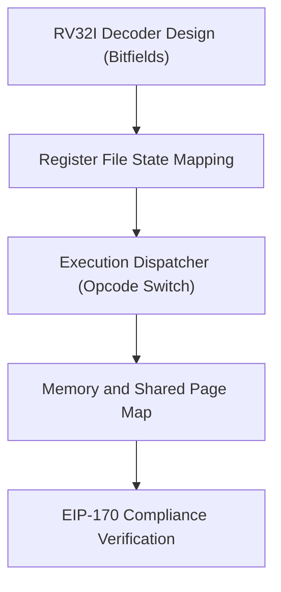

# Next-Generation On-Chain Emulator Architecture: Feasibility Study

Under EVM execution constraints, the primary blocker for next-generation 16-bit or 32-bit emulators is **EIP-170**, which limits smart contract size to **24,576 bytes** (24KB). This document analyzes candidate architectures and outlines a design strategy for a compact, gas-efficient interpreter in Yul.

---

## 1. Candidate Comparison & Bytecode Footprints

| Architecture | Word Size | Opcode Space / Instruction Count | Addressing Modes | Estimated Yul Bytecode Size | EVM Fit |
| :--- | :--- | :--- | :--- | :--- | :--- |
| **6502 / 6509** | 8-bit | ~150 instructions (incl. undocumented) | 13 modes | ~16KB - 20KB | **Passes** (Tight) |
| **RISC-V (RV32I)** | 32-bit | **40 instructions** (base integer set) | 1 mode (Register-Register/Immediate) | **~6KB - 10KB** | **Optimal Pass** |
| **Zilog Z80** | 8-bit | ~1,000+ combinations (prefixed CB/DD/ED/FD) | 10+ modes | ~35KB - 50KB | **Fails** (Requires splitting) |
| **Motorola 68000** | 16/32-bit | ~100+ instructions, massive orthogonal variations | 14 modes (incl. post-inc/pre-dec) | ~50KB - 80KB | **Fails** (Requires splitting) |
| **Intel 8086** | 16-bit | ~120 instructions + complex ModR/M byte | Segmented (CS, DS, SS, ES) | ~40KB - 60KB | **Fails** (Requires splitting) |

### Key Findings:
- **RISC-V (RV32I)** is exceptionally compact due to its fixed-length instruction encoding (all instructions are 32-bit words) and a minimal instruction set (only 40 base instructions).
- **Z80 and m68k** suffer from massive instruction count and complex decode paths (variable byte sizes, extensive flag registers, orthogonal addressing modes) that yield large, duplicate ASTs in Yul compiler outputs.

---

## 2. Next-Gen Architecture: The RISC-V (RV32I) On-Chain design

The RV32I base integer instruction set can be split into 6 instruction formats: **R-type, I-type, S-type, B-type, U-type, and J-type**. All use uniform positions for the source registers (`rs1`, `rs2`) and destination register (`rd`), which makes instruction decoding a zero-overhead bitmask in Yul.

### 2.1 Unified Bitfield Decode Strategy
Because RISC-V registers and immediate offsets align perfectly across instructions, we can decode all components in just a few Yul instructions before dispatching the opcode switch:

```yul
let instr := readMemory32(pc)
let opcode := and(instr, 0x7F)
let rd := and(shr(7, instr), 0x1F)
let funct3 := and(shr(12, instr), 0x07)
let rs1 := and(shr(15, instr), 0x1F)
let rs2 := and(shr(20, instr), 0x1F)
let funct7 := and(shr(25, instr), 0x7F)

// Immediate extraction (sign extension is done efficiently in Yul via arithmetic shifts)
let immI := sar(20, instr) // I-type immediate
```

### 2.2 Register Mapping in EVM Storage
Rather than using 32 separate storage slots for the integer registers `x0`-`x31`, we map them into a contiguous 256-bit word (`sstore` slot) or a simple storage array to reduce execution storage writes:

- **Register `x0`**: Hardwired to `0`.
- **Registers `x1`–`x31`**: Dynamically mapped. Under Yul execution, they can be cached in EVM memory (e.g., at offset `0x200` to `0x3FF`), loaded at the start of `runSteps`, and committed to storage in a single batch write at transaction end.

---

## 3. Implementation Milestones



1. **Decoder Stage**: Write a compact bitmask-based decoder in Yul that parses opcodes and immediates with zero lookup tables.
2. **Interpreter Stage**: Implement the execution loop for memory-resident instructions.
3. **Optimized Shared Page Access**: Adapt the namespaced bypass logic (pioneered in the C64 shared screen register `$D50D`) to support collaborative multi-user memory maps directly on the RV32I bus.
