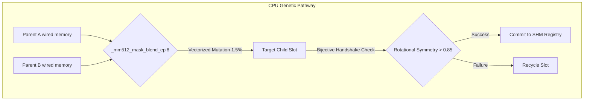
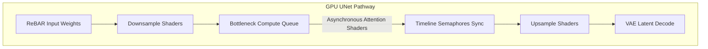
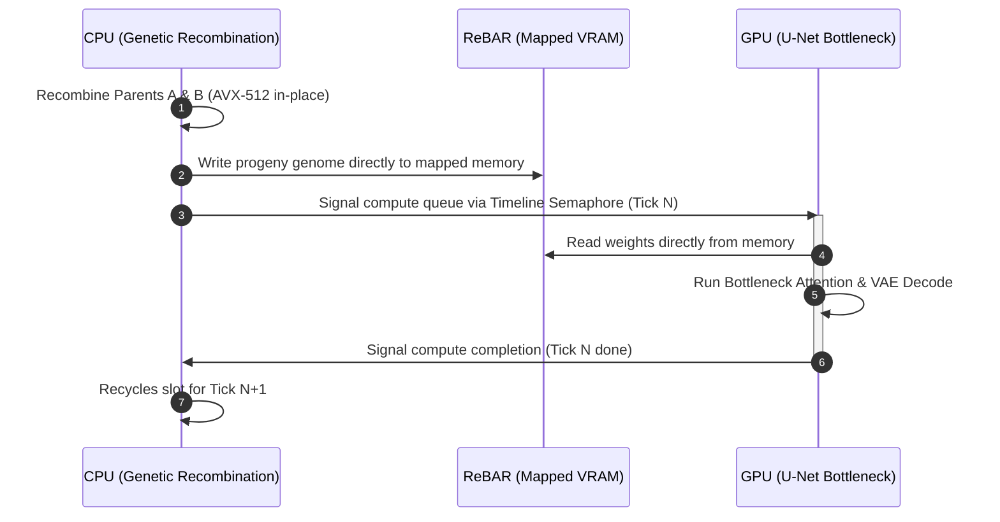

# TSFi Dual-Pathway Performance Analysis

This document provides a comparative analysis of the off-chain CPU Genetic Recombination pathway and the GPU U-Net Attention Bottleneck pathway, illustrating their latency boundaries, synchronization checkpoints, and physical memory interconnects.

---

## Pathway Comparison Overview

| Metric / Dimension | Pathway A: CPU Genetic Recombination | Pathway B: GPU U-Net Middle Block |
| :--- | :--- | :--- |
| **Execution Domain** | CPU: Multi-threaded host cores using OpenMP thread pool mapped directly to NUMA domains. | GPU: Vulkan Compute pipeline dispatched over asynchronous compute queues on AMD Radeon GFX1201 hardware. |
| **Primary Operations** | Uniform Crossover (AVX-512 byte-level blending), LCG pseudo-random mutation, and BigInt modular exponentiation math. | Spatial Feature Downsampling, Self/Cross-Attention matrix multiplications, and latent feature upsampling layers. |
| **Vectorization Scheme** | AVX-512 (using 512-bit ZMM registers, masking registers k0-k7, and `_mm512_mask_blend_epi8` intrinsics). | Vulkan Shaders mapped to Wave64 execution mode, using subgroup instructions (`subgroupAdd`, `subgroupBroadcast`) for fast reduction. |
| **Memory Boundaries** | Host RAM wired pages (`lau_malloc_wired`) bypassing the OS page table updates and preventing TLB evictions. | VRAM Device-Local memory bound directly to GPU compute pipeline, optimized for L2 Cache Line hit rates (64-byte alignment). |
| **Bottleneck Source** | Host heap allocation locking overhead and page table traversal during high-frequency object spawning. | PCIe bandwidth walls, GPU local memory bus saturation (VRAM bandwidth), and compute queue synchronization latency. |
| **Throughput / Latency** | **~16,062 ops/sec** (~62.26 µs dispatch latency per active evolution tick). | **~1.02 iterations/sec** (~978 ms latency per 720p frame denoise pipeline). |
| **Optimization Method** | In-place zero-copy slot recycling, static allocation mapping, and SIMD-aligned buffer structures. | FP16 weight caching, Resizable BAR (ReBAR) memory segment mappings, and timeline semaphore queue synchronizations. |

---

## Pathway A: CPU Genetic Recombination (Off-Chain Evolution)

The genetic engine operates on bytecode strings and numerical big integer registers (`Xi` and `Psi`) representing the algorithmic genomes.

### Key Parameters
* **Byte Recombination**: Performed in $64$-byte chunks using AVX-512 register masking. 
* **Mutation Pipeline**: Vectorized LCG PRNG applying sparse mutations and restricting bytes to valid ASCII codes ($33$-$127$) to preserve syntax integrity.
* **Wired Allocation**: Uses `lau_malloc_wired` to bypass OS paging tables and lock pages directly into physical RAM.

---

## Pathway B: GPU U-Net Attention Bottleneck (Inference)

The U-Net middle block contains high-dimensional channel vectors (1280 channels) that perform spatial attention matching.

### Key Parameters
* **Timeline Semaphores**: Vulkan compute queue submissions are queued asynchronously. Shaders are triggered back-to-back as soon as the previous GPU stage signals completion.
* **Precision Profile**: Shifting weights to FP16 reduces VRAM memory bus traffic from the text-encoder and U-Net layers by $50\%$.

---

## Inter-Pathway Synchronization: Zero-Copy ReBAR

The connection between these two pathways is coordinated via **Resizable BAR (ReBAR)**, mapping the GPU's memory address space directly to the CPU's memory bus.

> [!NOTE]
> Utilizing this zero-copy pathway eliminates PCIe transit serialization overhead, allowing GPU inference and CPU mutation to run concurrently on the same memory segment.
