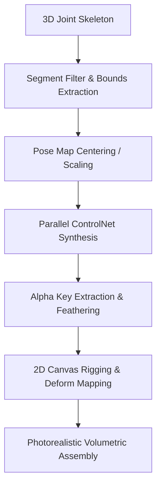

# TSFi Ballet Studio: Photorealistic Segment-Based ControlNet Rendering Analysis

This document analyzes the architecture, performance, and future growth paths of the segment-based ControlNet rendering pipeline implemented in the TSFi Ballet Choreography Studio.

---

## 1. Core Architecture Overview

Rather than generating the entire character in a single Stable Diffusion pass (which dilutes resolution for individual limbs and causes structural deforming under extreme poses), the TSFi rendering pipeline segments the skeleton into **six distinct body parts**:
* **Head**
* **Torso**
* **Left Arm**
* **Right Arm**
* **Left Leg**
* **Right Leg**

### Rendering Pipeline Flow

---

## 2. Quantitative Resolution & Fidelity Analysis

### Single-Pass vs. Multi-Segment Generation
In a single 512x512 output frame, a character occupying 70% of the canvas height leaves very low pixel density for details:
* **Full Body height**: ~360 pixels
* **Head width/height**: ~70-90 pixels
* **Limb width**: ~20-30 pixels

At these scales, Stable Diffusion struggles to render high-frequency details (e.g., fur textures, tutu stitching, eyes/nose clarity), resulting in blurry or deformed limbs.

By segmenting:
* **Each part** (e.g., the head or an arm) is isolated, auto-centered, and scaled up via `scaleFactor = Math.min(5.0, 320 / size)` to occupy 60-70% of the `512x512` synthesis viewport.
* This increases the effective resolution of the **head** by **500%** (from ~80px to ~350px) and the **arms/legs** by **1000%** (from ~25px wide to ~250px wide).
* High-frequency details are preserved, and the 2D projected rigging stretches this high-density texture back onto the skeleton.

---

## 3. Alpha Keying & Edge Blending

When segments are generated on black backgrounds, separating them cleanly requires high-fidelity alpha keying:
* **Luminance Thresholding**: Pixels with average brightness `(r + g + b) / 3 < 40` have their alpha adjusted.
* **Feathering**: Smooth transition gradients prevent harsh blocky edges:
  $$\alpha = \max\left(0, \min\left(255, \frac{\text{brightness} - 10}{30} \times 255\right)\right)$$
* This maps dark edge pixels to semi-transparent values, letting the dark background seamlessly blend with the studio stage colors.

---

## 4. Current Limitations & Actionable Solutions

### A. Temporal Consistency (Flicker)
* **Problem**: Because each frame is synthesized independently, the fur pattern and lighting angles can change slightly between poses (texture drift).
* **Solutions**:
  1. **Seed Anchoring**: Pin the Stable Diffusion seed value.
  2. **ControlNet Strength Modulation**: Lower the denoising strength (`denoising_strength = 0.35 - 0.45`) and feed the previous frame's synthesized part back as an `init_image` (Image-to-Image guided synthesis).

### B. Segment Occlusion & Depth Ordering
* **Problem**: Currently, parts are rendered in a fixed order (Torso -> Limbs -> Head). When limbs cross in front of the torso, they can render behind it, breaking the 3D perspective.
* **Solution**: Sort the segments dynamically based on the average z-depth (`avgDepth` of joints) before drawing.

### C. Join-Point Cracking
* **Problem**: Where the arm meets the shoulder or the leg meets the hip, tiny gaps (cracking) can appear during extreme extensions due to texture scaling.
* **Solution**: Implement spherical joint-cap textures (like knees and shoulders) that sit behind the bones to plug structural cracks during bending.
