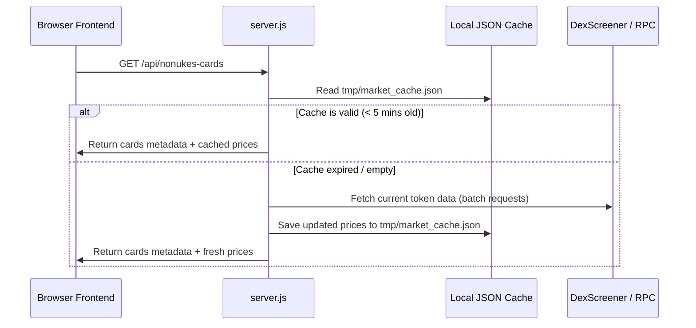

# Integration Plan: USD Price & Liquidity Data for Partner Cards

This plan outlines the architecture, data retrieval pathways, caching strategy, and frontend UI changes to incorporate live USD prices and liquidity statistics into the NoNukes partner card DApp.

---

## 1. Data Retrieval Pathways

To fetch USD price and liquidity (TVL) data for each token address (e.g. `0x008fc4bbb1998bfee060f780be7688f0cec66bff`), we have two primary approaches:

### Pathway A: Off-Chain Indexer API (Recommended for Performance)
Using the public **DexScreener API** is highly performant and provides aggregated price and liquidity stats across all pools.
* **Endpoint:** `https://api.dexscreener.com/latest/dex/tokens/:tokenAddress`
* **JSON Structure Returned:**
  ```json
  {
    "pairs": [
      {
        "priceUsd": "0.00004512",
        "liquidity": {
          "usd": 245000,
          "base": 5430000000,
          "quote": 122500
        },
        "volume": { "h24": 15000 },
        "priceChange": { "h24": 5.4 }
      }
    ]
  }
  ```

### Pathway B: Pure On-Chain Querying (No API Dependencies)
Querying PulseX (Uniswap V2 clone) pools directly via PulseChain RPC (`https://rpc.pulsechain.com`):
1. **Find Pool Address:** Query the PulseX Factory (`0xA1077a294dDE1B09bB078844df40758a5d0f9a27`) using `getPair(tokenAddress, WPLSAddress)`.
2. **Fetch Reserves:** Call `getReserves()` on the Pair contract to retrieve token balances ($R_{token}$ and $R_{PLS}$).
3. **Resolve PLS Price in USD:** Query the WPLS/DAI pair reserves to get the USD conversion factor for PLS.
4. **Calculations:**
   * $\text{Price in PLS} = R_{PLS} / R_{token}$
   * $\text{Price in USD} = \text{Price in PLS} \times \text{PLS Price in USD}$
   * $\text{Total Liquidity (USD)} = 2 \times R_{PLS} \times \text{PLS Price in USD}$

---

## 2. Backend Caching Strategy

Since fetching price data for 400+ partner tokens on every page load would trigger rate limits or slow down the server, a backend caching mechanism will be implemented:



---

## 3. UI/UX Dashboard Enhancements

We can present this data inside [nonukes_art_viewer.html](file:///home/mariarahel/src/tsfi2/atropa_pulsechain/frontend/nonukes_art_viewer.html) and [dragons_lair.html](file:///home/mariarahel/src/tsfi2/atropa_pulsechain/frontend/dragons_lair.html) by modifying the active card display area to include a premium **Market Metrics Grid**:

```
+-------------------------------------------------------------+
|                     ACTIVE PARTNER CARD                     |
|                                                             |
|   [ Card Name ]                                             |
|   [ Card Description ]                                      |
|                                                             |
|   +-----------------------------------------------------+   |
|   |                  MARKET STATS                       |   |
|   +--------------------------+--------------------------+   |
|   |  USD Price:              |  Total Liquidity (TVL):  |   |
|   |  $0.00004512             |  $245,000 USD            |   |
|   |  (▲ +5.4% 24h)           |  (Quote: WPLS)           |   |
|   +--------------------------+--------------------------+   |
|                                                             |
+-------------------------------------------------------------+
```

### Aesthetic Enhancements:
* **Real-time Badges:** Add small badges representing price direction (green up-arrow for positive 24h change, red down-arrow for negative).
* **Glassmorphism Metrics Grid:** Render stats inside semi-transparent panels with neon border colors matching the card's theme (`card.color`).
* **Loading Skeletons:** Show animated placeholders for price fields if the server is performing a cold update.
