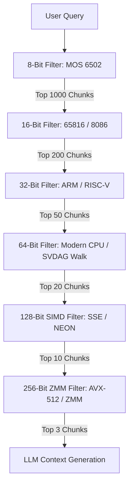

# Progressive Bit-Depth RAG Pipeline Architecture

This document describes the architectural design for a progressive, hierarchical Retrieval-Augmented Generation (RAG) pipeline. The system executes a cascading search, starting with ultra-low-power, coarse 8-bit lookups on a simulated MOS 6502 coprocessor, and scales up through successive layers of 16-bit, 32-bit, 64-bit, 128-bit, and 256-bit processors.

By progressively filtering candidate documents, the system dramatically reduces search latency, memory bandwidth, and compute costs.

---

## 1. Architectural Overview



### Cascade Mechanics

| Layer | Bit Depth | Processor Class | Mathematical Representation | Search/Matching Algorithm | Candidate Input | Candidate Output |
| :--- | :---: | :--- | :--- | :--- | :---: | :---: |
| **Stage 1** | 8-bit | MOS 6502 | 8-bit Sparse Semantic Cluster IDs / MinHash | Direct table lookup, Accumulator-based bitcount | 100,000 | 1,000 |
| **Stage 2** | 16-bit | 65816 / 8086 | 16-bit Hamming codes / PQ Codebooks | Bitwise XOR distance via 16-bit register loop | 1,000 | 200 |
| **Stage 3** | 32-bit | ARM / RISC-V | 32-dim $\times$ float32 Matryoshka sub-vector | Euclidean distance or dot-product | 200 | 50 |
| **Stage 4** | 64-bit | Modern x86-64 | Pointer-based Graph nodes (64-bit addresses) | Semantic Vector DAG (SVDAG) local walk | 50 | 20 |
| **Stage 5** | 128-bit | SIMD (SSE/Neon) | 128-dim $\times$ float16 (or 4 $\times$ float32) | SIMD-parallel Cosine similarity | 20 | 10 |
| **Stage 6** | 256-bit | SIMD (AVX/ZMM) | 768-dim $\times$ float32 high-fidelity embedding | Full Cross-Encoder attention matrix | 10 | 3 |

---

## 2. Stage Breakdown & Algorithms

### Stage 1: 8-Bit RAG (MOS 6502)
* **Objective**: Rapidly exclude 99% of irrelevant documents using extremely limited memory and CPU cycles.
* **Representation**: Each document is assigned a single 8-bit Semantic ID representing one of 256 global document clusters, or an 8-bit MinHash signature.
* **6502 Implementation Concept**:
  ```assembly
  ; Simple 6502 Loop to check Cluster Match
  LDY #$00          ; Initialize candidate counter
  LOOP:
    LDA (CANDIDATE_PTR), Y  ; Load candidate semantic cluster ID
    CMP QUERY_CLUSTER        ; Compare with query cluster ID
    BNE NO_MATCH             ; Skip if not a match
    ; (Add index to matching candidates table)
  NO_MATCH:
    INY
    BNE LOOP
  ```

### Stage 2: 16-Bit RAG (65816 / 8086)
* **Objective**: Refine the 1,000 candidate pool down to 200 using 16-bit representation.
* **Representation**: Documents are represented by a 16-bit Hamming code (binary hash) capturing broad topic co-occurrences.
* **Algorithm**: Hamming Distance (number of differing bits). On 16-bit hardware, this uses a simple `XOR` followed by a lookup-table bit-counting loop.

### Stage 3: 32-Bit RAG (ARM / RISC-V)
* **Objective**: Perform floating-point dot products in low-dimensional space.
* **Representation**: Matryoshka Embeddings sliced to the first 32 dimensions of 32-bit floats.
* **Algorithm**: Cosine similarity on a $32$-dimensional vector.

### Stage 4: 64-Bit RAG (64-bit CPU)
* **Objective**: Traversal of semantic structure.
* **Representation**: A structured Graph (SVDAG - Semantic Vector Directed Acyclic Graph) where nodes contain 64-bit memory addresses of text segments and contextual parents.
* **Algorithm**: A localized walk along the graph starting from the candidates matched in Stage 3, navigating along context edges.

### Stage 5: 128-Bit RAG (SIMD - SSE / NEON)
* **Objective**: Batch vector similarity processing.
* **Representation**: 128-bit SIMD registers containing four 32-bit floats or eight 16-bit floats.
* **Algorithm**: Parallel vector similarity scoring over intermediate dimension slices (e.g. 128 dimensions).

### Stage 6: 256-Bit RAG (SIMD - AVX2 / AVX-512 / ZMM)
* **Objective**: Full high-fidelity cross-encoder reranking.
* **Representation**: Full 768-dimensional float32 embeddings matching modern LLM attention heads.
* **Algorithm**: Parallel dot product attention over the final candidates.

---

## 3. Reference Simulation

To demonstrate this cascade, we have written a simulator script: [progressive_rag_simulation.js](file:///home/mariarahel/src/tsfi2/atropa_pulsechain/scripts/progressive_rag_simulation.js). 

This script models:
1. Generation of a mock database of 10,000 documents with hierarchical features.
2. Progressive filtering from 8-bit matching to 256-bit full dot-product similarity.
3. Statistics showing the reduction in overall floating-point operations (FLOPs) compared to executing a flat 256-bit search on the entire database.
