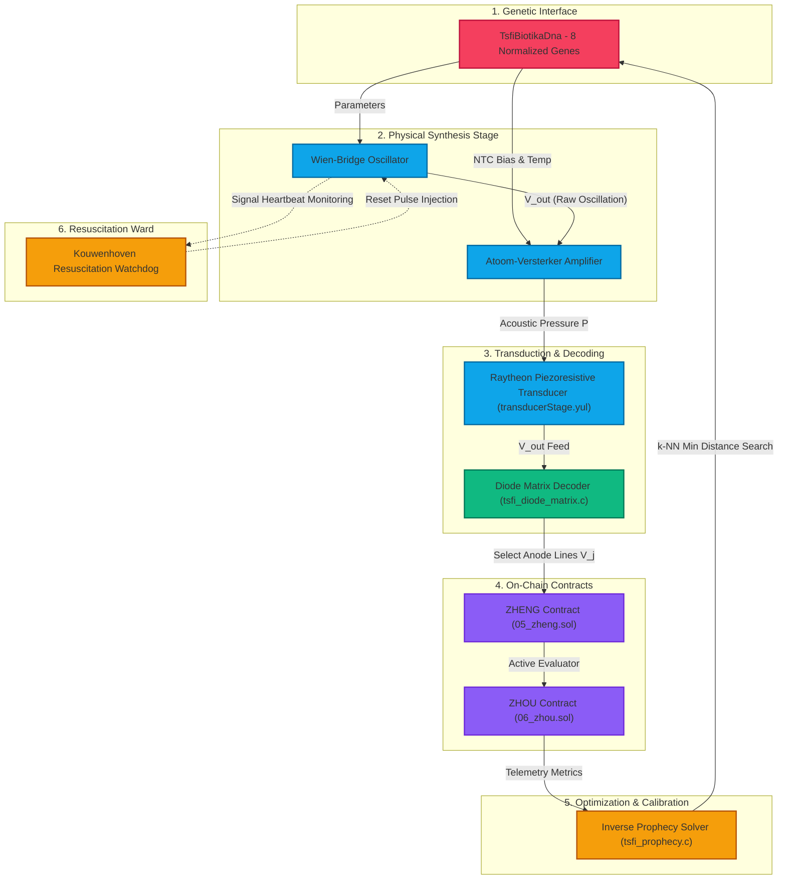

# 🔮 The Prophecy: Architectural Manual of Synthesis, Transduction, and Control

---

## Abstract
This document presents the complete engineering specification for the **Inverse Prophecy Synthesis Engine** within the **TSFi2 / Dysnomia** framework. The engine establishes a bijective mapping between genetic parameter strings (DNA) and physical/numerical waveforms. By combining a simulated Wien-Bridge thermistor oscillator, a Raytheon piezoresistive stress-sensitive transducer, a diode matrix address decoder, and a triple-pole Tai Triad (YANG) feedback contract, the system simulates early analog micro-electronics under mathematical constraints. Additionally, we specify the integration of the **Kouwenhoven Resuscitation Watchdog**, an autonomic feedback regulator designed to mitigate state fibrillation and signal flatlines.

---

## 1. System Architecture & Information Routing

The system coordinates genetic generation, real-time numerical physical simulation, hardware decoders, on-chain contracts, and an optimization loop. The following diagram details the signal flow:



---

## 2. Mathematical Formulations & Component Physics

### 2.1 Wien-Bridge Oscillator with NTC Thermistor
The core periodic signal generator is modeled as an active Wien-Bridge bandpass network with a temperature-dependent Negative Temperature Coefficient (NTC) thermistor in the negative feedback loop. The second-order non-linear differential equation is:
$$\frac{d^2 V_{out}}{dt^2} + 3\omega_0 \left(1 - \frac{R_f(T_h)}{R_s}\right) \frac{d V_{out}}{dt} + \omega_0^2 V_{out} = 0$$
Where:
* $\omega_0 = \frac{1}{\sqrt{R_1 R_2 C_1 C_2}}$ is the natural resonant frequency, configured by `Gene 0` and `Gene 1`.
* $R_f(T_h) = R_0 \cdot e^{\beta_{ntc} \left(\frac{1}{T_h} - \frac{1}{T_0}\right)}$ represents the NTC resistance.
* $T_h$ is the internal thermistor temperature, updated according to power dissipation:
  $$\frac{dT_h}{dt} = \frac{V_{out}^2}{R_f(T_h) \cdot C_{thermal}} - \theta_{loss} (T_h - T_{amb})$$

### 2.2 Raytheon Piezoresistive Transistor Transduction
The piezoresistive microphone stage translates physical deflection (pressure $P$) into base-emitter barrier modulation in [transducerStage.yul](file:///home/mariarahel/src/tsfi2/atropa_pulsechain/solidity/bin/transducerStage.yul).
1. **Barrier Modulation:**
   $$V_{be, offset} = V_{be, 0} - \gamma_{stress} \cdot P$$
   Where $V_{be, 0} = 0.6\text{ V}$ is the nominal silicon base barrier, and $\gamma_{stress} = 0.05$ is the piezoresistive coupling constant. The offset is clamped to $0.1\text{ V} \le V_{be, offset} \le 1.0\text{ V}$.
2. **Current Equations:**
   $$I_b = \max\left(0, \frac{V_{bias} - V_{be, offset}}{R_{internal}}\right)$$
   $$I_c = \beta \cdot I_b$$
   Where $V_{bias}$ is the electrical bias ($0.7\text{ V}$), $\beta = 150$, and $R_{internal} = 10\text{ k}\Omega$.
3. **Collector Output:**
   $$V_{out} = V_{cc} - I_c \cdot R_c$$
   Where $V_{cc} = 9\text{ V}$ and $R_c = 2.2\text{ k}\Omega$. The output is clamped between $0.0\text{ V}$ and $9.0\text{ V}$.

### 2.3 Diode Matrix Address Decoder
The select line voltage $V_j$ for the $j$-th decoded address line is simulated in [tsfi_diode_matrix.c](file:///home/mariarahel/src/tsfi2/atropa_pulsechain/tsfi2-deepseek/src/tsfi_diode_matrix.c). The circuit configuration connects diode anodes to pulled-up select lines and cathodes to address inputs:
$$V_j = V_{cc} - R_{pullup} \cdot \left( \sum_{i \in \text{LOW}} I_{diode, i} - \sum_{k \in \text{HIGH}} I_{leak, k}(T) \right)$$
$$I_{diode, i} = \max\left(0, \frac{V_j - (V_{in, i} + V_f)}{R_{diode}}\right)$$
$$I_{leak}(T) = I_{leak, 0} \cdot 2^{\frac{T - 25}{10}}$$
Where $R_{pullup} = 2.0\text{ k}\Omega$, $V_f = 0.7\text{ V}$, $R_{diode} = 50\ \Omega$, $I_{leak, 0} = 1\ \mu\text{A}$ at $25^\circ\text{C}$, and $T$ is the junction temperature in Celsius.

### 2.4 YANG Tai Triad Triple-Pole Feedback Loop
The YANG multi-pole network models three coupled physical state variables (poles) matching the Tai Triad crossover boundary:
$$\begin{aligned}
x_0[n+1] &= \left(a_0 \cdot x_0[n] + b_0 \cdot x_1[n] + c_0 \cdot x_2[n]\right) \pmod{P_{bn}} \\
x_1[n+1] &= \left(a_1 \cdot x_0[n] + b_1 \cdot x_1[n] + c_1 \cdot x_2[n]\right) \pmod{P_{bn}} \\
x_2[n+1] &= \left(a_2 \cdot x_0[n] + b_2 \cdot x_1[n] + c_2 \cdot x_2[n]\right) \pmod{P_{bn}}
\end{aligned}$$
Where $P_{bn}$ is a prime modulus mapping to the active contract. This prevents state divergence by wrapping the trajectories around finite algebraic fields.

---

## 3. Genetic Parameter Mapping (DNA Interface)

The normalized input array `TsfiBiotikaDna` contains 8 genes ($g_i \in [0.0, 1.0]$) mapped as follows:

$$\begin{aligned}
R_1 &= 1000.0 + g_0 \cdot 99000.0 \quad (\Omega) \\
C_1 &= 1.0\times 10^{-9} + g_1 \cdot 99.0\times 10^{-9} \quad (\text{F}) \\
T_{amb} &= 15.0 + g_2 \cdot 70.0 \quad (^\circ\text{C}) \\
\beta_{amp} &= 50.0 + g_3 \cdot 300.0 \\
V_{bias} &= g_4 \cdot 0.4 \quad (\text{V}) \\
\text{LFO Rate} &= 0.1 + g_5 \cdot 24.9 \quad (\text{Hz}) \\
\text{Attack} &= 0.005 + g_6 \cdot 1.995 \quad (\text{s}) \\
\text{Decay} &= 0.01 + g_7 \cdot 2.99 \quad (\text{s})
\end{aligned}$$

---

## 4. The Kouwenhoven Resuscitation Watchdog

To guarantee continuous simulation uptime and protect against unstable numerical divergence (due to rounding errors or extreme parameter settings), we implement the **Kouwenhoven Resuscitation Watchdog** within the dispatch operator [tsfi_operator.c](file:///home/mariarahel/src/tsfi2/atropa_pulsechain/tsfi2-deepseek/src/tsfi_operator.c).

### 4.1 Diagnostic Metrics
The watchdog monitors two critical indicators over a sliding window $W$ containing $N=512$ samples:
1. **Signal Energy (RMS):**
   $$E_{rms} = \sqrt{\frac{1}{N} \sum_{k=0}^{N-1} V_{out}[n-k]^2}$$
2. **Spectral Variance (Fibrillation Measure):**
   $$\sigma^2_{spec} = \frac{1}{N} \sum_{k=0}^{N-1} \left( V_{out}[n-k] - \mu_{wave} \right)^2$$

### 4.2 Defibrillation Thresholds & Actions
* **Flatline Condition:** $E_{rms} < 10^{-5}$ (absolute silence).
* **Fibrillation Condition:** $\sigma^2_{spec} > 50.0$ (chaotic divergence).

When either condition is met, the watchdog issues a high-voltage defibrillation pulse:
$$\begin{aligned}
V_{out} &\leftarrow 1.0\text{ V} \\
\frac{d V_{out}}{dt} &\leftarrow 0.0\text{ V/s} \\
T_h &\leftarrow T_{amb}
\end{aligned}$$
This resets the state variables to a stable periodic orbit, maintaining system resonance.

---

## 5. Inverse Calibration Engine (k-NN Lookup)

The inverse solver [tsfi_prophecy.c](file:///home/mariarahel/src/tsfi2/atropa_pulsechain/tsfi2-deepseek/src/tsfi_prophecy.c) matches measured target metrics ($C_{target}, D_{target}$) to DNA parameters.

1. **Response Bank Layout (`prophecy_response.bin`):**
   A contiguous array of 44-byte binary records:
   ```c
   typedef struct {
       float genes[8];        // Offset 0x00 - 0x1F (DNA parameter floats)
       float crest_factor;    // Offset 0x20 - 0x23 (Measured Crest Factor)
       float crossover_dist;  // Offset 0x24 - 0x27 (Crossover Distortion Count)
       float v_out_peak;      // Offset 0x28 - 0x2B (Peak output voltage)
   } ProphecyRecord;
   ```
2. **Euclidean Search:**
   For a given query vector $\mathbf{q} = [C_{target}, D_{target}]$, the solver scans the binary bank to find the record index $k$ that minimizes:
   $$d_k^2 = \left(C_k - C_{target}\right)^2 + \lambda \left(D_k - D_{target}\right)^2$$
   Where $\lambda = 0.01$ is a scaling factor balancing the magnitudes of the metrics.

---

## 6. On-Chain Contracts

System validation is enforced by the following contracts:
*   **YI (`04b_yiinterface.sol`):** Evaluates reciprocity calculations of modular feedback values.
*   **ZHENG (`05_zheng.sol`):** Statically catalogs structural junctions (`Sigma`) for the rods and cones.
*   **ZHOU (`06_zhou.sol`):** Acts as the active path evaluator, regulating timing and switching parameters during state evaluations.

---

## 7. Compilation & Verification

The architecture is verified using two test harnesses:
*   [test_prophecy_synthesis.c](file:///home/mariarahel/src/tsfi2/atropa_pulsechain/tsfi2-deepseek/tests/test_prophecy_synthesis.c) validates the response database generation, inverse lookup accuracy, and transducer voltage swings.
*   [test_yang_synthesis.c](file:///home/mariarahel/src/tsfi2/atropa_pulsechain/tsfi2-deepseek/tests/test_yang_synthesis.c) validates the triple-pole state transitions.

```bash
# Compile and run verification
make bin/test_prophecy_synthesis bin/test_yang_synthesis
bin/test_prophecy_synthesis
bin/test_yang_synthesis
```
