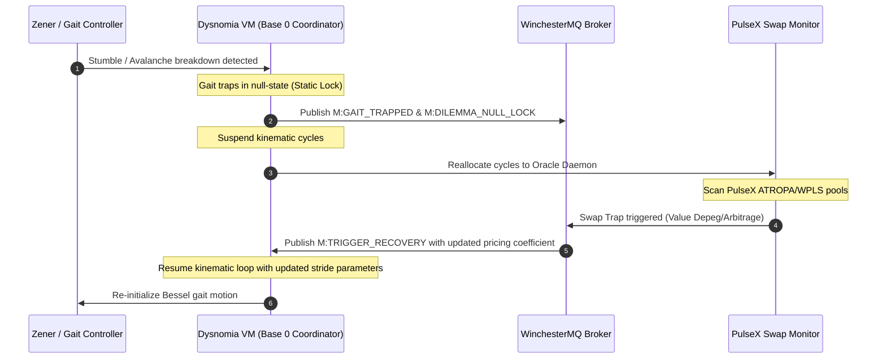

# PulseX Swap Trap & Gait Trapping Usage Scenario

This scenario outlines how low-level **Auncient** hardware emulator states (Bessel-Zener gait trapping) integrate with high-level decentralized finance event traps (PulseX Swap Monitoring) via the WinchesterMQ message broker.

---

---

## 1. Phase 1: Physical Trapping Event
1. **Terrain Instability**: The physical system experiences a terrain stumble. High-entropy reverse breakdown in the simulated **Auncient** Zener diode (`tsfi_zener.c`) causes low-pass filtered noise power to spike past the threshold ($> 0.0005$).
2. **Trap Propagation**: The system emits `M:GAIT_TRAPPED` to WinchesterMQ.
3. **Null-State Lock**: The phase velocity decays towards the first zero of the Bessel J0 function. Once velocity drops below $0.05$, the Base 0 Protocol coordinator transitions to a permanent standby lock, emitting `M:DILEMMA_NULL_LOCK`.

## 2. Phase 2: VM Cycle Reallocation
1. **Kinematics Suspension**: The coordinator halts all active gait updates, freeing up compute budget.
2. **Oracle Escalation**: The local Dysnomia VM swaps execution priorities to the background price tracker daemon (`monitor_pulsex.py`).

## 3. Phase 3: PulseX Swap Traps
1. **Target Pool**: The daemon monitors the active `ATROPA/WPLS` liquidity pool (holding a steady ratio of $5,587.50$ PLS/ATROPA) and tracks WPLS base value ($0.00006055$ USD).
2. **Swap Trap Event**: A large swap occurs, causing a temporary liquidity imbalance. The pricing table shifts, triggering a "Swap Trap" target (e.g., an arbitrage window where ATROPA deviates from its $0.3383$ USD target).
3. **MQ Broadcast**: The oracle publishes the event `M:TRIGGER_RECOVERY` containing the updated pricing and state coefficients back to WinchesterMQ.

## 4. Phase 4: Gait Recovery
1. **Trap Release**: The Base 0 Coordinator catches `M:TRIGGER_RECOVERY`.
2. **Kinematic Reset**: The coordinator updates the stride amplitude/frequency parameters using the newly parsed pricing coefficients as scaling factors.
3. **Resume Motion**: The physical lock is cleared, and nominal walking resume trajectories (`M:TRIGGER_NOMINAL`) are re-established.
