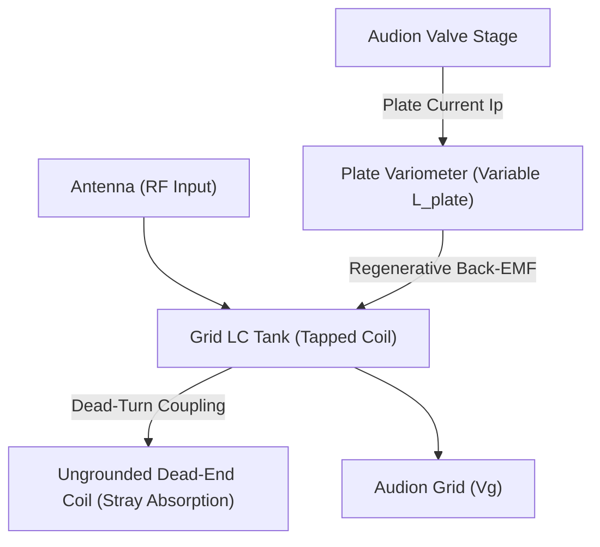

# QST Issue #10 Technical Analysis: Paragon RA-6 Regenerative Architecture

A physical modeling study of the Adams-Morgan "Paragon RA-6" short-wave regenerative receiver introduced in October 1916, detailing the plate-variometer feedback loop and dead-end switch parasitic absorption.

---

## 1. Historical & Technical Context

In October 1916 (Volume 1, Number 11 of *QST*), Paul Godley introduced the **Paragon RA-6** short-wave regenerative receiver. This was the first commercial receiver designed specifically to handle Armstrong's feedback principle at the amateur "short-wave" assignment of $200\text{ meters}$ ($\approx 1.5\text{ MHz}$).

### Key Architectural Features:
*   **Tuning Mechanism**: Plate-circuit variometers (variable inductors) instead of tickler coils.
*   **Grounding Convention**: DeForest-style "upside-down" wiring where the $A+$ filament line serves as the system ground.
*   **Coil Design**: Tapped inductors with ungrounded "dead-end" turns.

---

## 2. Plate-Variometer Feedback Model

Instead of transferring energy back to the grid via mutual inductance (a tickler coil), the Paragon RA-6 tuned the plate circuit to resonance using a **variometer** ($L_{\text{plate}}$). When the plate circuit is tuned slightly below the grid resonant frequency, the grid-to-plate capacitance ($C_{gp}$) of the Audion acts as a feedback path, introducing negative resistance into the grid tank.

Under the zero-loss algebraic invariant ($\Phi = 0$), the feedback voltage $v_f(t)$ injected back onto the grid is governed by the plate variometer inductance $L_{\text{plate}}$ and the plate current $i_p(t)$:

$$v_f(t) = L_{\text{plate}} \frac{d i_p(t)}{dt}$$

This back-EMF couples through the internal valve capacity $C_{gp}$, effectively neutralizing the tank losses and driving the autodyne oscillations.

---

## 3. Dead-End Switch Parasitics Model

The tapped tuning coils in the RA-6 left unused turns floating (ungrounded). These "dead-turns" act as a secondary resonant winding coupled to the active tuning coil via mutual inductance ($M$) and stray capacitance ($C_s$).

This floating circuit absorbs energy at its own self-resonant frequency:

$$f_{\text{dead}} = \frac{1}{2 \pi \sqrt{L_{\text{dead}} C_s}}$$

When the receiver is tuned near $f_{\text{dead}}$, the dead-turns act as an electromagnetic "sink", pulling power away from the grid tank and causing a sudden drop in sensitivity (a "dead spot"). The active grid voltage $v_g(t)$ is modified by the absorption current $i_a(t)$:

$$L_{\text{act}} \frac{d i_l}{dt} + v_g + M \frac{d i_a}{dt} = v_{\text{in}}$$

---

## 4. Modeling Parameters for Paragon RA-6 Simulation

To simulate the Paragon RA-6 receiver stage in `TSFi2`:

| Parameter | Symbol | Value | Description |
| :--- | :---: | :---: | :--- |
| **Grid Inductance** | $L_{\text{act}}$ | $120\,\mu\text{H}$ | Active tuning winding |
| **Plate Variometer** | $L_{\text{plate}}$ | $50 - 300\,\mu\text{H}$ | Adjustable feedback inductor |
| **Feedback Capacity** | $C_{gp}$ | $8.0\,\text{pF}$ | Audion internal grid-to-plate capacity |
| **Dead-Turn Inductance** | $L_{\text{dead}}$ | $80\,\mu\text{H}$ | Floating ungrounded turns |
| **Stray Capacitance** | $C_s$ | $12.0\,\text{pF}$ | Coupling to ground |
| **Dead-Spot Frequency** | $f_{\text{dead}}$ | $\approx 1.62\,\text{MHz}$ | Parasitic absorption frequency |
