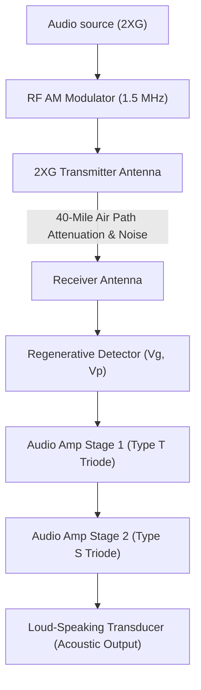

# QST Issue #13 Technical Analysis: De Forest Wireless Dance & Cascade Amplification

A physical modeling study of the end-to-end wireless transmission, regenerative detection, and multi-stage amplification system described in the February 1917 issue of *QST* ("Wireless Dance" at Theodore E. Gaty's residence).

---

## 1. Historical & Technical Context

In the February 1917 issue of *QST* (Volume 2, Number 3), a report documented a **"Wireless Dance"** hosted at the Morristown, N.J. residence of Theodore E. Gaty, located approximately 40 miles from the De Forest experimental radio-telephone station (**2XG**) at Highbridge, New York. 

Using a regenerative receiver and a **two-step (two-stage) audio amplifier** connected to a loud-speaking telephone (horn/speaker transducer), Gaty successfully received and amplified wireless music broadcasts with enough acoustic volume to entertain several dancing couples.

---

## 2. End-to-End Simulation Mathematical Model

### A. RF Transmitter & AM Modulation
The audio signal $x(t)$ modulates a high-frequency carrier $f_c \approx 1.5\text{ MHz}$ (representing amateur short-wave bands of the era):
$$s_{\text{tx}}(t) = [1.0 + m_k \cdot x(t)] \cdot \cos(2\pi f_c t)$$
where $m_k \in [0, 1]$ is the modulation index.

### B. Free Space Propagation & Path Loss
Over the $d = 40\text{ miles}$ ($\approx 64.37\text{ km}$) path, the signal undergoes attenuation and gathers additive white Gaussian atmospheric noise (AWGN):
$$s_{\text{rx}}(t) = A_{\text{path}} \cdot s_{\text{tx}}(t) + \eta(t)$$
where $A_{\text{path}}$ is the path attenuation coefficient and $\eta(t)$ is the noise.

### C. Regenerative Detector
The receiver grid circuit uses positive feedback (regeneration) to cancel losses, modeling the grid voltage $v_g(t)$ with a feedback term from the plate circuit:
$$v_g(t) = s_{\text{rx}}(t) + \beta_g \cdot v_{p,\text{ac}}(t - \tau)$$
If feedback $\beta_g$ is set below the oscillation threshold, it acts as a highly selective Q-multiplier. The non-linear grid current characteristics demodulate the AM envelope.

### D. Two-Stage (Two-Step) Cascade Amplifier
The demodulated audio output drives a two-stage triode amplifier, coupled via transformer or grid-leak configuration:
1. **Stage 1 (Type T Triode):** Performs first-stage voltage amplification.
2. **Stage 2 (Type S Triode):** Provides power amplification to drive the acoustic load.

The plate current of each triode stage is governed by De Forest's space-charge equation:
$$I_{p} = K \cdot (V_g + V_p/\mu)^{1.5}$$

### E. Loud-Speaking Phone Transducer
The final amplifier stage output drives an electromagnetic speaker horn. The diaphragm displacement $z(t)$ and output acoustic pressure $P_{\text{acoustic}}(t)$ are modeled as a second-order spring-mass-damper system driven by magnetic force:
$$M_{\text{dia}} \frac{d^2 z}{dt^2} + R_{\text{dia}} \frac{dz}{dt} + K_{\text{dia}} z = K_{\text{force}} \cdot I_{p2}(t)$$
$$P_{\text{acoustic}}(t) = K_{\text{acoustic}} \cdot \frac{d^2 z}{dt^2}$$

---

## 3. Physical Parameters for Wireless Dance Simulation

| Parameter | Symbol | Value | Description |
| :--- | :---: | :---: | :--- |
| **Carrier Frequency** | $f_c$ | $1.5\text{ MHz}$ | RF carrier frequency |
| **Modulation Index**  | $m_k$ | $0.8$ | AM modulation factor |
| **Path Loss Factor**  | $A_{\text{path}}$ | $1.5 \times 10^{-4}$| Attenuation over 40 miles |
| **Feedback Factor**   | $\beta_g$ | $0.85$ | Regenerative feedback gain |
| **Stage 1 Gain ($\mu_1$)** | $\mu_1$ | $12.0$ | Coaxial tubular triode |
| **Stage 2 Gain ($\mu_2$)** | $\mu_2$ | $8.0$ | Flat-plate triode |
| **Speaker Mass** | $M_{\text{dia}}$ | $0.001\text{ kg}$ | Diaphragm mass |
| **Speaker Damping** | $R_{\text{dia}}$ | $0.15\text{ N}\cdot\text{s/m}$ | Viscous damping |
| **Speaker Spring** | $K_{\text{dia}}$ | $450.0\text{ N/m}$ | Restoring spring constant |
