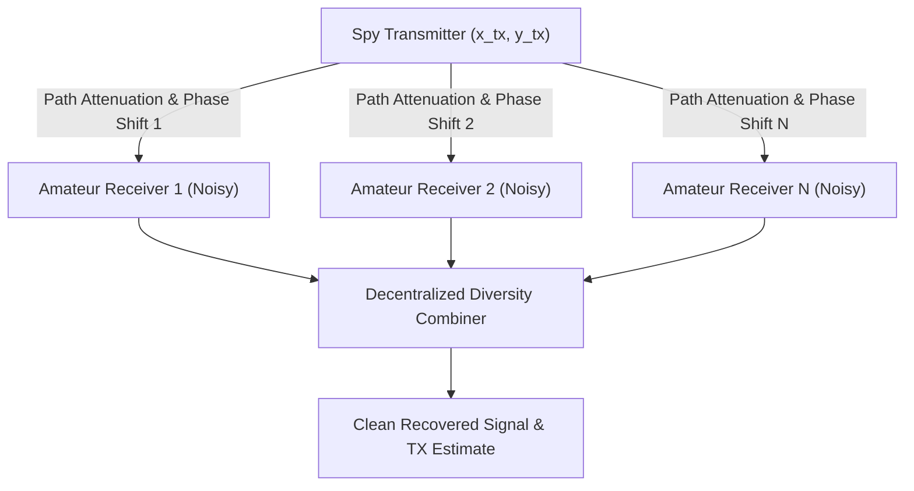

# QST Issue #14 Technical Analysis: "One Thousand Listening Ears" Spatial Diversity Network

A physical modeling study of the decentralized amateur receiver monitoring network proposed in the March 1917 issue of *QST* ("WAR?"), detailing spatial diversity reception and noise cancellation algorithms for spy transmitter localization.

---

## 1. Historical & Technical Context

In the March 1917 issue of *QST* (Volume 2, Number 4), under the editorial title **"WAR?"**, the American Radio Relay League (ARRL) anticipated the suspension of amateur radio transmission. They proposed utilizing the vast network of amateur operators as a defensive listening service, dubbed the **"one thousand pairs of listening ears."** Even if barred from transmitting, amateurs could keep their regenerative receivers active to monitor, log, and locate illegal or enemy wireless stations transmitting from within the United States.

---

## 2. Mathematical Network Model

### A. Spy Transmitter
The spy transmitter is located at a coordinate $(x_{\text{tx}}, y_{\text{tx}})$ and broadcasts a signal $s(t)$:
$$s(t) = A_0(t) \cdot \cos(2\pi f_c t + \phi_{\text{tx}})$$

### B. Decentralized Receiving Stations (The Array)
We define a network of $N$ amateur stations distributed across coordinates $(x_i, y_i)$.
For each station $i$:
1.  **Distance and Delay**:
    $$d_i = \sqrt{(x_i - x_{\text{tx}})^2 + (y_i - y_{\text{tx}})^2}$$
    $$\tau_i = \frac{d_i}{c}$$
    where $c$ is the speed of light.
2.  **Path Loss**:
    $$A_i = \frac{A_{\text{ref}}}{d_i}$$
3.  **Received Signal**:
    $$r_i(t) = A_i \cdot s(t - \tau_i) + \eta_i(t)$$
    where $\eta_i(t)$ represents independent local atmospheric static and grid noise at station $i$.

### C. Coherent Integration & Spatial Diversity Combining
To reconstruct the weak spy signal and suppress uncorrelated local noise, the centralized coordinator aligns the delays (phase alignment) and performs a weighted sum:
$$y(t) = \sum_{i=1}^N w_i \cdot r_i(t + \tau_i)$$
The weight $w_i$ can be proportional to the inverse of local noise variance (Maximum Ratio Combining, MRC). As $N \to 1000$, the uncorrelated noise components cancel out:
$$\text{SNR}_{\text{combined}} \approx \sum_{i=1}^N \text{SNR}_i$$
This enables the network to recover signals buried deep below the noise floor of any individual receiver.

---

## 3. Physical Parameters for Simulation

| Parameter | Symbol | Value | Description |
| :--- | :---: | :---: | :--- |
| **Number of Stations** | $N$ | $50$ | Simulated listener nodes |
| **Carrier Frequency**  | $f_c$ | $1.5\text{ MHz}$ | RF target frequency |
| **Network Radius**     | $R_{\text{net}}$| $100.0\text{ km}$ | Geographical dispersion |
| **Signal Velocity**    | $c$ | $3 \times 10^8\text{ m/s}$ | Speed of electromagnetic propagation |
| **Individual SNR**     | $\text{SNR}_i$ | $-15.0\text{ dB}$ | Signal buried in local receiver noise |
| **Target Coordinates** | $(x_{\text{tx}}, y_{\text{tx}})$ | $(25.0, -40.0)\text{ km}$ | Spy transmitter location |
