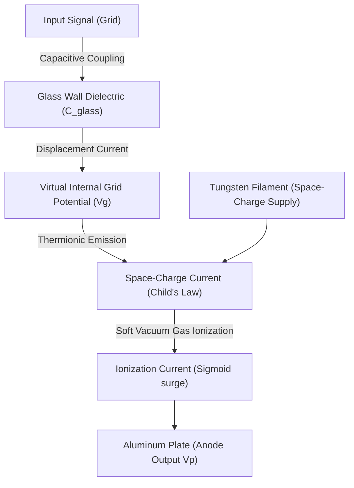

# QST Issue #8 Technical Analysis: The External-Grid Moorhead Electron Relay

A physical modeling study of the Otis B. Moorhead "Electron Relay" vacuum valve introduced in August 1916, focusing on the external-grid control band, dielectric displacement charge delays, and soft vacuum gas ionization.

---

## 1. Historical & Physical Context

In August 1916 (Volume 1, Issue 9 of *QST*), amateur radio operators were introduced to the **Moorhead Electron Relay**—a competitor to the de Forest Audion and Cunningham AudioTron. Due to aggressive patent enforcement by de Forest regarding internal grids, Moorhead temporarily bypassed the litigation by building a triode with an **external control electrode**.

### Electrode Materials and Geometry:
*   **Filament (Cathode)**: A straight axial tungsten wire.
*   **Plate (Anode)**: A bent aluminum cylinder surrounding the filament.
*   **Control Grid**: A perforated brass band clamped to the **outside** of the glass envelope.

---

## 2. Dielectric Displacement Grid Coupling Model

Because the control grid is located on the outside of the glass envelope, there is no direct conduction path. Instead, the signal must capacitively couple through the glass wall. Under the zero-loss algebraic invariant ($\Phi = 0$), the virtual internal grid potential $v_g(t)$ is governed by the dielectric displacement current:

$$C_{\text{glass}} \frac{d(v_{\text{in}} - v_g)}{dt} = \frac{v_g}{R_{\text{leak}}}$$

Integrating this dynamic delay, the effective internal grid voltage satisfies:

$$\tau \frac{d v_g}{dt} + v_g = \tau \frac{d v_{\text{in}}}{dt}$$

where $\tau = R_{\text{leak}} C_{\text{glass}}$ represents the dielectric relaxation time constant of the glass-vacuum boundary.

### Physical Consequences:
1.  **High-Pass Filtering**: Static DC bias on the external clamp does not affect the electron stream once the displacement charge equilibrates.
2.  **Attenuation**: The signal amplitude is heavily attenuated depending on the glass thickness and permittivity ($\epsilon_{\text{glass}} \approx 4.0$).

---

## 3. Modeling Parameters for the Moorhead Valve

To accurately represent the August 1916 Electron Relay in the `TSFi2` simulator, we establish the following physical constants:

| Parameter | Symbol | Value | Description |
| :--- | :---: | :---: | :--- |
| **Amplification Factor** | $\mu$ | $12.0$ | Low electrostatic control due to external grid distance |
| **Perveance** | $K$ | $0.000015\text{ A/V}^{1.5}$ | Pure tungsten filament space-charge limit |
| **Relaxation Time Constant**| $\tau$ | $1.2 \cdot 10^{-4}\text{ s}$ | High-pass cutoff frequency of $\approx 1.3\text{ kHz}$ |
| **Ionization Threshold** | $V_{\text{ion}}$ | $28.0\text{V}$ | Lower ionization threshold due to gassy soft vacuum |
| **Plate Voltage Range** | $V_p$ | $10\text{V} - 35\text{V}$ | Low plate potential typical of early soft tubes |

---

## 4. Implementation Formula

The virtual internal grid voltage $v_g[n]$ for sample $n$ at sampling interval $\Delta t$ can be approximated via Euler backward integration:

$$v_g[n] = \frac{\tau}{\tau + \Delta t} v_g[n-1] + \frac{\tau}{\tau + \Delta t} (v_{\text{in}}[n] - v_{\text{in}}[n-1])$$

This virtual grid potential is then used in the Space-Charge current calculation:

$$I_p[n] = K \cdot \max\left(0, \frac{V_p}{ \mu } + v_g[n] + V_{\text{bias}}\right)^{1.5} \cdot \left(1.0 + \text{ionization\_factor} \cdot \sigma(V_p - V_{\text{ion}})\right)$$
