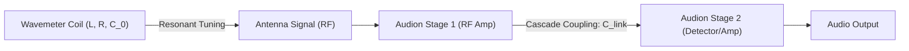

# QST Issue #9 Technical Analysis: Cascade Amplification and Wavemeter Parasitics

An investigation into the physical modeling parameters defined by Paul F. Godley's landmark paper, *"Applications of the Audion"* (presented June 1916, published September 1916 in *QST*), and the associated parasitics of wavemeter coils.

---

## 1. Historical & Technical Context

In September 1916 (Volume 1, Number 10 of *QST*), Paul F. Godley published the definitive guide to multi-stage Audion operation: **"Applications of the Audion."** The article provided the first detailed analysis of **cascade (multi-stage) amplification** for radio-telephony and telegraphy. Concurrently, the issue addressed technical requirements for **wavemeter coils**, focusing on their inductance ($L$), high-frequency resistance ($R$), and parasitic self-capacitance ($C_0$).

---

## 2. Cascade Valve Coupling Model

Godley's cascade amplifier passes the output plate signal of the first stage through a coupling capacitor ($C_{\text{link}}$) and a grid leak resistor ($R_{\text{leak}}$) to drive the grid of the second stage. Under the zero-loss algebraic invariant ($\Phi = 0$), this dynamic inter-stage coupling is governed by:

$$C_{\text{link}} \frac{d(V_{p1} - V_{g2})}{dt} = \frac{V_{g2}}{R_{\text{leak}}}$$

This prevents DC plate potentials ($100\text{V} - 250\text{V}$) from saturating the grid of the second valve, while transferring AC oscillations above the high-pass cutoff frequency:

$$f_c = \frac{1}{2 \pi R_{\text{leak}} C_{\text{link}}}$$

---

## 3. Wavemeter Coil Parasitics Model

Wavemeter coils of the era suffered from significant distributed self-capacitance ($C_0$). To model the coil behavior accurately, the effective inductance ($L_{\text{eff}}$) at operating frequency $\omega$ is expressed as:

$$L_{\text{eff}} = \frac{L}{1 - \omega^2 L C_0}$$

As the operating frequency approaches the self-resonant frequency $\omega_0 = 1/\sqrt{L C_0}$, the effective inductance diverges, causing tuning errors and high-frequency damping (lowering the $Q$-factor).

---

## 4. Modeling Parameters for Godley Cascade Simulation

To represent a two-stage cascade amplifier using the `TSFi2` simulator:

| Parameter | Stage 1 (RF Amp) | Stage 2 (Detector) |
| :--- | :---: | :---: |
| **Valve Type** | Tubular Type T (coaxial) | Flat-Plate Type S |
| **Amplification ($\mu$)** | $90.0$ | $110.0$ |
| **Perveance ($K$)** | $0.00002\text{ A/V}^{1.5}$ | $0.000025\text{ A/V}^{1.5}$ |
| **Grid Leak ($R_{\text{leak}}$)**| — | $1.5\text{ M}\Omega$ |
| **Link Cap ($C_{\text{link}}$)** | — | $250\text{ pF}$ |
| **High-Pass Cutoff ($f_c$)** | — | $\approx 424.4\text{ Hz}$ |
