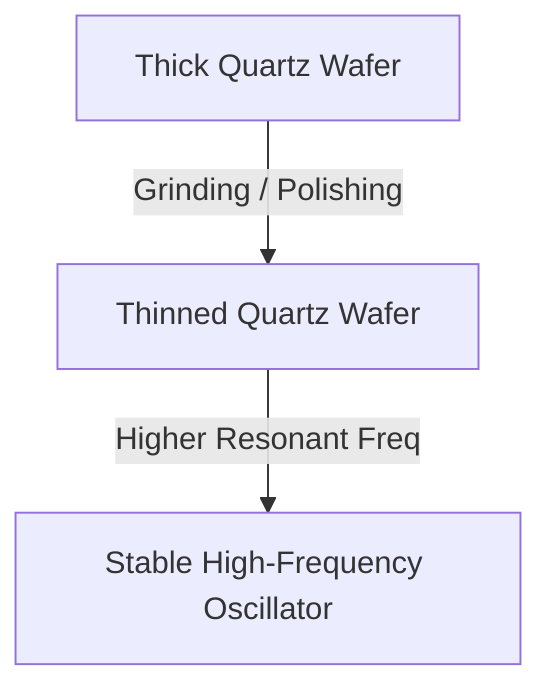

# Quartz Crystals in Radio Frequency Control & Synthesizer Systems

In amateur radio (especially during the era of *73 Magazine*) and high-stability synthesizer control systems, **quartz crystal resonators** serve as the cornerstone of precise frequency determination, filtering, and mixing.

---

## ⚡ 1. The Piezoelectric Effect & Equivalent Circuit

Quartz crystals utilize the **piezoelectric effect**: applying mechanical stress to the crystal lattice generates an electric charge, and conversely, applying an electric field induces physical deformation.

### Butterworth-Van Dyke (BVD) Equivalent Model
A quartz crystal behaves electrically as a highly resonant LC network with an extremely high quality factor ($Q \approx 10,000 \text{ to } 100,000+$).

```
          --- L_m --- R_m --- C_m ---
      ---|                            |---
         |-----------  C_0  ----------|
```

*   **$L_m$ (Motional Inductance):** Represents the physical mass of the vibrating crystal.
*   **$C_m$ (Motional Capacitance):** Represents the elasticity of the quartz structure.
*   **$R_m$ (Motional Resistance):** Represents internal friction and energy dissipation.
*   **$C_0$ (Shunt/Holder Capacitance):** Represents the static electrical capacitance of the metal electrodes and housing surrounding the quartz wafer.

### Resonant Modes
Because of the motional and shunt capacitances, a crystal exhibits two distinct resonant frequencies:
1.  **Series Resonance ($f_s$):** The frequency where $L_m$ and $C_m$ cancel, yielding minimal impedance.
    $$f_s = \frac{1}{2 \pi \sqrt{L_m C_m}}$$
2.  **Parallel Resonance ($f_p$):** The frequency where the motional arm resonates with the shunt capacitance $C_0$, yielding maximum impedance.
    $$f_p = f_s \sqrt{1 + \frac{C_m}{C_0}}$$

---

## 📻 2. Historic Amateur Radio Applications (73 Magazine Era)

### A. Surplus FT-243 Crystals
Following World War II, military surplus **FT-243 crystal units** were incredibly cheap and abundant.
*   **Grid Pinout:** Hams commonly built Pierce or Colpitts oscillators using a single tube and an FT-243 crystal to fix the transmitter to a specific frequency.
*   **Crystal Grinding:** To change the frequency, amateurs would open the FT-243 holder, extract the quartz wafer, and rub it in a circular motion on a glass plate using a paste of carborundum powder and water (or toothpaste) to grind down its thickness—thus shifting its resonant frequency upward.



### B. Crystal Filters in Single Sideband (SSB) Receivers
To isolate a single sideband ($300\text{--}3000\text{ Hz}$ bandwidth) at intermediate frequencies (IF), hams designed **crystal ladder filters**.
*   By placing multiple crystals of identical or slightly offset series frequencies in a ladder configuration with shunt capacitors, they achieved extremely steep filter skirts (high shape factors) capable of rejecting the carrier and opposite sideband.

---

## 🎹 3. Integration into Modern Synthesizer Architectures

In our modern synthesizer control and output system, quartz crystal models can be integrated via:

### A. Reference Clock Synthesizers
A quartz crystal oscillator (e.g., $10\text{ MHz}$ TCXO - Temperature Compensated Crystal Oscillator) provides the ultra-stable reference clock for Phase-Locked Loop (PLL) or Direct Digital Synthesis (DDS) chips, ensuring that the generated musical pitches and RF carriers do not drift.

### B. DSP Physical Modeling
We can physically model the BVD equivalent circuit of a crystal inside our synthesizer's DSP chain. This provides an ultra-sharp, resonant bandpass filter (simulate a crystal filter) with extremely high $Q$, allowing metallic ring modulation and physical modeling of vibrating plates/quartz.

```c
typedef struct {
    float lm, cm, rm, c0;
    float state_i_lm; // Integrator state for inductor current
    float state_v_cm; // Integrator state for capacitor voltage
    float state_v_c0; // Integrator state for shunt voltage
} DspCrystalResonator;
```
