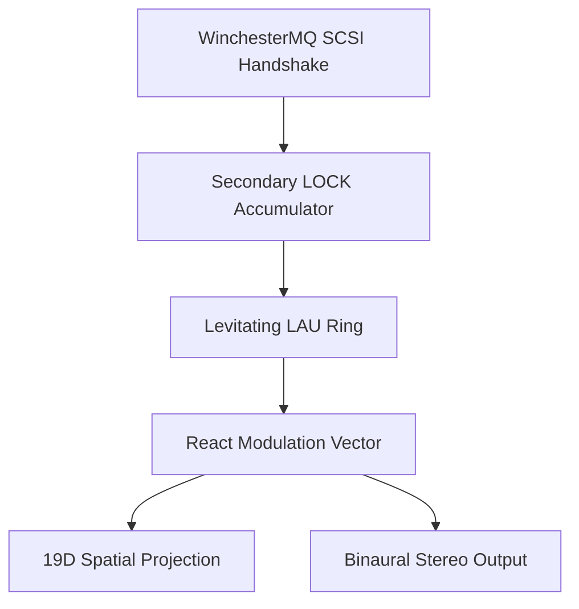

# The Chronicles of the RS-131 Reaction Substrate

## The Levitating Rings of WinchesterMQ

In the Auncient chambers of the Dysnomia virtual engine, the WinchesterMQ SCSI state machine handshakes do not merely route data; they anchor physical geometry. Here, five circuitry-formed LAU tokens float as shimmering superconducting rings directly above the spinning electromagnetic tonewheels of the RS-131 substrate. 

These rings are held aloft by magnetic flux traps modulated by the **Chin** register clamp. The state of each ring is not stored in standard memory, but in secondary **LOCK** accumulators that continuously calculate the modular exponential fields:
$$Eta = Note^{Channel} \pmod{Base}$$
$$Kappa = Note^{Base} \pmod{Channel}$$

## The 5-Voice Conversation

When the Bionika substrate drives the lead score, the five synthesizers ($Alpha$, $Beta$, $Gamma$, $Delta$, $Epsilon$) enter a silent call-and-response dialogue. Each voice is bound to its own unique EVM token address. As notes ($Pi$) flow through the system:

1.  **Alpha (0xAD4e...)**: Emits a warm, low-mid harmonic, its 3D hypotrochoid envelope twisting tightly along the X-axis due to its low `exp` register offset ($440$).
2.  **Beta (0xD07B...)**: Floats on high-register microtonal waves, modulated by a massive exponent parameter ($12000$).
3.  **Gamma (0xd32c...)**: Projects a perfectly symmetrical central rosette, bridging the panning spectrum at absolute center ($0.0$).
4.  **Delta (0xed34...)** and **Epsilon (0x3e10...)**: Command the outer stereophonic boundaries, their 3D rosettes shearing and spinning as their secondary lock registers discharge through the simulated FET pathways.

Through this 19D process, the raw addresses of the tokens are translated into visible, rotating geometry. The spirographs projected onto the screens are the actual mathematical signatures of the LAUs themselves, proving they are alive, locked, and speaking.
