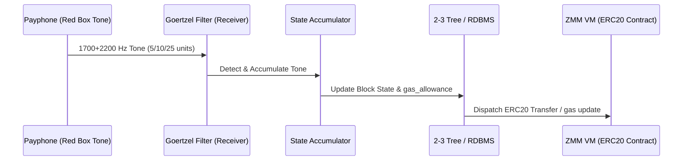

# Red Box Coin-to-ERC20 Integration Plan

This plan outlines the architecture and unit tests to bridge physical Red Box coin drop tones directly to ERC20/gas token state updates inside the ZMM VM.

## 1. Architecture Flow

### Key Integrations
* **Tone-to-Token Mapping:**
  * Nickel (5): Adds `5 * 10^18` token decimals or `50,000` gas units.
  * Dime (10): Adds `10 * 10^18` token decimals or `100,000` gas units.
  * Quarter (25): Adds `25 * 10^18` token decimals or `250,000` gas units.
* **State Hash Commitment:** Every token top-up updates `state_hash` using the non-preferential accumulator, which is verified against Yul firewall rules before VM execution.

## 2. Planned Unit Tests

We will add a dedicated test suite `tests/test_computel_red_box.c` covering:
1. **Coin Signal Decoding:** Generating nickel/dime/quarter tone buffers, running Goertzel filters, and verifying the exact denomination matches.
2. **Gas & ERC20 Balance Mapping:** Verifying that a decoded quarter increment update increases `gas_allowance` and triggers the corresponding state hash update.
3. **Double-Spend/Replay Attack Mitigation:** Checking validation guards to ensure the same tone buffer cannot be fed twice to increase balances.

## 3. Implementation Steps

* **Step 1:** Create `tests/test_computel_red_box.c` to test the Goertzel coin detection mapping to contract balances.
* **Step 2:** Link the test into the [Makefile](file:///home/mariarahel/src/tsfi2/atropa_pulsechain/tsfi2-deepseek/Makefile) and verify execution.
