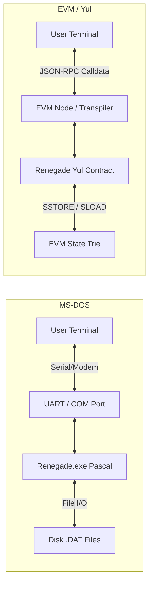

# Renegade BBS: EVM Yul Port Architecture

This document explores the architectural design for porting the classic **Renegade BBS** (originally written in Turbo Pascal for MS-DOS) into **Yul**, the EVM (Ethereum Virtual Machine) intermediate assembly language.

---

## 1. Paradigm Shift: DOS vs. EVM

In MS-DOS, Renegade interacts directly with memory-mapped serial ports (UART), files on disk, and bios/interrupt routines. In Yul, the BBS operates as a decentralized state machine where every transaction represents a terminal keystroke or menu command.



---

## 2. Storage Layout (256-bit Words)

Instead of Turbo Pascal record structures on disk, data is mapped to 256-bit EVM storage slots using Keccak256 hashes.

### A. User Records
In Pascal, a user record might be 200 bytes. In Yul, we pack user fields into storage slots:

| Offset / Slot | Type | Description |
| :--- | :--- | :--- |
| `keccak256(user_id, 0x01)` | `bytes32` | Username (up to 32 characters) |
| `keccak256(user_id, 0x02)` | `uint256` | Security Level (DSL), Upload/Download bytes, post counts |
| `keccak256(user_id, 0x03)` | `address` | Owner EVM Address (replaces passwords with ECDSA signatures) |

### B. Message Bases (Squish / JAM style)
Each message board has a message counter. Message contents are stored in chunks across sequential storage slots.

---

## 3. The ANSI Terminal & Menu Engine in Yul

To render menus (e.g., the Main Menu with options like `[F]iles`, `[M]essage`, `[G]oodbye`), Yul functions calculate state transitions and return ANSI-encoded screen buffers.

```yul
object "RenegadeBBS" {
    code {
        // Constructor: Initialize BBS sysop and default settings
        sstore(0, caller())
        return(0, 0)
    }
    object "runtime" {
        code {
            // Retrieve calldata signature (first 4 bytes)
            let selector := shr(224, calldataload(0))
            
            switch selector
            // processKeystroke(uint8 char) -> returns (string ansiScreen)
            case 0x7c49b38f {
                let key := calldataload(4)
                let current_state := sload(caller())
                let next_state, screen_ptr, screen_len := handle_state_transition(current_state, key)
                sstore(caller(), next_state)
                return(screen_ptr, screen_len)
            }
            default {
                revert(0, 0)
            }
            
            function handle_state_transition(state, key) -> new_state, ptr, len {
                // State 0: Main Menu
                if eq(state, 0) {
                    // User pressed 'M' for Message Base
                    if eq(key, 0x4d) { 
                        new_state := 1 // Message Menu State
                        ptr := 0x80    // Memory pointer to Msg Menu ANSI data
                        len := 512     // Length of screen buffer
                        return
                    }
                    // User pressed 'G' for Goodbye
                    if eq(key, 0x47) {
                        new_state := 2 // Disconnected State
                        ptr := 0x280
                        len := 128
                        return
                    }
                }
                // Default: keep state, return current menu
                new_state := state
                ptr := 0x80
                len := 512
            }
        }
    }
}
```

---

## 4. Key Advantages of a Yul BBS

1. **Password-less Security**: Authentication is handled via Ethereum cryptography (`caller()`). There are no password files to steal or brute-force.
2. **Zero-Configuration Multi-node**: Since transaction execution is atomic and sequential, the blockchain acts as a multi-node controller. No share-rationing or complex file lockouts (`SHARE.EXE`) are required.
3. **Decentralized Sysop Controls**: Moderation/Sysop permissions can be distributed via a DAO (Decentralized Autonomous Organization) contract.
