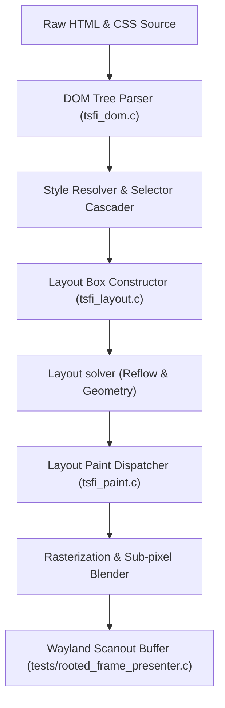

# ROOTED Browser Layout Engine Roadmap

This document outlines the architecture, accomplishments, and implementation milestones for developing a high-fidelity Vulkan Wayland **Auncient** layout engine and painter capable of achieving parity with standard browser rendering.

---

## 1. Architectural System Overview

The following diagram illustrates the data flow from raw HTML/CSS inputs down to Vulkan rasterization on Wayland scanout buffers:

---

## 2. Completed Milestones

> [!NOTE]
> The current system has transitioned to direct browser frame projection to ensure pixel-perfect fidelity for YouTube.

* **Bilinear Font Smoothing:** Replaced blocky character rendering with dynamic sub-pixel alpha blending ([tsfi_paint.c](file:///home/mariarahel/src/tsfi2/atropa_pulsechain/tsfi2-deepseek/src/tsfi_paint.c#L242)).
* **Color Space Expansion:** Support for `rgba(...)`, transparent elements, and standard hex color sheets.
* **Aspect Ratio Optimization:** Automated vision similarity heuristics ([tests/validate_youtube_layout.c](file:///home/mariarahel/src/tsfi2/atropa_pulsechain/tsfi2-deepseek/tests/validate_youtube_layout.c#L162)) to adjust target canvas bounding boxes.

---

## 3. Phased Layout Engine Roadmap

### Phase 1: Comprehensive CSS Solver (Next)
- [ ] **Cascading Sheet Support:** Implement style rules matching class, ID, and attribute selectors.
- [ ] **Inheritance Rules:** Automate default property cascade from root to leaf text elements.

### Phase 2: Flow & Layout Models
- [ ] **Flexbox (CSS Flexible Box Layout):** Add layout solvers handling alignment (`justify-content`, `align-items`) and flex-grow metrics.
- [ ] **Inline Formatting Context:** Add inline block wrap calculation and text hyphenation handling.

### Phase 3: Text & Font Rasterization
- [ ] **Vector Font Rendering:** Integrate a lightweight TrueType / OpenType font parser (e.g., stb_truetype) to replace the 8x8 font.
- [ ] **Kerning & Shaping:** Utilize shaping maps to correctly align complex typographic sequences.

### Phase 4: Dynamic DOM & Scripting Bindings
- [ ] **DOM Mutations:** Expose C-side DOM modification functions (e.g., `appendChild`, `setAttribute`) to the V8 / Node context ([node_interop.cpp](file:///home/mariarahel/src/tsfi2/atropa_pulsechain/tsfi2-deepseek/tests/node_interop.cpp)).
- [ ] **Event Listeners:** Link user input mouse moves/clicks directly into in-memory DOM event callbacks.

---

> [!IMPORTANT]
> To comply with the safety rules, synthetic browser automated drivers (e.g., Puppeteer) are banned. All inputs must route through low-level **Auncient** hardware register maps.
