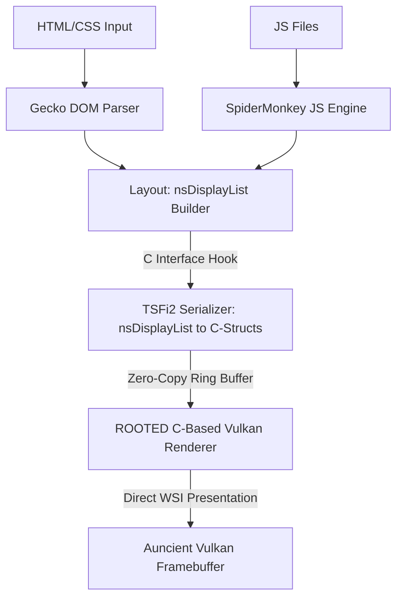

# ROOTED: Minimal C-Based Vulkan Renderer Roadmap

This document outlines the architecture for stripping down the Mozilla/Gecko engine to retain only the essential HTML and JS parser layers, while rewriting the rendering, presentation, and input layers entirely in C for our custom Vulkan displays.

## 1. Architectural Overview

Instead of maintaining the massive Firefox layout/compositing pipelines (WebRender, Rust libraries, GTK/Wayland widgets, and hardware acceleration layers), we intercept the rendering commands at the layout boundary and route them to our custom C-based rasterizers.



---

## 2. Core Integration Points

### A. Extracting the Display List (C++ to C Boundary)
Instead of feeding WebRender, we hook into `nsDisplayList.cpp` (specifically during `nsDisplayList::PaintRoot`). 
- We walk the display tree and serialize each drawing primitive (text runs, rectangles, images, boundaries) into a simplified C-struct format:
```c
typedef struct {
    uint8_t type;         // TEXT, RECT, IMAGE, CLIP_PUSH, CLIP_POP
    float x, y, w, h;     // Position & bounds
    uint32_t color;       // HSL / RGBA color data (4:4:4 color support)
    void* resource;       // Backing texture/font pointer
} RootedDrawItem;
```
- This list is copied directly to a shared memory ring buffer managed by the **Auncient** compositor.

### B. C-Based Rasterization (Bypassing WebRender & Rust)
The serialized `RootedDrawItem` stream is consumed by our optimized C engines:
1. **Text Rendering:** Handled by `tsfi_font_engine.c` using subpixel anti-aliasing and AVX-512 acceleration.
2. **Vector/Shape Drawing:** Rendered via `tsfi_pbr.c` and coordinate transformation helpers (`tsfi_opt_zmm.c`).
3. **Image & Lensing Composition:** Processed by our **Auncient** Fourier and Wavelet filters in `tsfi_fourier.c` for top plane 77 overlay lensing.

### C. Input Routing (Direct Access Layer)
Instead of routing events through GTK, Wayland client libraries, and the Firefox Widget loop, we intercept raw inputs from our Vulkan window and feed them directly to Gecko's event queue:
- Device file descriptors are read inside the compositor loop.
- Inputs are injected via `nsIWidget::DispatchEvent` bypassing the GTK library layer.

---

## 3. Step-by-Step Implementation Plan

### Step 1: Serialize Display Lists
Modify `layout/painting/nsDisplayList.cpp` to dump drawing primitives to stdout/logs, verifying layout coordinates.
Write a C-compatible serialization bridge.

### Step 2: Inject the C Vulkan Presentation Layer
Route the serialized items to `libtsfi2.so`'s drawing queue.
Bypass the GTK window loop (`nsWindowWayland.cpp`) by initializing the Vulkan surface directly from our compositor thread.

### Step 3: Turn off WebRender & Rust Compilation
Once the C rasterizer handles the serialized display list, disable WebRender and the Rust-dependent subsystems in `.mozconfig` using:
```bash
ac_add_options --disable-webrender
ac_add_options --disable-rust
```
This isolates the browser to a lean HTML/CSS parser and SpiderMonkey JS compiler, running entirely on our C-based Vulkan backend.
