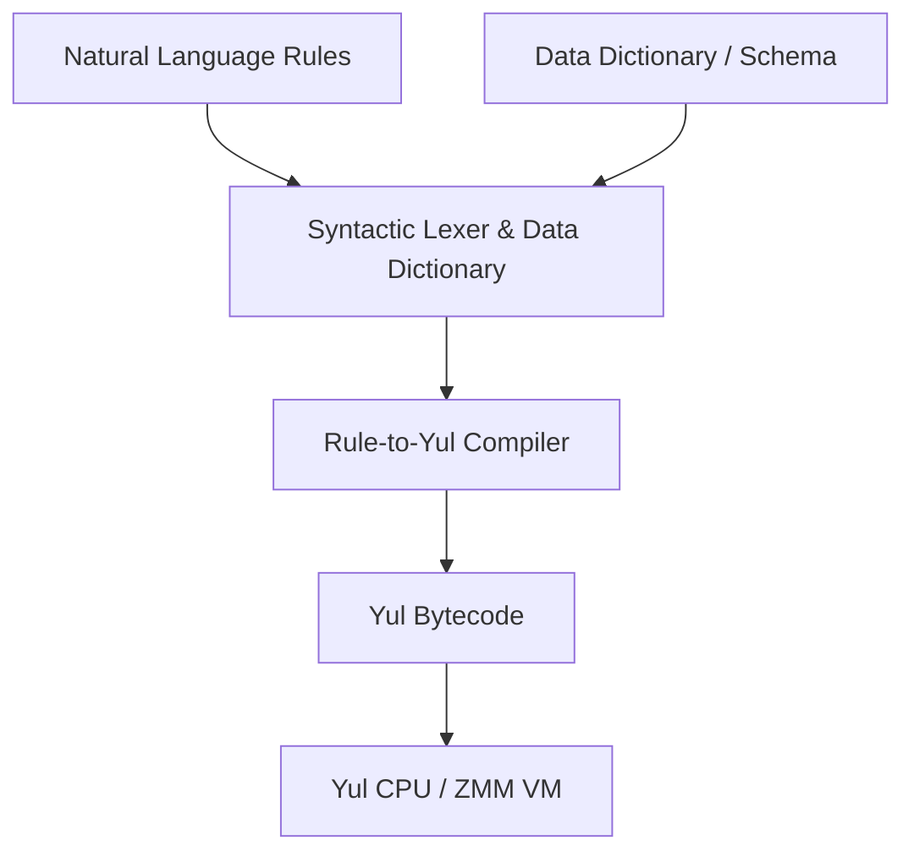

# RuleBurst-Style Natural Language Determinations Engine

RuleBurst (now Oracle Policy Automation / Oracle Intelligent Advisor) is a business rules engine (BRE) centered around **natural language inferencing**. Instead of traditional code, policy writers specify rules using structured sentences like:
```text
The citizen is eligible for assistance if
  the citizen is a resident and
  the citizen's income is less than 50000
```

This document details the design of a lightweight, compile-to-Yul Determinations Engine running directly on our virtual CPU architecture.

---

## 1. Engine Architecture

The Yul-based Determinations Engine maps natural language rule declarations into operational memory locations and executable bytecode.



### Key Components:
1. **Data Dictionary**: Defines the layout mapping natural language concepts to VM memory offsets (e.g., `"the citizen's income"` $\rightarrow$ offset `0x1020`, Type: `uint256`).
2. **Syntactic Lexer**: A C-based rules compiler running as a CLI utility that parses logic operators (`if`, `and`, `or`, `is less than`, `is greater than`, `is equal to`).
3. **Yul Codegen Engine**: Translates parsed logic trees directly into standard Solidity Yul IR code, which compiles to EVM-compatible bytecode executable on our CPU.

---

## 2. Syntactic Rules Grammar & Mapping

We define a subset of RuleBurst-style grammar:

| Rule Syntax | Logical Meaning | Translated Yul Code |
| :--- | :--- | :--- |
| `[attribute] is true` | Boolean check | `mload(offset) // non-zero` |
| `[attr1] is less than [attr2]` | Comparison | `lt(mload(o1), mload(o2))` |
| `... if A and B` | Logical AND | `and(A, B)` |
| `... if A or B` | Logical OR | `or(A, B)` |
| `the outcome is [val] if ...` | Assignment | `if cond { mstore(o_out, val) }` |

### Sample Rule Compiler Input
```text
DECL: citizen_income at 0x1000 uint256
DECL: citizen_resident at 0x1020 bool
DECL: citizen_eligible at 0x1040 bool

RULE:
the citizen is eligible if
  the citizen is a resident and
  the citizen's income is less than 50000
```

### Generated Yul IR Code
```yul
object "determinations_rules" {
    code {
        datacopy(0, dataoffset("runtime"), datasize("runtime"))
        return(0, datasize("runtime"))
    }
    object "runtime" {
        code {
            // Load variables from memory mappings
            let income := mload(0x1000)
            let resident := mload(0x1020)
            
            // Perform natural language inferencing
            let income_check := lt(income, 50000)
            let eligible := and(resident, income_check)
            
            // Store outcome
            mstore(0x1040, eligible)
        }
    }
}
```

---

## 3. Benefits & Practical Use Cases
1. **Readable Gas & Tax Models**: We can model the `gas taxation` algorithms and accounting rules in readable English rules, compile them to Yul, and execute them on-chain or inside the VM.
2. **Interactive Simulation**: The Wayland terminal can feed input values into a virtual spreadsheet, execute the RuleBurst-style compiled contract, and instantly update the telemetry HUD with decision state trees.
