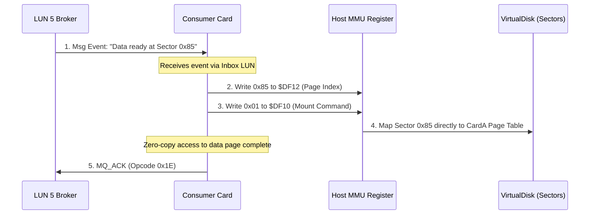

# Sector-to-Card Mapping and Msg Event Coordination

This document details the architectural design where VM cards are represented directly by disk sectors, and how message events dynamically map these sectors into card execution space.

---

## 1. Dimensional Alignment

Because our page size, message block size, and disk sector size are all aligned at **256 bytes**, we have a direct mathematical mapping:

$$\text{1 Sector} = \text{1 Message Block} = \text{1 VM Memory Page (256 bytes)}$$

A single ZMM Card CPU has a 16-bit address space (64KB), which consists of **256 pages**. Therefore:
- A card's entire memory space is exactly **256 sectors**.
- Any sector on the persistent on-chain cartridge (`VirtualDisk.sol`) can represent an individual, mountable memory page for any card.

---

## 2. Cards Represented as Dynamic Sectors

Instead of cards having fixed, hardcoded memory blocks, a card is simply a page directory pointer array. This allows us to treat any sector on the disk cartridge as a card page:

* **Code Sectors**: Program binaries (guest assembly drivers, ISR routines) are stored in specific sectors. When a card boots, the scheduler dynamically mounts these code sectors into the card's execution pages.
* **State Sectors**: Card local variables, telemetry, and heaps are backed by cartridge sectors, ensuring persistence across ZMM VM reboots.
* **Shared Sectors**: Multiple cards can mount the exact same sector pointer (zero-copy sharing), allowing instantaneous, gas-free inter-card communication.

---

## 3. How Msg Events Apply to Sector-Cards

When a message event (containing a block of data) is routed through WinchesterMQ, it coordinates sector-card mappings dynamically:

### The Transaction Flow:
1. **Event Notification**: A publisher writes a transaction block to WinchesterMQ indicating a data change or task completion, referencing a specific target sector ID.
2. **Dynamic Mount**: Upon receiving the message event via its inbox LUN, the receiver card uses the MMU registers (`$DF10`–`$DF13`) to mount that target sector directly into its own memory page directory.
3. **Execution**: The receiver card operates directly on the sector's live memory buffer.
4. **Commit (Phase 2)**: Once finished, the card sends an `MQ_ACK` (Opcode `0x1E`) to release the message lease, ensuring clean state transitions.
