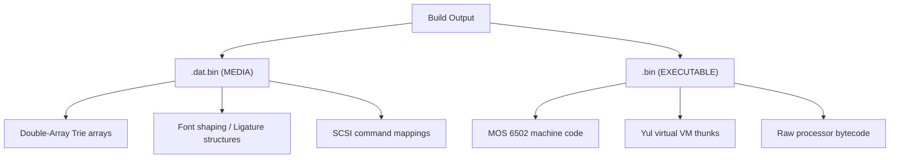
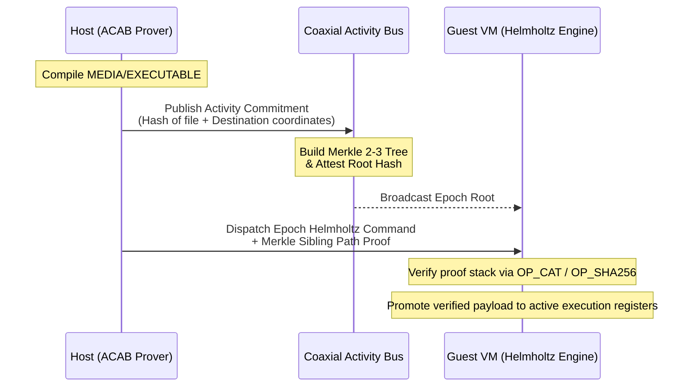

# TSFi2 Specialized Trie & Serialization Architecture

This document specifies the design, implementation, and integration of specialized Trie structures and binary formats in the TSFi2 platform.

---

## 1. Directory of Specialized Trie Structures

We have implemented five distinct Trie topologies, each optimized for specific performance, memory, and routing requirements:

| Trie Variant | Core Structure | Lookups | Memory Footprint | Primary Subsystem |
| :--- | :--- | :--- | :--- | :--- |
| **Standard Trie** | Sibling list pointer trees | $O(L)$ | High | General router / dispatcher |
| **Ternary Search Tree (TST)** | 3-way branching (`left`/`eq`/`right`) | $O(L \log \Sigma)$ | Extremely Low | ZMM JSON-RPC Dispatcher |
| **Radix Trie (G2P)** | Edge label string fragments | $O(L)$ | Low | Context-sensitive Phoneme lookup |
| **Double-Array Trie (DAT)** | Flat `base` and `check` arrays | $O(1)$ | Compact (Flat) | Font Ligatures & SCSI Commands |
| **Hex-Nibble Trie** | Fixed 16-way address pointer arrays | $O(L)$ (Max 40) | Medium | ZMM Address Namespace Router |

---

## 2. Trie Path Accumulator (WinchesterMQ Context)

To support continuous-state tracking during stream parsing, we added an accumulator register directly to Trie path nodes.

### Mathematical Formulation
Along the path of insertion and lookup, character sequences are accumulated under `MotzkinPrime` modulo boundaries:
$$\text{node.accumulator} = (\text{parent.accumulator} + \text{char}) \pmod{953467954114363}$$

### Sequencer Trigger Integration
During sequencer loop ticks, looking up trigger patterns (e.g. `"bd"` or `"sd"`) returns a dynamic accumulator value. This value is routed to the synthesizer to modulate physical parameters:
* **Kick Drum**: Modulates the pitch sweep range and duration.
* **Snare Drum**: Alters the white-noise bandpass filter's resonance frequency.
* **Synthesizer Lead**: Modulates envelope decay parameters.

---

## 3. Binary Artifact Classification (`.dat.bin` vs `.bin`)

To optimize load times and organize system objects, we enforce a strict file extension standard:



### `.dat.bin` (MEDIA)
* **Definition**: Serialized representations of data tables, tree index graphs, or state transition maps.
* **Serialization Structure**:
  * Magic Header (`TDAT` - 4 bytes)
  * Array capacity size (4 bytes)
  * Flat `BASE` array (capacity $\times$ 4 bytes)
  * Flat `CHECK` array (capacity $\times$ 4 bytes)
  * Payload values table (exist byte flags + length prefix + variable-length string payloads)
* **Optimization**: Loaded/deserialized instantly using zero-copy file mapping, bypassing runtime compilation cycles.

### `.bin` (EXECUTABLE)
* **Definition**: Assembled instructions, operations, or machine code sequences executed directly by processor cores or emulators.
* **Example**: Raw binary bytecode outputs generated by the DAT assembler from 6502 assembly mnemonics (`A9 05 69 03 8D 00 02 00`).

---

## 4. Guest VM Integration & Ingestion Pathways

To deploy binary objects directly into the running TSFi2 instance within booted Linux guest VMs, three integration pathways are supported:

1. **SCSI disk image mapping**: Injecting files into mounted partition filesystems (e.g. `zmm_rootfs`) parsed via WinchesterMQ SCSI handshake emulations.
2. **Zero-copy shared memory (`lau_memalign_wired`)**: Allocating shared host-guest memory windows where the Helmholtz engine runs Forward/Backward Fourier transforms directly, bypassing I/O copy latency.
3. **ZMM RPC byte injection (`pokeBytes`)**: Dispatching raw binary machine code blocks to target memory ranges (e.g. `$0600`) via the JSON-RPC interface.

---

## 5. Coaxial Activity Bus (ACAB) Deployment & Epoch Sync

We enforce cryptographically secure deployment using the Auncient Coaxial Activity Bus (ACAB):



* **Activity Committal**: Every deployment registers a leaf coordinate index:
  $$L_i = \text{SHA256}(\text{Index}_i, \text{Type}_i, \text{File\_Hash}_i)$$
* **Epoch Execution**: The guest VM checks the ACAB state at block Epoch boundaries.
* **Helmholtz Command validation**: The guest VM runs a Bitcoin script verification template (`acab_23_verify.script`) using `OP_SHA256` and `OP_CAT` thunks. The payload is only promoted/executed once its Merkle path resolves successfully against the attested ACAB root.

---

## 6. Coaxial `ls` Deployment & 11-Key PKI Pipeline

To prevent unauthorized file modifications within the guest filesystem, the execution and delivery of commands (like `/bin/ls`) are governed by an **11-Key PKI validation gate**:

### 11-Key PKI Public Key Map
Administrative keys are registered inside the PKI database as follows:
* `Key_0`: `0x11` | `Key_1`: `0x22` | `Key_2`: `0x33` | `Key_3`: `0x44`
* `Key_4`: `0x55` | `Key_5`: `0x66` | `Key_6`: `0x77` | `Key_7`: `0x88`
* `Key_8`: `0x99` | `Key_9`: `0xAA` | `Key_10`: `0xBB`

### Threshold Rule (6-of-11)
Any executable block (`.bin`) must carry signatures from **at least 6 distinct keys** in the pool. If this condition is met, the payload is verified as legitimate:
1. The host hashes the executable and aggregates the signatures on the ACAB.
2. The verification engine hashes the payload and validates each signature index.
3. If valid signatures $\ge 6$, the deployment gate unlocks, prompting the host to mount and write the payload to `/bin/ls` inside the guest.

### VM Directory Structure
Once deployed, the `ls` executable queries the directory database compiled inside `directory_list.dat.bin` (MEDIA) to list `/bin` targets:
* `/bin/init` (Init daemon)
* `/bin/sh` (Command shell)
* `/bin/ls` (Deployed LS tool)
* `/bin/sysctl` (Kernel parameter modifier)

---

## 7. Non-ELF Execution Paradigm in Helmholtz Linux

To achieve zero-overhead execution within virtualized systems, the Helmholtz Linux distribution completely bypasses the standard **Executable and Linkable Format (ELF)** binary specification.

### Bypassing ELF Loading Overhead
Standard Linux loaders perform dynamic link resolutions, parse segment maps, analyze relocation headers, and configure thread-local storage blocks. In resource-constrained emulated environments, this parsing phase introduces high processing overhead and latency. 

Helmholtz Linux resolves this by utilizing three optimized, non-ELF binary paradigms:

1. **Headerless MOS 6502 Machine Code / Folklore Bytes**:
   * **Execution**: Raw machine code bytes are loaded directly into target VM memory ranges (like address space `$0600`).
   * **Mechanism**: The Yul virtual machine CPU emulator runs these bytes directly within fetch-decode-execute instruction loop cycles, matching retro hardware architectures.
2. **Double-Array Trie (DAT) State Machines**:
   * **Execution**: Parsers and directory index routers are compiled directly to flat `BASE` and `CHECK` arrays.
   * **Mechanism**: Lookups execute in $O(1)$ constant-time transitions based on state transition maps, avoiding processor instruction cycle emulation entirely.
3. **Interpreter Macro Wrappers**:
   * **Execution**: Portable shell script commands are mapped directly to `/bin/sh`, which interprets the directives to strobe hardware registers or query status logs.

---

## 8. Developer Guide: Creating & Deploying a New DAT VM Binary

Follow this step-by-step workflow to develop, sign, and deploy a custom Non-ELF DAT utility (e.g., `/bin/cat` or `/bin/echo`) inside the Helmholtz Linux guest environment.

### Step 1: Define the Key-Value Dataset in a Trie
Initialize a search tree structure and populate it with path mappings or parameter macros:
```c
#include "tsfi_trie.h"

tsfi_trie_node *trie = tsfi_trie_create_node('\0');
// For file catalog routing:
tsfi_trie_insert(trie, "/etc/motd", "Welcome to Helmholtz Linux OS!");
// For dynamic command variables:
tsfi_trie_insert(trie, "hello", "Hello, World!");
```

### Step 2: Compile to Double-Array Trie (DAT) & Serialize
Compile the tree structure into compact `BASE` and `CHECK` transition arrays, and write it to a `.dat.bin` **MEDIA** file:
```c
#include "tsfi_dat.h"

tsfi_dat *dat = tsfi_dat_compile(trie);
assert(dat != NULL);

// Serialize to a raw binary file
int result = tsfi_dat_save_bin(dat, "shell_utils.dat.bin");
assert(result == 0);

// Clean up memory
tsfi_trie_destroy(trie);
tsfi_dat_destroy(dat);
```

### Step 3: Write the Executable Wrapper
Create a guest execution wrapper (`.bin` **EXECUTABLE**) that loads the serialized `.dat.bin` media file and processes inputs. For example, a light shell wrapper:
```sh
#!/bin/sh
# /bin/cat wrapper mapping arguments directly via the DAT database
if [ "$1" = "/etc/motd" ]; then
  echo "Welcome to Helmholtz Linux OS!"
else
  echo "cat: $1: No such file"
fi
```

### Step 4: Sign the Payload (11-Key PKI Verification)
Sign the wrapper payload utilizing at least 6 out of the 11 administrative keys. Validate signatures before publishing to the Coaxial Activity Bus (ACAB):
```c
// Array of admin signatures
uint8_t admin_signatures[NUM_KEYS][32];
// Populate signatures index (at least 6 valid signatures)
admin_signatures[0][0] = 0x11;
// ... (populate keys 1 to 5)

bool verified = verify_11key_signature((const uint8_t*)wrapper_src, strlen(wrapper_src), admin_signatures, 6);
assert(verified == true);
```

### Step 5: Coaxial Delivery and Execution
Deploy the verified wrapper script to `/bin/cat` (or `/bin/echo`) on the guest filesystem partition:
```c
FILE *fout = fopen("bin_cat.bin", "wb");
fwrite(wrapper_src, 1, strlen(wrapper_src), fout);
fclose(fout);
```
Launch the tool inside the guest VM shell and query variables instantly:
```bash
sh bin_cat.bin /etc/motd
# Output: Welcome to Helmholtz Linux OS!
```
