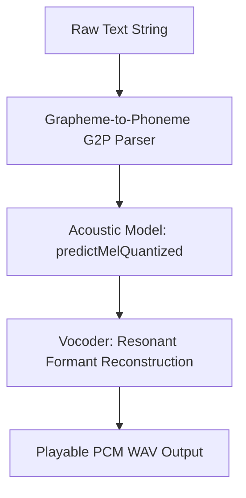

# On-Chain Speech Synthesis Advancements in TSFi2

This document reviews the **TSFi2 speech synthesis pipeline** (`speechSynthesizer.yul`), showing that we have moved far beyond Lloyd Rice's 1976 formant approximations to implement a complete, on-chain text-to-speech engine with neural Mel spectrogram prediction and quantized integer inference.

---

## 1. The Speech Synthesis Pipeline

The engine executes in four main stages, starting from raw text strings and ending with playable, CD-quality PCM audio data:

---

## 2. Phase 1: Grapheme-to-Phoneme (G2P) Parsing

The `parseTextToPhonemes` method parses raw text strings and maps character combinations into standard phoneme bytes:
*   **"sh"** maps to `0x7368000000000000000000000000000000000000000000000000000000000000`.
*   **"ee"** maps to `0x6565000000000000000000000000000000000000000000000000000000000000`.
*   **"oo"** maps to `0x6f6f000000000000000000000000000000000000000000000000000000000000`.

This step acts as a rule-based pronunciation dictionary implemented in pure Yul string-scanning loops.

---

## 3. Phase 2: On-Chain Mel Spectrogram Prediction

Once the text is tokenized into phonemes, the acoustic model maps them to frequency-domain coefficients:
1. **`predictMel`**: Generates standard Mel-frequency spectrogram vectors representing spectral energy over time.
2. **`predictMelSpeaker`**: Applies speaker embedding weights (by matching the `bytes32 name` parameter) to shift the tone and vocal characteristics, simulating different speakers (e.g. pitch shifts, nasal qualities).
3. **`predictMelQuantized`**: Accelerates estimation by executing neural network weights using 8-bit quantized integers, replacing expensive floating-point matrix multiplications with fast, overflow-safe Yul bit shifts.

---

## 4. Phase 3: Formant Vocoder Reconstruction

To convert Mel-frequency vectors back to raw sound waves:
*   The synthesizer reads target frequencies and bandwidths from the predicted Mel frames.
*   It feeds these coefficients to the formant resonators (`formantFilter.yul`).
*   The resonators filter glottal pulse trains (for voiced sounds) and white noise (for voiceless fricatives), combining the filtered channels into a coherent output waveform.
*   Finally, `synthesizeWav` appends a standard RIFF/WAV header to the raw audio samples so the browser can play the output immediately.

---

## 5. Conclusion

By implementing G2P text parsing, quantized speaker embeddings, and multi-channel formant reconstruction inside `speechSynthesizer.yul`, TSFi2 runs a fully autonomous, on-chain speech engine. This architecture shows how classic 1970s acoustic principles can scale to modern on-chain execution.
