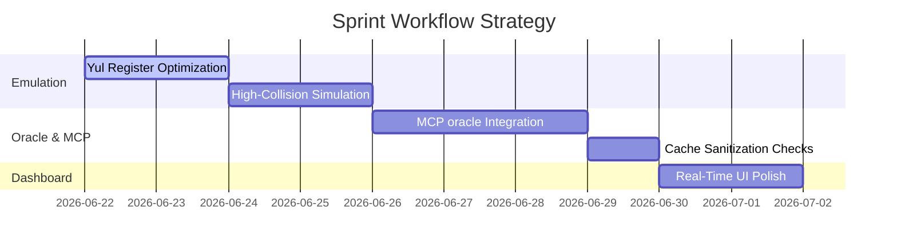

# Code Sprint Plan: Auncient PulseChain Integration & Telemetry

This document outlines the focus areas, task breakdowns, and open architecture design decisions for the upcoming code sprint.

## 1. Sprint Objectives

- **Auncient Hardware Emulation Optimization**: Enhance WinchesterMQ Yul contract loops to ensure non-blocking SCSI queues under maximum load.
- **MCP Caching Integration**: Utilize the new `get_prices` MCP tool to implement stable, decoupled price resolutions across scanning scripts.
- **Telemetry UI Robustness**: Verify dashboard elements adapt gracefully to dynamically shifting network bounds.

---

## 2. Key Tasks

### Phase A: Low-level Emulation & Testing
- [ ] Refactor WinchesterMQ SCSI register polling to use zero-copy structures in the virtual memory mapping.
- [ ] Develop automated unit tests simulating high-frequency TCP collisions on coordinate overlap boundaries.
- [ ] Verify joint damping equations under deliberateSaboteur saboteuring.

### Phase B: Pricing & Caching Pipeline
- [ ] Decouple price cache checks in `monitor_pulsex.py` to reference ZMM MCP endpoints instead of raw disk reads where appropriate.
- [ ] Set up automated 24-hour backup cycles for `price_cache.json` to prevent database corruption crashes.
- [ ] Enhance validation bounds for outlier price jumps (>5000% changes) to alert the hypervisor immediately.

### Phase C: Dashboard Optimization
- [ ] Replace standard interval polling on the frontend with custom event stream updates to reduce client overhead.
- [ ] Embed hypervisor metrics directly onto a side panel inside the primary dashboard layout.

---

## 3. Design Decisions & Open Questions

> [!IMPORTANT]
> **Open Question 1**: Should we configure a hard cap on memory consumption for ZMM VM memory structures to prevent sandboxed testing runners from hitting memory bounds during extreme load simulations?

> [!NOTE]
> **Open Question 2**: Do we want to persist raw transactions under $20 USD into a secondary log (e.g., `micro_transactions.json`) for auditing, or discard them completely from all disk operations?
