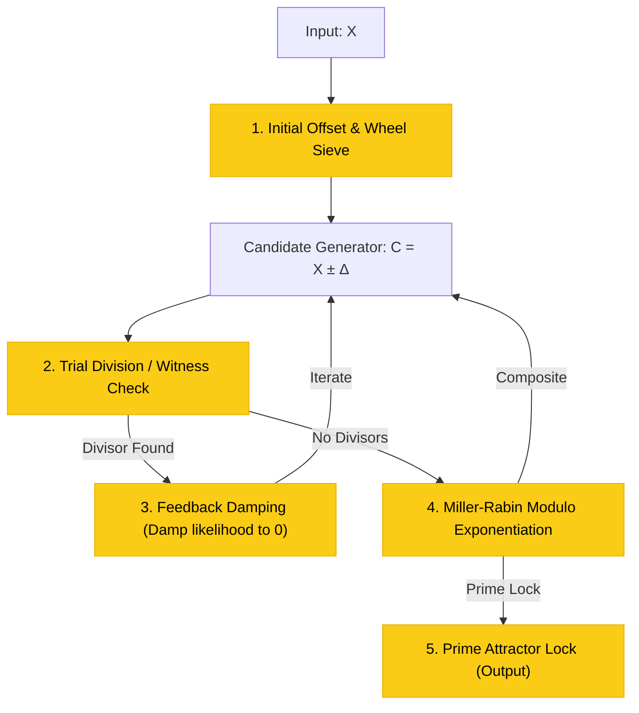

# The Internal Feedback Mechanics of the 'Stabilize' Operator

This document analyzes the internal complexity of the **Stabilize** operator ($\pi^+$ and $\pi^-$), modeling it as a multi-stage closed-loop feedback system (similar to a Phase-Locked Loop) rather than an atomic function.

---

## 1. Deconstructing 'Stabilize' into Sub-Operations

To find the nearest prime stabilizer ($\pi^+(U)$ or $\pi^-(L)$) for any composite input $X$, a computer must execute a continuous, iterative feedback loop consisting of at least five discrete operations:

---

## 2. The Five Internal Operations

### 1. The Candidate Generator & Wheel Sieve
* **Operation**: Given starting point $X$, calculate initial offset $\Delta$ to skip obvious composites (multiples of 2, 3, 5).
* **Feedback Mechanism**: Serves as the coarse frequency tuning (VCO) of the loop.

### 2. Trial Division (Low-Frequency Attenuation)
* **Operation**: Check divisibility against small primes.
* **Feedback Mechanism**: Serves as a low-pass filter that quickly attenuates composite candidates without consuming heavy computational resources.

### 3. Feedback Damping (Q-Damping)
* **Operation**: When a divisor is found, the primality probability is immediately damped to $0$. 
* **Feedback Mechanism**: Instantly resets the candidate generator offset (analogous to discharging a capacitor in a relaxation oscillator to trigger the next pulse).

### 4. Modular Exponentiation Witness Testing (Miller-Rabin)
* **Operation**: Calculate $a^d \pmod C$ to check for strong pseudoprimality witnesses.
* **Feedback Mechanism**: Serves as a high-precision phase detector, measuring the phase error between the candidate's cyclic group properties and those of a true prime.

### 5. The Prime Attractor Lock (PLL Lock)
* **Operation**: Once a candidate passes all witness tests with zero error, the loop "locks" its output.
* **Feedback Mechanism**: Analogous to a Phase-Locked Loop (PLL) capturing and locking onto a stable grid frequency, trapping the drifting candidate value exactly on a prime coordinate.
