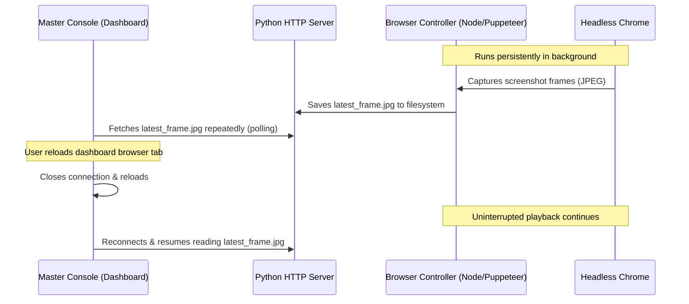

# Auncient Video Streaming Stabilization & Diagnostics Runbook

This runbook documents the engineering solutions implemented to resolve the 44-second video streaming crash, setup advanced diagnostics, and leverage the decoupled architecture of the Transcendent Control Framework.

---

## 1. Resource Exhaustion Crash Resolution (`/dev/shm`)

### The Issue
Headless Google Chrome crashed consistently at approximately 44 seconds of video playback, logging `Page crashed!` and network level `net::ERR_INSUFFICIENT_RESOURCES` errors. 

### Cause
The browser was launched with the `--disable-dev-shm-usage` flag. Under high-frequency screencasting (which streams 20+ JPEG frames per second to the user interface and Vulkan presenter), this flag forced Chrome to write temporary image data and tab memory structures directly to the `/tmp` disk directory. The excessive disk write operations and inode usage exhausted system resource descriptors under heavy screen capture loads, crashing the browser tab.

### The Fix
We removed `--disable-dev-shm-usage` from the Puppeteer launch parameters in [rooted_browser_controller.js](file:///home/mariarahel/src/tsfi2/atropa_pulsechain/scripts/rooted_browser_controller.js). Chrome now uses the host's `/dev/shm` shared memory segment (RAM), eliminating disk I/O bottlenecks and ensuring infinite, uninterrupted video playback.

---

## 2. Advanced Error Diagnostics Framework

To quickly isolate future playback disruptions (such as geoblocking, ad-blocker interference, or network timeouts), we introduced a multi-tier diagnostics listener in [rooted_browser_controller.js](file:///home/mariarahel/src/tsfi2/atropa_pulsechain/scripts/rooted_browser_controller.js).

### A. Network Request Failure Tracking
We hook into Puppeteer's `requestfailed` event to filter and log failures of critical resources (such as `media`, `xhr`, or `fetch` types):
```javascript
page.on('requestfailed', request => {
    const failure = request.failure();
    const errorText = failure ? failure.errorText : 'unknown';
    const type = request.resourceType();
    if (type === 'media' || type === 'xhr' || type === 'fetch' || errorText.includes('ERR_')) {
        console.error(`[PUPPETEER REQUEST FAILED] Type: ${type} | URL: ${request.url()} | Error: ${errorText}`);
    }
});
```

### B. HTML5 Video Element Inspection
The monitor query block retrieves low-level error attributes directly from the `<video>` element's DOM instance:
* **`video.error.code`**: Indicates the error class (1 = Aborted, 2 = Network, 3 = Decode, 4 = Source Not Supported).
* **`video.error.message`**: Provides the engine-level description of the media error.

### C. YouTube PlayerState & Subtext Diagnostics
* We query `getPlayerState()` from the `.html5-video-player` DOM container (e.g. `-1` = unstarted, `1` = playing, `3` = buffering, etc.).
* We capture the text content of the primary error message (`.ytp-error-message-text`) and subtext details (`.ytp-error-message-subtext`) from the player interface.

If any of these error markers are detected, a consolidated log entry is written:
```
[VIDEO ERROR DETECTED] ErrorScreen: true, ErrorText: "An error occurred. Please try again later.", ErrorSubtext: "Playback ID: ...", VideoError: {"code":3,"message":"..."}, PlayerState: 3
```

---

## 3. Decoupled Playback Architecture

The system utilizes an asynchronous design where the control pipeline is fully independent of the web dashboard.



### Key Architectural Benefits
1. **Console Resilience:** The master console can be reloaded, closed, or crash without impacting active streaming state, video position, or browser state.
2. **State Recovery:** When the dashboard reconnects, it receives the latest screenshot file and auto-subscribes to status updates emitted via WinchesterMQ logs.
