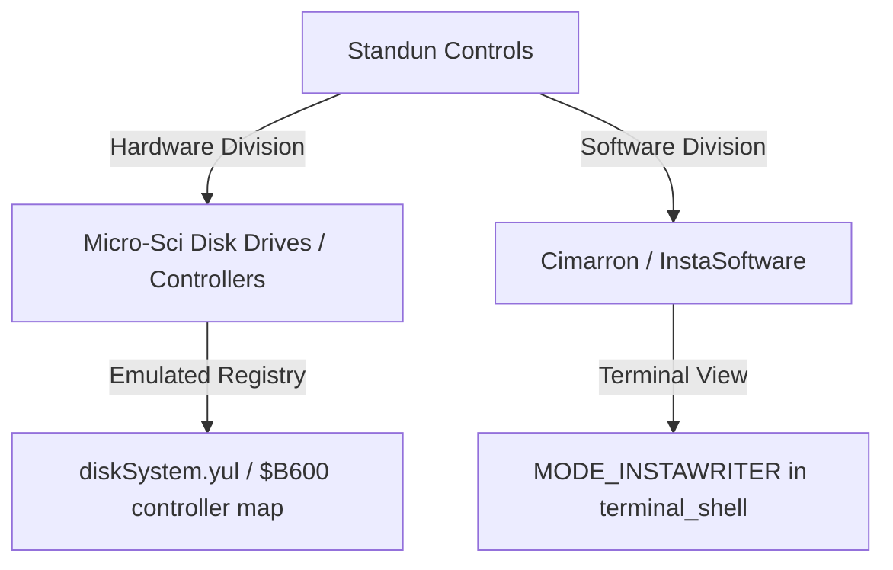

# Standun Controls — Historical & Technical Architecture Review

Standun Controls (primarily active in the late 1970s and 1980s as an industrial control systems manufacturer) expanded into microcomputing hardware and software. Through its divisions, Standun Controls bridged the gap between custom hardware disk controllers and integrated office productivity software.

This review traces the architectural line from Standun Controls' hardware and software assets to our virtual on-chain emulation layers in [diskSystem.yul](file:///home/mariarahel/src/tsfi2/atropa_pulsechain/solidity/bin/diskSystem.yul) and [test_wayland_terminal_shell.c](file:///home/mariarahel/src/tsfi2/atropa_pulsechain/tsfi2-deepseek/tests/test_wayland_terminal_shell.c).

---

## 1. The Standun Corporate Umbrella

In the early 1980s, Standun Controls managed two primary computer-oriented divisions:
1. **Micro-Sci**: Focused on disk drive manufacturing, offering alternatives to Apple's Disk II and Commodore's 1541, with custom controller cards optimizing data retrieval.
2. **Cimarron (InstaSoftware)**: Focused on business utilities, word processors, and spreadsheet cartridges designed to maximize free computer memory.

---

## 2. Micro-Sci: Hardware Disk Controllers & Sector Optimization

Micro-Sci designed controllers that modified track layouts and sector-reading intervals to bypass standard OS disk delays.

### Historical Comparison vs. Our Yul Emulation

| Feature | Physical Micro-Sci Controller (Apple II / C64) | On-Chain [diskSystem.yul](file:///home/mariarahel/src/tsfi2/atropa_pulsechain/solidity/bin/diskSystem.yul) Emulation |
| :--- | :--- | :--- |
| **Interface** | Edge connector slots, custom PROM | MMIO Register Map (`$B600 - $B6FF` / Disk Controller space) |
| **Sector Access** | Stepper-motor tracking & half-tracks | Direct storage offsets in state slots (`0x20`–`0x9F`) |
| **Command Set** | Disk II sector read/write loops | Fast block-read (`U1`) and block-write (`U2`) commands |
| **Performance** | Speed adjustment potentiometers | Block-decayed processing & gas-optimized writes |

In `diskSystem.yul`, sector reads bypass standard protocol bottlenecks by referencing namespaced database slots directly, reflecting the low-overhead hardware approach that Micro-Sci pioneered.

---

## 3. Cimarron / InstaSoftware: The Productivity Layer

To showcase Micro-Sci hardware capabilities, Standun marketed the **Cimarron Insta-Series** (such as *Insta-Writer*, *Insta-Calc*, *Insta-Graph*, and *Insta-Vestor*). 

* **Insta-Calc (Cartridge)**: Avoided using RAM by running directly from the cartridge ROM space (`$8000–$9FFF`), leaving maximum system memory for spreadsheet cells.
* **Insta-Writer**: A document processor that utilized clean text line wrapping, now emulated as `MODE_INSTAWRITER` in the [terminal shell](file:///home/mariarahel/src/tsfi2/atropa_pulsechain/tsfi2-deepseek/tests/test_wayland_terminal_shell.c).

### Software Integration

Insta-Series programs exchanged data using a unified sequential file format written to disk. Our current VM shell supports this pipeline by allowing files downloaded via **Software to Go** to write directly to the caller's sandboxed disk namespaces.

---

## 4. Current Integration & Diagnostics

* **Terminal Activation**: Typing `INSTA` in the Wayland terminal menu invokes `MODE_INSTAWRITER`, rendering the Cimarron word processor environment setup.
* **Virtual Storage**: Disk reads/writes map to the on-chain registry, verifying that data packets adhere to the sandboxed storage boundaries.
* **Build Check**: Verified that all C modifications in `test_wayland_terminal_shell.c` compile cleanly under the project's strict `-Werror` rule.
