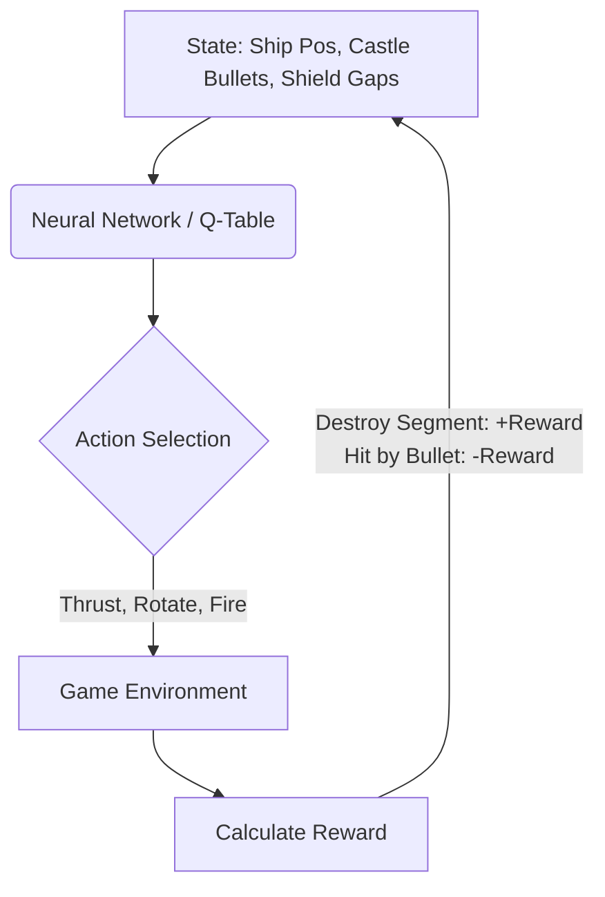

# AI Learning Integration & Evolution for Star Castle

We can leverage artificial intelligence to shift Star Castle from a static retro simulator into a dynamic, evolving environment. Here is a roadmap of how we can integrate machine learning and adaptive heuristics directly into the game loops.

---

## 1. Reinforcement Learning (RL) for the Core Castle & Fighter Ship

Currently, the AI mode uses a hand-crafted heuristic (orbital control, radial correction, and basic bullet distance-checking). We can replace this with a browser-based **Q-learning** or **Policy Gradient** network (via a lightweight neural library or TensorFlow.js).

### Implementation Details:
* **State Space ($S$)**: 
  * Relative angle and distance of the ship to the castle center.
  * Angular velocity and linear velocity vectors.
  * Vectors pointing to the 3 nearest castle bullets.
  * Shield ring rotation status and nearest broken gaps.
* **Action Space ($A$)**: `[Rotate Left, Rotate Right, Thrust, Fire, Idle]`.
* **Reward Function ($R$)**:
  * $+10$ for destroying a shield segment.
  * $+100$ for hitting the core.
  * $-50$ for getting hit by a bullet (termination).
  * $-0.01$ per frame (encourages speed).

---

## 2. Genetic Algorithms (GA) for Evolving Castle Defense

Instead of static rotating shield rings, we can implement an evolutionary algorithm where the Castle is a "species" trying to survive as long as possible.

* **Genome**: 
  * Rotation speeds of the 3 rings.
  * Shield segment layout configurations (e.g., bitmasks representing solid vs. empty spaces).
  * Castle core projectile speeds and firing intervals.
* **Fitness Function**: Survival time against the player's ship (or against the training pilot AI).
* **Evolution Cycle**:
  1. Initialize a population of 10 different castle configurations.
  2. Test them against the player or RL agent.
  3. Select the top 2 performing castles (longest survival times).
  4. Perform crossover (combining segment patterns/ring speeds) and add minor mutations.
  5. Deploy the next-generation castle configurations in subsequent waves.

---

## 3. On-Chain Neural Weights (Alchemical Mutation)

Since we are integrated with the local `ZarrellaLedger` on-chain system, we can store evolved weight states or fitness metrics directly on-chain:

* **State Persistence**: The best-performing genome/weights can be hashed or stored directly in the contract using custom registry storage slots.
* **On-Chain Evolution**: Players can "mint" custom mutated castle profiles by spending their harvested reagents (`Lead`, `Mercury`, `Sulfur`). The ledger contract can process a transmutation that modifies the genome rules and emits a `CastleMutated` event, which the frontend reads to spawn the newly evolved castle.

---

## 4. Adaptive Difficulty Heuristics (Dynamic Game Balancing)

A simpler, instant-action approach is **Dynamic Difficulty Adjustment (DDA)** using a feedback control loop:

$$\text{Difficulty Factor} = \alpha \cdot (\text{Player Kill Rate}) - \beta \cdot (\text{Player Death Rate})$$

* If the player is destroying shield segments quickly, the castle increases its shield rotation speed, starts firing seeking bullets, or shrinks the gap size.
* If the player is dying frequently, the castle scales down its projectile velocity and expands segment gaps to balance the game.
